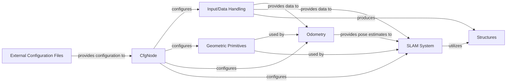

## Details

The `gradslam` architecture is centered around the `CfgNode` component, which manages application-wide configurations loaded from `External Configuration Files`. The `Input/Data Handling` component is responsible for loading and preparing various datasets, producing `Structures` like `RGBDImages` and `Pointclouds`. These structures are then processed by the `Geometric Primitives` component, which provides fundamental geometric operations. The `Odometry` component, utilizing `Geometric Primitives` and data from `Input/Data Handling`, estimates camera motion. Finally, the `SLAM System` integrates outputs from `Odometry` and `Input/Data Handling`, leveraging `Geometric Primitives` and `Structures` to perform simultaneous localization and mapping, constructing a consistent representation of the environment.

### CfgNode
This component is responsible for defining, loading, merging, and accessing application-wide configuration settings. It provides a structured, hierarchical approach to managing parameters, ensuring consistency and flexibility across the `gradslam` library.

**Related Classes/Methods**:

- <a href="https://github.com/gradslam/gradslam/blob/main/gradslam/config/cfgnode.py" target="_blank" rel="noopener noreferrer">`gradslam.config.cfgnode.CfgNode:__init__`</a>
- <a href="https://github.com/gradslam/gradslam/blob/main/gradslam/config/cfgnode.py" target="_blank" rel="noopener noreferrer">`gradslam.config.cfgnode.CfgNode:_create_config_tree_from_dict`</a>
- <a href="https://github.com/gradslam/gradslam/blob/main/gradslam/config/cfgnode.py" target="_blank" rel="noopener noreferrer">`gradslam.config.cfgnode.CfgNode:__setattr__`</a>
- <a href="https://github.com/gradslam/gradslam/blob/main/gradslam/config/cfgnode.py" target="_blank" rel="noopener noreferrer">`gradslam.config.cfgnode.CfgNode:merge_from_file`</a>
- <a href="https://github.com/gradslam/gradslam/blob/main/gradslam/config/cfgnode.py" target="_blank" rel="noopener noreferrer">`gradslam.config.cfgnode.CfgNode:_merge_a_into_b`</a>
- <a href="https://github.com/gradslam/gradslam/blob/main/gradslam/config/cfgnode.py" target="_blank" rel="noopener noreferrer">`gradslam.config.cfgnode.CfgNode:freeze`</a>
- <a href="https://github.com/gradslam/gradslam/blob/main/gradslam/config/cfgnode.py" target="_blank" rel="noopener noreferrer">`gradslam.config.cfgnode.CfgNode:defrost`</a>
- <a href="https://github.com/gradslam/gradslam/blob/main/gradslam/config/cfgnode.py" target="_blank" rel="noopener noreferrer">`gradslam.config.cfgnode.CfgNode:dump`</a>
- <a href="https://github.com/gradslam/gradslam/blob/main/gradslam/config/cfgnode.py" target="_blank" rel="noopener noreferrer">`gradslam.config.cfgnode.CfgNode:register_deprecated_key`</a>
- <a href="https://github.com/gradslam/gradslam/blob/main/gradslam/config/cfgnode.py" target="_blank" rel="noopener noreferrer">`gradslam.config.cfgnode.CfgNode:register_renamed_key`</a>

### External Configuration Files
External files (e.g., YAML, JSON) that provide configuration settings to the CfgNode component. These files define the initial parameters and settings for the `gradslam` application.

**Related Classes/Methods**:

- <a href="https://github.com/gradslam/gradslam/blob/main/gradslam/config/cfgnode.py" target="_blank" rel="noopener noreferrer">`gradslam.config.cfgnode`</a>

### Input/Data Handling
This component is responsible for loading and preprocessing various datasets, including ICL-NUIM, ScanNet, and TUM. It provides utilities for data augmentation, transformation, and batching, ensuring data is in the correct format for downstream processing.

**Related Classes/Methods**:

- <a href="https://github.com/gradslam/gradslam/blob/main/gradslam/datasets/icl.py" target="_blank" rel="noopener noreferrer">`gradslam.datasets.icl.ICLDataset`</a>
- <a href="https://github.com/gradslam/gradslam/blob/main/gradslam/datasets/scannet.py" target="_blank" rel="noopener noreferrer">`gradslam.datasets.scannet.ScanNetDataset`</a>
- <a href="https://github.com/gradslam/gradslam/blob/main/gradslam/datasets/tum.py" target="_blank" rel="noopener noreferrer">`gradslam.datasets.tum.TUMDataset`</a>
- <a href="https://github.com/gradslam/gradslam/blob/main/gradslam/datasets/datautils.py" target="_blank" rel="noopener noreferrer">`gradslam.datasets.datautils.DataLoader`</a>

### Geometric Primitives
This component provides fundamental geometric operations and utilities, including transformations (SE(3)), projections, and conversions between different geometric representations. It forms the basis for manipulating 3D data within the `gradslam` framework.

**Related Classes/Methods**:

- <a href="https://github.com/gradslam/gradslam/blob/main/gradslam/geometry/se3utils.py" target="_blank" rel="noopener noreferrer">`gradslam.geometry.se3utils.SE3`</a>
- <a href="https://github.com/gradslam/gradslam/blob/main/gradslam/geometry/projutils.py#L92-L238" target="_blank" rel="noopener noreferrer">`gradslam.geometry.projutils.project_points`:92-238</a>
- <a href="https://github.com/gradslam/gradslam/blob/main/gradslam/geometry/geometryutils.py" target="_blank" rel="noopener noreferrer">`gradslam.geometry.geometryutils.inverse_transform`</a>

### Odometry
This component focuses on estimating the motion of the camera or sensor. It includes various odometry algorithms, such as ICP (Iterative Closest Point) and GradICP, which are crucial for tracking the pose of the system over time.

**Related Classes/Methods**:

- <a href="https://github.com/gradslam/gradslam/blob/main/gradslam/odometry/icp.py#L12-L97" target="_blank" rel="noopener noreferrer">`gradslam.odometry.icp.ICP`:12-97</a>
- <a href="https://github.com/gradslam/gradslam/blob/main/gradslam/odometry/gradicp.py#L12-L122" target="_blank" rel="noopener noreferrer">`gradslam.odometry.gradicp.GradICP`:12-122</a>
- <a href="https://github.com/gradslam/gradslam/blob/main/gradslam/odometry/base.py#L6-L19" target="_blank" rel="noopener noreferrer">`gradslam.odometry.base.Odometry`:6-19</a>

### SLAM System
This component integrates odometry, mapping, and tracking functionalities to build a complete Simultaneous Localization and Mapping (SLAM) system. It handles tasks like point cloud fusion and global map construction.

**Related Classes/Methods**:

- <a href="https://github.com/gradslam/gradslam/blob/main/gradslam/slam/icpslam.py#L18-L264" target="_blank" rel="noopener noreferrer">`gradslam.slam.icpslam.ICPSLAM`:18-264</a>
- <a href="https://github.com/gradslam/gradslam/blob/main/gradslam/slam/pointfusion.py#L16-L112" target="_blank" rel="noopener noreferrer">`gradslam.slam.pointfusion.PointFusion`:16-112</a>
- <a href="https://github.com/gradslam/gradslam/blob/main/gradslam/slam/fusionutils.py" target="_blank" rel="noopener noreferrer">`gradslam.slam.fusionutils.fuse_pointclouds`</a>

### Structures [[Expand]](./Structures.md)
This component defines and manages core data structures used throughout `gradslam`, such as `RGBDImages` and `Pointclouds`. It provides methods for manipulating these structures, including conversions and utility functions.

**Related Classes/Methods**:

- <a href="https://github.com/gradslam/gradslam/blob/main/gradslam/structures/rgbdimages.py#L13-L915" target="_blank" rel="noopener noreferrer">`gradslam.structures.rgbdimages.RGBDImages`:13-915</a>
- <a href="https://github.com/gradslam/gradslam/blob/main/gradslam/structures/pointclouds.py" target="_blank" rel="noopener noreferrer">`gradslam.structures.pointclouds.Pointclouds`</a>
- <a href="https://github.com/gradslam/gradslam/blob/main/gradslam/structures/structutils.py" target="_blank" rel="noopener noreferrer">`gradslam.structures.structutils.convert_pointcloud_to_rgbdimage`</a>

### [FAQ](https://github.com/CodeBoarding/GeneratedOnBoardings/tree/main?tab=readme-ov-file#faq)