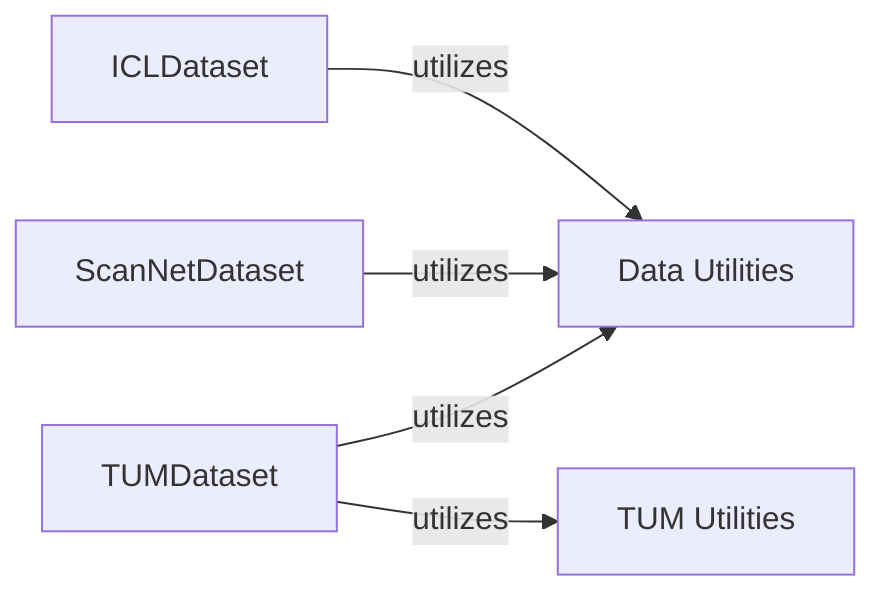

## Details

The `Data Loaders & Preprocessing` subsystem is responsible for ingesting various 3D datasets (e.g., ICL-NUIM, ScanNet, TUM), parsing their specific formats, and performing initial preprocessing to provide raw sensor data (RGB images, depth maps, camera poses, intrinsics) to the rest of the `gradslam` system. Its boundaries are defined by the `gradslam.datasets` package.

### ICLDataset
Specializes in loading and preprocessing the ICL-NUIM dataset. It handles the retrieval and initial transformation of RGB images, depth maps, and camera poses specific to this dataset, ensuring data is in a usable format for downstream processing.

**Related Classes/Methods**:

- <a href="https://github.com/gradslam/gradslam/blob/main/gradslam/datasets/icl.py" target="_blank" rel="noopener noreferrer">`ICLDataset`</a>

### ScanNetDataset
Manages the loading and preprocessing of the ScanNet dataset. This includes handling RGB, depth, camera intrinsics, poses, and semantic labels, along with dataset-specific label conversions (e.g., `nyu40_to_scannet20`), adapting the diverse ScanNet structure for `gradslam`.

**Related Classes/Methods**:

- <a href="https://github.com/gradslam/gradslam/blob/main/gradslam/datasets/scannet.py" target="_blank" rel="noopener noreferrer">`ScanNetDataset`</a>

### TUMDataset
Focuses on loading and preprocessing the TUM dataset. It is responsible for associating data streams (RGB and depth) and homogenizing pose data (`_homogenPoses`), ensuring consistent data representation from the TUM format.

**Related Classes/Methods**:

- <a href="https://github.com/gradslam/gradslam/blob/main/gradslam/datasets/tum.py" target="_blank" rel="noopener noreferrer">`TUMDataset`</a>

### Data Utilities
Provides common, reusable data manipulation and preprocessing functions. This module encapsulates generic utilities that can be applied across different dataset loaders, promoting code reuse and consistency in data handling operations.

**Related Classes/Methods**:

- <a href="https://github.com/gradslam/gradslam/blob/main/gradslam/datasets/datautils.py" target="_blank" rel="noopener noreferrer">`datautils`</a>

### TUM Utilities
Offers specific utility functions tailored for the TUM dataset, particularly for reading and transforming camera trajectory files (`read_trajectory`, `transform44`). This component abstracts dataset-specific parsing logic.

**Related Classes/Methods**:

- <a href="https://github.com/gradslam/gradslam/blob/main/gradslam/datasets/tumutils.py" target="_blank" rel="noopener noreferrer">`tumutils`</a>

### [FAQ](https://github.com/CodeBoarding/GeneratedOnBoardings/tree/main?tab=readme-ov-file#faq)