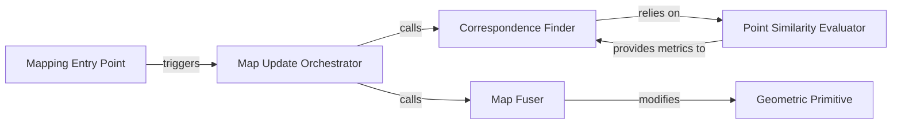

## Details

This subsystem is responsible for integrating new sensor data (typically point clouds) into a consistent global 3D map, often by fusing new point clouds with existing map points. It encompasses the core logic for updating and maintaining the spatial representation of the environment.

### Mapping Entry Point
The primary interface for initiating the map update and fusion process. It serves as the starting point for the entire mapping pipeline within this subsystem.

**Related Classes/Methods**:

- <a href="https://github.com/gradslam/gradslam/blob/main/gradslam/slam/pointfusion.py#L107-L112" target="_blank" rel="noopener noreferrer">`gradslam.slam.pointfusion._map`:107-112</a>

### Map Update Orchestrator
Coordinates the overall map fusion workflow, directing the sequence of operations required to integrate new data into the existing map. This component acts as the central control for the fusion pipeline.

**Related Classes/Methods**:

- <a href="https://github.com/gradslam/gradslam/blob/main/gradslam/slam/fusionutils.py#L761-L789" target="_blank" rel="noopener noreferrer">`gradslam.slam.fusionutils.update_map_fusion`:761-789</a>

### Correspondence Finder
Identifies potential matches or relationships between incoming point cloud data and the existing map points, a crucial step before fusion. It determines which new points correspond to existing map features.

**Related Classes/Methods**:

- <a href="https://github.com/gradslam/gradslam/blob/main/gradslam/slam/fusionutils.py#L549-L577" target="_blank" rel="noopener noreferrer">`gradslam.slam.fusionutils.find_correspondences`:549-577</a>

### Point Similarity Evaluator
Assesses the similarity between individual map points, considering attributes like proximity and normal orientation, to aid the Correspondence Finder in establishing accurate matches.

**Related Classes/Methods**:

- <a href="https://github.com/gradslam/gradslam/blob/main/gradslam/slam/fusionutils.py#L290-L411" target="_blank" rel="noopener noreferrer">`gradslam.slam.fusionutils.find_similar_map_points`:290-411</a>

### Map Fuser
Performs the actual integration of new point cloud data into the existing map, updating its properties such as color, normal, and position. This is where the map is physically modified.

**Related Classes/Methods**:

- <a href="https://github.com/gradslam/gradslam/blob/main/gradslam/slam/fusionutils.py#L580-L722" target="_blank" rel="noopener noreferrer">`gradslam.slam.fusionutils.fuse_with_map`:580-722</a>

### Geometric Primitive
Provides the fundamental data structure for representing and manipulating 3D point cloud data within the `gradslam` framework. This component serves as the underlying data model for the map that is being updated and fused.

**Related Classes/Methods**:

- <a href="https://github.com/gradslam/gradslam/blob/main/gradslam/structures/pointclouds.py" target="_blank" rel="noopener noreferrer">`gradslam.structures.pointclouds.Pointclouds`</a>

### [FAQ](https://github.com/CodeBoarding/GeneratedOnBoardings/tree/main?tab=readme-ov-file#faq)