```mermaid
graph LR
    Odometry_Base_Component["Odometry Base Component"]
    Standard_ICP_Component["Standard ICP Component"]
    Gradient_based_ICP_Component["Gradient-based ICP Component"]
    ICP_Utilities_Component["ICP Utilities Component"]
    Ground_Truth_Odometry_Component["Ground Truth Odometry Component"]
    Standard_ICP_Component -- "inherits from/implements interface of" --> Odometry_Base_Component
    Standard_ICP_Component -- "relies on/utilizes" --> ICP_Utilities_Component
    Gradient_based_ICP_Component -- "inherits from/implements interface of" --> Odometry_Base_Component
    Gradient_based_ICP_Component -- "relies on/utilizes" --> ICP_Utilities_Component
    ICP_Utilities_Component -- "processes data for" --> Standard_ICP_Component
    ICP_Utilities_Component -- "processes data for" --> Gradient_based_ICP_Component
    Ground_Truth_Odometry_Component -- "serves as reference for" --> Standard_ICP_Component
    Ground_Truth_Odometry_Component -- "serves as reference for" --> Gradient_based_ICP_Component
```

## Details

The `Odometry & Pose Estimation` subsystem in `gradslam` is designed as a modular and extensible set of components for estimating camera motion. It adheres to the ML Toolkit/Library architectural pattern by providing distinct, reusable building blocks for different odometry approaches.

### Odometry Base Component
Defines the abstract interface or base class (Odometry) for all odometry algorithms. This component establishes a consistent API, promoting extensibility and allowing different odometry implementations to be used interchangeably within a larger pipeline.

**Related Classes/Methods**:

- <a href="https://github.com/gradslam/gradslam/blob/main/gradslam/odometry/base.py" target="_blank" rel="noopener noreferrer">`gradslam/odometry/base`</a>

### Standard ICP Component
Implements the classic Iterative Closest Point (ICP) algorithm, likely focusing on point-to-plane minimization. It orchestrates the core ICP loop, utilizing utility functions for data preparation and optimization. This component provides a robust, non-differentiable odometry solution.

**Related Classes/Methods**:

- <a href="https://github.com/gradslam/gradslam/blob/main/gradslam/odometry/icp.py" target="_blank" rel="noopener noreferrer">`gradslam/odometry/icp`</a>

### Gradient-based ICP Component
Implements a differentiable, gradient-based variant of the ICP algorithm. This component is crucial for integration into end-to-end differentiable pipelines, leveraging gradient-aware optimization techniques to enable backpropagation through the odometry process.

**Related Classes/Methods**:

- <a href="https://github.com/gradslam/gradslam/blob/main/gradslam/odometry/gradicp.py" target="_blank" rel="noopener noreferrer">`gradslam/odometry/gradicp`</a>

### ICP Utilities Component
Provides a collection of reusable utility functions essential for various ICP implementations. This includes data preprocessing (e.g., downsampling point clouds/RGB-D images), core geometric minimization logic (e.g., point-to-plane ICP), and optimization/solver utilities (e.g., solving linear systems, Gauss-Newton). This component encapsulates common, low-level operations.

**Related Classes/Methods**:

- <a href="https://github.com/gradslam/gradslam/blob/main/gradslam/odometry/icputils.py" target="_blank" rel="noopener noreferrer">`gradslam/odometry/icputils`</a>

### Ground Truth Odometry Component
Provides mechanisms to handle or utilize ground truth pose information. Its primary purpose is for evaluation, debugging, or simulation, offering an interface to load or simulate ground truth odometry data to compare against estimated poses.

**Related Classes/Methods**:

- <a href="https://github.com/gradslam/gradslam/blob/main/gradslam/odometry/groundtruth.py" target="_blank" rel="noopener noreferrer">`gradslam/odometry/groundtruth`</a>

### [FAQ](https://github.com/CodeBoarding/GeneratedOnBoardings/tree/main?tab=readme-ov-file#faq)