```mermaid
graph LR
    gradslam_structures_rgbdimages_RGBDImages["gradslam.structures.rgbdimages.RGBDImages"]
    gradslam_structures_pointclouds_Pointclouds["gradslam.structures.pointclouds.Pointclouds"]
    gradslam_structures_utils["gradslam.structures.utils"]
    gradslam_structures_structutils["gradslam.structures.structutils"]
    gradslam_structures_rgbdimages_RGBDImages -- "provides input data to" --> gradslam_structures_utils
    gradslam_structures_rgbdimages_RGBDImages -- "interacts with for visualization" --> gradslam_structures_structutils
    gradslam_structures_utils -- "converts data to" --> gradslam_structures_pointclouds_Pointclouds
    gradslam_structures_pointclouds_Pointclouds -- "interacts with for visualization" --> gradslam_structures_structutils
```

## Details

The RGB-D & Point Cloud Data Structures subsystem manages core data representations for visual and geometric information within the gradslam project, primarily through `RGBDImages` and `Pointclouds` classes, supported by `utils` for conversion and `structutils` for general data manipulation and visualization preparation.

### gradslam.structures.rgbdimages.RGBDImages
This is the foundational data structure for RGB-D images. It encapsulates raw RGB and Depth image data, camera intrinsics, and camera poses. Its core responsibility is to manage this data and, crucially, to derive 3D geometric information such as vertex maps and normal maps from the 2D image data and camera parameters. It also provides methods for data manipulation (cloning, detaching, device transfer) and integration with visualization tools.

**Related Classes/Methods**:

- <a href="https://github.com/gradslam/gradslam/blob/main/gradslam/structures/rgbdimages.py#L13-L915" target="_blank" rel="noopener noreferrer">`gradslam.structures.rgbdimages.RGBDImages`:13-915</a>

### gradslam.structures.pointclouds.Pointclouds
This component serves as the fundamental data structure for 3D point clouds. It manages collections of 3D points, associated normals, colors, and features. It provides robust mechanisms for accessing data in various formats (lists, padded tensors) and performing a wide array of geometric transformations (offsetting, scaling, rotation, general transformations, pinhole projection). Similar to `RGBDImages`, it supports data manipulation and visualization.

**Related Classes/Methods**:

- <a href="https://github.com/gradslam/gradslam/blob/main/gradslam/structures/pointclouds.py" target="_blank" rel="noopener noreferrer">`gradslam.structures.pointclouds.Pointclouds`</a>

### gradslam.structures.utils
This component acts as a utility bridge specifically for converting `RGBDImages` data into `Pointclouds` data. This highlights its role in the data flow pipeline, transforming one core data structure into another, which is essential for processing visual data into 3D geometric representations.

**Related Classes/Methods**:

- <a href="https://github.com/gradslam/gradslam/blob/main/gradslam/structures/utils.py" target="_blank" rel="noopener noreferrer">`gradslam.structures.utils`</a>

### gradslam.structures.structutils
This component provides general utility functions for data structure manipulation and preparing data for visualization, particularly for integration with external plotting libraries (e.g., Plotly). It serves as a common helper for both `RGBDImages` and `Pointclouds` when preparing data for external consumption or display.

**Related Classes/Methods**:

- <a href="https://github.com/gradslam/gradslam/blob/main/gradslam/structures/structutils.py" target="_blank" rel="noopener noreferrer">`gradslam.structures.structutils`</a>

### [FAQ](https://github.com/CodeBoarding/GeneratedOnBoardings/tree/main?tab=readme-ov-file#faq)