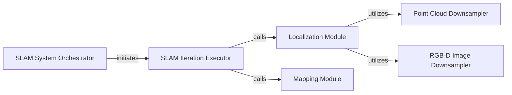

## Details

The `SLAM System Orchestrator` subsystem is primarily defined by the `gradslam.slam.icpslam` package, which encapsulates the core logic for Simultaneous Localization and Mapping. The subsystem boundaries are primarily within the `gradslam.slam.icpslam` module, with key dependencies extending to `gradslam.odometry.icputils` for data preprocessing utilities essential for localization.

### SLAM System Orchestrator [[Expand]](./SLAM_System_Orchestrator.md)
The central component that orchestrates the entire SLAM pipeline. It provides the main interface for users to initiate and control the SLAM process, integrating odometry and mapping functionalities.

**Related Classes/Methods**:

- <a href="https://github.com/gradslam/gradslam/blob/main/gradslam/slam/icpslam.py#L18-L264" target="_blank" rel="noopener noreferrer">`gradslam.slam.icpslam.ICPSLAM`:18-264</a>

### SLAM Iteration Executor
Executes a single, complete iteration of the SLAM algorithm. This involves sequentially performing both the localization and mapping sub-steps, ensuring a coherent update of the camera pose and the environment map.

**Related Classes/Methods**:

- <a href="https://github.com/gradslam/gradslam/blob/main/gradslam/slam/icpslam.py" target="_blank" rel="noopener noreferrer">`gradslam.slam.icpslam.ICPSLAM.step`</a>

### Localization Module
Estimates the current camera's pose (position and orientation) by aligning incoming sensor data with the existing map or previous frames. This component is responsible for the odometry aspect of SLAM.

**Related Classes/Methods**:

- <a href="https://github.com/gradslam/gradslam/blob/main/gradslam/slam/icpslam.py" target="_blank" rel="noopener noreferrer">`gradslam.slam.icpslam.ICPSLAM._localize`</a>

### Mapping Module
Updates and constructs the 3D representation of the environment. It integrates the localized sensor data into a consistent global map, refining the environmental model over time.

**Related Classes/Methods**:

- <a href="https://github.com/gradslam/gradslam/blob/main/gradslam/slam/icpslam.py" target="_blank" rel="noopener noreferrer">`gradslam.slam.icpslam.ICPSLAM._map`</a>

### Point Cloud Downsampler
Reduces the density of point cloud data to improve the computational efficiency of subsequent processing, particularly for ICP-based localization algorithms. This is a utility crucial for performance.

**Related Classes/Methods**:

- <a href="https://github.com/gradslam/gradslam/blob/main/gradslam/odometry/icputils.py#L548-L620" target="_blank" rel="noopener noreferrer">`gradslam.odometry.icputils.downsample_pointclouds`:548-620</a>

### RGB-D Image Downsampler
Reduces the resolution or density of RGB-D image data for efficient processing, similar to point cloud downsampling, specifically to prepare data for localization.

**Related Classes/Methods**:

- <a href="https://github.com/gradslam/gradslam/blob/main/gradslam/odometry/icputils.py#L623-L669" target="_blank" rel="noopener noreferrer">`gradslam.odometry.icputils.downsample_rgbdimages`:623-669</a>

### [FAQ](https://github.com/CodeBoarding/GeneratedOnBoardings/tree/main?tab=readme-ov-file#faq)