```mermaid
graph LR
    Configuration_Management["Configuration Management"]
    Data_Loaders_Preprocessing["Data Loaders & Preprocessing"]
    Geometric_Primitives_Utilities["Geometric Primitives & Utilities"]
    RGB_D_Point_Cloud_Data_Structures["RGB-D & Point Cloud Data Structures"]
    Odometry_Pose_Estimation["Odometry & Pose Estimation"]
    Mapping_Fusion["Mapping & Fusion"]
    SLAM_System_Orchestrator["SLAM System Orchestrator"]
    Data_Loaders_Preprocessing -- "Provides raw RGB-D data" --> RGB_D_Point_Cloud_Data_Structures
    RGB_D_Point_Cloud_Data_Structures -- "Supplies point cloud data for pose estimation" --> Odometry_Pose_Estimation
    Odometry_Pose_Estimation -- "Delivers estimated camera poses" --> SLAM_System_Orchestrator
    SLAM_System_Orchestrator -- "Directs map updates" --> Mapping_Fusion
    Mapping_Fusion -- "Updates and manages the global point cloud map" --> RGB_D_Point_Cloud_Data_Structures
    Configuration_Management -- "Provides configuration parameters" --> Data_Loaders_Preprocessing
    Configuration_Management -- "Provides configuration parameters" --> Geometric_Primitives_Utilities
    Configuration_Management -- "Provides configuration parameters" --> RGB_D_Point_Cloud_Data_Structures
    Configuration_Management -- "Provides configuration parameters" --> Odometry_Pose_Estimation
    Configuration_Management -- "Provides configuration parameters" --> Mapping_Fusion
    Configuration_Management -- "Provides configuration parameters" --> SLAM_System_Orchestrator
    Geometric_Primitives_Utilities -- "Provides core 3D mathematical operations" --> RGB_D_Point_Cloud_Data_Structures
    Geometric_Primitives_Utilities -- "Provides core 3D mathematical operations" --> Odometry_Pose_Estimation
    Geometric_Primitives_Utilities -- "Provides core 3D mathematical operations" --> Mapping_Fusion
    click Configuration_Management href "https://github.com/CodeBoarding/GeneratedOnBoardings/blob/main/gradslam/Configuration_Management.md" "Details"
    click Data_Loaders_Preprocessing href "https://github.com/CodeBoarding/GeneratedOnBoardings/blob/main/gradslam/Data_Loaders_Preprocessing.md" "Details"
    click RGB_D_Point_Cloud_Data_Structures href "https://github.com/CodeBoarding/GeneratedOnBoardings/blob/main/gradslam/RGB_D_Point_Cloud_Data_Structures.md" "Details"
    click Odometry_Pose_Estimation href "https://github.com/CodeBoarding/GeneratedOnBoardings/blob/main/gradslam/Odometry_Pose_Estimation.md" "Details"
    click Mapping_Fusion href "https://github.com/CodeBoarding/GeneratedOnBoardings/blob/main/gradslam/Mapping_Fusion.md" "Details"
    click SLAM_System_Orchestrator href "https://github.com/CodeBoarding/GeneratedOnBoardings/blob/main/gradslam/SLAM_System_Orchestrator.md" "Details"
```

## Details

The `gradslam` project implements a modular and differentiable SLAM system, structured around a clear data processing pipeline. At its foundation, `Configuration Management` provides system-wide parameters, while `Geometric Primitives & Utilities` offer core 3D mathematical operations. The process initiates with `Data Loaders & Preprocessing` supplying raw sensor data, which is then handled by `RGB-D & Point Cloud Data Structures` to form 3D representations. This structured data is crucial for `Odometry & Pose Estimation`, which calculates camera motion. The `SLAM System Orchestrator` acts as the central coordinator, leveraging pose estimates to direct `Mapping & Fusion` in building and maintaining a consistent global 3D map, ultimately managed within `RGB-D & Point Cloud Data Structures`. This architecture facilitates a flexible and extensible framework for research and development in differentiable SLAM.

### Configuration Management [[Expand]](./Configuration_Management.md)
Manages application-wide configuration parameters, allowing for flexible setup and modification of system behavior across all modules.

**Related Classes/Methods**:

- <a href="https://github.com/gradslam/gradslam/blob/main/gradslam/config/cfgnode.py" target="_blank" rel="noopener noreferrer">`gradslam.config.cfgnode`</a>

### Data Loaders & Preprocessing [[Expand]](./Data_Loaders_Preprocessing.md)
Responsible for loading, parsing, and initial preprocessing of various 3D datasets (e.g., ICL-NUIM, ScanNet, TUM). It provides raw sensor data (RGB images, depth maps, camera poses, intrinsics) to the system.

**Related Classes/Methods**:

- <a href="https://github.com/gradslam/gradslam/blob/main/gradslam/datasets/icl.py" target="_blank" rel="noopener noreferrer">`gradslam.datasets.icl`</a>
- <a href="https://github.com/gradslam/gradslam/blob/main/gradslam/datasets/scannet.py" target="_blank" rel="noopener noreferrer">`gradslam.datasets.scannet`</a>
- <a href="https://github.com/gradslam/gradslam/blob/main/gradslam/datasets/tum.py" target="_blank" rel="noopener noreferrer">`gradslam.datasets.tum`</a>
- <a href="https://github.com/gradslam/gradslam/blob/main/gradslam/datasets/datautils.py" target="_blank" rel="noopener noreferrer">`gradslam.datasets.datautils`</a>
- <a href="https://github.com/gradslam/gradslam/blob/main/gradslam/datasets/tumutils.py" target="_blank" rel="noopener noreferrer">`gradslam.datasets.tumutils`</a>

### Geometric Primitives & Utilities
Provides a collection of fundamental mathematical operations for 3D geometry, including transformations, projections, and SE(3)/SO(3) algebra. These are foundational building blocks for other modules.

**Related Classes/Methods**:

- <a href="https://github.com/gradslam/gradslam/blob/main/gradslam/geometry/geometryutils.py" target="_blank" rel="noopener noreferrer">`gradslam.geometry.geometryutils`</a>
- <a href="https://github.com/gradslam/gradslam/blob/main/gradslam/geometry/projutils.py" target="_blank" rel="noopener noreferrer">`gradslam.geometry.projutils`</a>
- <a href="https://github.com/gradslam/gradslam/blob/main/gradslam/geometry/se3utils.py" target="_blank" rel="noopener noreferrer">`gradslam.geometry.se3utils`</a>

### RGB-D & Point Cloud Data Structures [[Expand]](./RGB_D_Point_Cloud_Data_Structures.md)
Encapsulates RGB-D image data and manages 3D point cloud data. It provides methods for deriving 3D information (vertex/normal maps) and supports geometric transformations on point clouds. This component combines the RGB-D Data Structures and Point Cloud Data Structures for a more consolidated visual representation.

**Related Classes/Methods**:

- <a href="https://github.com/gradslam/gradslam/blob/main/gradslam/structures/rgbdimages.py" target="_blank" rel="noopener noreferrer">`gradslam.structures.rgbdimages`</a>
- <a href="https://github.com/gradslam/gradslam/blob/main/gradslam/structures/pointclouds.py" target="_blank" rel="noopener noreferrer">`gradslam.structures.pointclouds`</a>
- <a href="https://github.com/gradslam/gradslam/blob/main/gradslam/structures/utils.py" target="_blank" rel="noopener noreferrer">`gradslam.structures.utils`</a>
- <a href="https://github.com/gradslam/gradslam/blob/main/gradslam/structures/structutils.py" target="_blank" rel="noopener noreferrer">`gradslam.structures.structutils`</a>

### Odometry & Pose Estimation [[Expand]](./Odometry_Pose_Estimation.md)
Estimates the relative camera motion (pose) between consecutive frames, typically using Iterative Closest Point (ICP) variants.

**Related Classes/Methods**:

- <a href="https://github.com/gradslam/gradslam/blob/main/gradslam/odometry/icputils.py" target="_blank" rel="noopener noreferrer">`gradslam.odometry.icputils`</a>
- <a href="https://github.com/gradslam/gradslam/blob/main/gradslam/odometry/icp.py" target="_blank" rel="noopener noreferrer">`gradslam.odometry.icp`</a>
- <a href="https://github.com/gradslam/gradslam/blob/main/gradslam/odometry/gradicp.py" target="_blank" rel="noopener noreferrer">`gradslam.odometry.gradicp`</a>
- <a href="https://github.com/gradslam/gradslam/blob/main/gradslam/odometry/base.py" target="_blank" rel="noopener noreferrer">`gradslam.odometry.base`</a>
- <a href="https://github.com/gradslam/gradslam/blob/main/gradslam/odometry/groundtruth.py" target="_blank" rel="noopener noreferrer">`gradslam.odometry.groundtruth`</a>

### Mapping & Fusion [[Expand]](./Mapping_Fusion.md)
Integrates new sensor data into a consistent global 3D map, often by fusing new point clouds with existing map points.

**Related Classes/Methods**:

- <a href="https://github.com/gradslam/gradslam/blob/main/gradslam/slam/fusionutils.py" target="_blank" rel="noopener noreferrer">`gradslam.slam.fusionutils`</a>
- <a href="https://github.com/gradslam/gradslam/blob/main/gradslam/slam/pointfusion.py" target="_blank" rel="noopener noreferrer">`gradslam.slam.pointfusion`</a>

### SLAM System Orchestrator [[Expand]](./SLAM_System_Orchestrator.md)
Orchestrates the entire Simultaneous Localization and Mapping process, combining odometry for camera pose estimation and mapping for building a consistent 3D environment. This component acts as the central coordinator for the SLAM pipeline.

**Related Classes/Methods**:

- <a href="https://github.com/gradslam/gradslam/blob/main/gradslam/slam/icpslam.py" target="_blank" rel="noopener noreferrer">`gradslam.slam.icpslam`</a>

### [FAQ](https://github.com/CodeBoarding/GeneratedOnBoardings/tree/main?tab=readme-ov-file#faq)