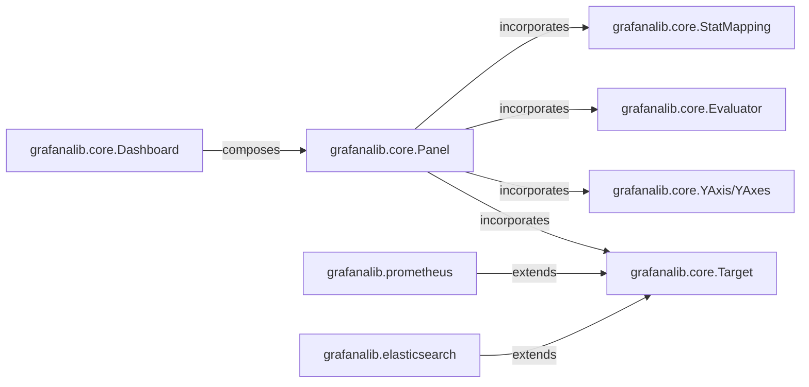

## Details

The Dashboard Definition DSL subsystem encompasses the Python modules responsible for defining Grafana dashboard structures programmatically. Its primary boundaries are defined by: grafanalib.core, grafanalib.prometheus, and grafanalib.elasticsearch. These modules collectively form the Pythonic DSL that allows users to define complex Grafana dashboards as code, adhering to the "Dashboard as Code" architectural pattern.

### grafanalib.core.Dashboard
Serves as the top-level container for a Grafana dashboard. It orchestrates and manages a collection of `Panel` objects and defines dashboard-wide settings such as title, description, and time range.

**Related Classes/Methods**:

- <a href="https://github.com/weaveworks/grafanalib/blob/main/grafanalib/core.py#L1767-L1885" target="_blank" rel="noopener noreferrer">`grafanalib.core.Dashboard`:1767-1885</a>

### grafanalib.core.Panel
Encapsulates the configuration for a single visualization panel within a dashboard. This includes defining data sources, queries (`Target`s), display options, Y-axis configurations (`YAxis`/`YAxes`), and potentially alert conditions (`Evaluator`s) and data mappings (`StatMapping`).

**Related Classes/Methods**:

- <a href="https://github.com/weaveworks/grafanalib/blob/main/grafanalib/core.py#L1902-L1996" target="_blank" rel="noopener noreferrer">`grafanalib.core.Panel`:1902-1996</a>

### grafanalib.core.Target
Acts as an abstract base class defining the common interface for data queries. It specifies the fundamental properties required for any data source query within a panel, serving as the extensible point for various data sources.

**Related Classes/Methods**:

- <a href="https://github.com/weaveworks/grafanalib/blob/main/grafanalib/core.py" target="_blank" rel="noopener noreferrer">`grafanalib.core.Target`</a>

### grafanalib.prometheus
Provides specialized implementations of `grafanalib.core.Target` for defining queries against Prometheus data sources. This includes Prometheus-specific query language and parameters, allowing the DSL to interact with Prometheus.

**Related Classes/Methods**:

- <a href="https://github.com/weaveworks/grafanalib/blob/main/grafanalib/prometheus.py" target="_blank" rel="noopener noreferrer">`grafanalib.prometheus`</a>

### grafanalib.elasticsearch
Provides specialized implementations of `grafanalib.core.Target` for defining queries and aggregations against Elasticsearch data sources. This extends the DSL's capability to integrate with Elasticsearch.

**Related Classes/Methods**:

- <a href="https://github.com/weaveworks/grafanalib/blob/main/grafanalib/elasticsearch.py" target="_blank" rel="noopener noreferrer">`grafanalib.elasticsearch`</a>

### grafanalib.core.YAxis/YAxes
Configures the properties of the Y-axis for panels, such as units, labels, and value ranges, enabling detailed control over panel visualization.

**Related Classes/Methods**:

- <a href="https://github.com/weaveworks/grafanalib/blob/main/grafanalib/core.py" target="_blank" rel="noopener noreferrer">`grafanalib.core.YAxis`</a>
- <a href="https://github.com/weaveworks/grafanalib/blob/main/grafanalib/core.py" target="_blank" rel="noopener noreferrer">`grafanalib.core.YAxes`</a>

### grafanalib.core.Evaluator
Defines the logic and conditions for evaluating alerts associated with a panel, allowing users to embed alerting rules directly within the dashboard definition.

**Related Classes/Methods**:

- <a href="https://github.com/weaveworks/grafanalib/blob/main/grafanalib/core.py" target="_blank" rel="noopener noreferrer">`grafanalib.core.Evaluator`</a>

### grafanalib.core.StatMapping
Defines rules for mapping statistical data within panels, such as value-to-text transformations or color coding based on thresholds, enhancing data presentation.

**Related Classes/Methods**:

- <a href="https://github.com/weaveworks/grafanalib/blob/main/grafanalib/core.py#L2944-L2976" target="_blank" rel="noopener noreferrer">`grafanalib.core.StatMapping`:2944-2976</a>

### [FAQ](https://github.com/CodeBoarding/GeneratedOnBoardings/tree/main?tab=readme-ov-file#faq)