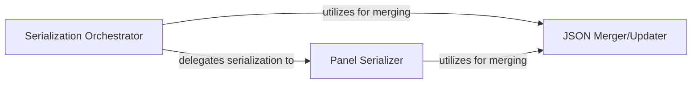

## Details

The `JSON Serialization Engine` subsystem is responsible for converting Python objects, defined by the Grafana DSL, into their corresponding Grafana-compatible JSON representations. Its core functionality revolves around the recursive traversal and conversion of these objects into the final JSON structure.

### Serialization Orchestrator
This component acts as the primary entry point and orchestrator for the entire JSON serialization process. It initiates the conversion of various high-level Python objects (e.g., `Dashboard`, `Panel`, `Row`) into their corresponding Grafana JSON structures. It manages the overall serialization flow and delegates specific conversion tasks to specialized components.

**Related Classes/Methods**:

- <a href="https://github.com/weaveworks/grafanalib/blob/main/grafanalib/core.py" target="_blank" rel="noopener noreferrer">`grafanalib.core:to_json_data`</a>

### Panel Serializer
This component is specifically focused on the serialization of individual Grafana panels. It ensures that all panel-specific attributes, configurations, and nested elements (such as targets, links, and thresholds) are correctly formatted and included in the JSON output for a given panel.

**Related Classes/Methods**:

- <a href="https://github.com/weaveworks/grafanalib/blob/main/grafanalib/core.py" target="_blank" rel="noopener noreferrer">`grafanalib.core:panel_json`</a>

### JSON Merger/Updater
This component provides a fundamental utility for recursively merging and updating dictionary structures. This is crucial for incrementally building complex, deeply nested JSON objects, as Grafana dashboards are composed of many hierarchical elements that need to be combined, and default values often need to be overridden or new properties added seamlessly.

**Related Classes/Methods**:

- <a href="https://github.com/weaveworks/grafanalib/blob/main/grafanalib/core.py" target="_blank" rel="noopener noreferrer">`grafanalib.core:_deep_update`</a>

### [FAQ](https://github.com/CodeBoarding/GeneratedOnBoardings/tree/main?tab=readme-ov-file#faq)