```mermaid
graph LR
    User_Dashboard_Definition_Python_Script_["User Dashboard Definition (Python Script)"]
    Dashboard_Definition_DSL["Dashboard Definition DSL"]
    JSON_Serialization_Engine["JSON Serialization Engine"]
    Output_Management_CLI["Output Management & CLI"]
    User_Dashboard_Definition_Python_Script_ -- "Defines Dashboards Using" --> Dashboard_Definition_DSL
    Dashboard_Definition_DSL -- "Provides Objects For" --> JSON_Serialization_Engine
    JSON_Serialization_Engine -- "Generates JSON For" --> Output_Management_CLI
    Output_Management_CLI -- "Loads & Executes" --> User_Dashboard_Definition_Python_Script_
    click Dashboard_Definition_DSL href "https://github.com/CodeBoarding/GeneratedOnBoardings/blob/main/grafanalib/Dashboard_Definition_DSL.md" "Details"
    click JSON_Serialization_Engine href "https://github.com/CodeBoarding/GeneratedOnBoardings/blob/main/grafanalib/JSON_Serialization_Engine.md" "Details"
```

## Details

`grafanalib` is architected as a "Dashboard as Code" solution, facilitating the programmatic generation of Grafana dashboards and alert configurations. The system's core flow begins with User Dashboard Definition (Python Script), where users leverage the Dashboard Definition DSL to construct Python objects representing Grafana entities. These objects are then fed into the JSON Serialization Engine, which meticulously transforms them into valid Grafana JSON. Finally, the Output Management & CLI component orchestrates the entire process, loading user scripts, triggering the serialization, and managing the output of the generated JSON to files or standard output, ready for deployment to a Grafana instance. This architecture emphasizes a clear, unidirectional data flow from Pythonic definition to deployable JSON.

### User Dashboard Definition (Python Script)
User-authored Python files (.py) that serve as the primary input to `grafanalib`. These scripts define Grafana dashboards and alert groups by importing and instantiating objects from the `grafanalib` DSL.

**Related Classes/Methods**:

- <a href="https://github.com/weaveworks/grafanalib/blob/main/grafanalib/tests/examples/example.dashboard.py" target="_blank" rel="noopener noreferrer">`grafanalib.tests.examples.example.dashboard`</a>

### Dashboard Definition DSL [[Expand]](./Dashboard_Definition_DSL.md)
This component provides the Pythonic Domain-Specific Language (DSL) for defining Grafana dashboard elements. It includes core components like `Dashboard`, `Panel`, and `Target` (`grafanalib.core.py`), as well as specialized extensions for various data sources (e.g., `grafanalib.prometheus.py`, `grafanalib.elasticsearch.py`).

**Related Classes/Methods**:

- <a href="https://github.com/weaveworks/grafanalib/blob/main/grafanalib/core.py" target="_blank" rel="noopener noreferrer">`grafanalib.core`</a>
- <a href="https://github.com/weaveworks/grafanalib/blob/main/grafanalib/prometheus.py" target="_blank" rel="noopener noreferrer">`grafanalib.prometheus`</a>

### JSON Serialization Engine [[Expand]](./JSON_Serialization_Engine.md)
The core conversion component responsible for transforming the Python objects defined by the DSL into their corresponding Grafana-compatible JSON representations. It handles the recursive traversal and conversion of complex Python objects into the final JSON structure.

**Related Classes/Methods**:

- <a href="https://github.com/weaveworks/grafanalib/blob/main/grafanalib/core.py" target="_blank" rel="noopener noreferrer">`grafanalib.core:to_json_data`</a>
- <a href="https://github.com/weaveworks/grafanalib/blob/main/grafanalib/core.py" target="_blank" rel="noopener noreferrer">`grafanalib.core:panel_json`</a>
- <a href="https://github.com/weaveworks/grafanalib/blob/main/grafanalib/core.py" target="_blank" rel="noopener noreferrer">`grafanalib.core:_deep_update`</a>

### Output Management & CLI
This component orchestrates the high-level process of generating, loading, and writing the final Grafana JSON output. It includes the command-line interface (CLI) entry points, which parse arguments, load user-defined Python dashboard scripts, invoke the serialization process, and manage writing the resulting JSON to files or standard output.

**Related Classes/Methods**:

- <a href="https://github.com/weaveworks/grafanalib/blob/main/grafanalib/_gen.py" target="_blank" rel="noopener noreferrer">`grafanalib._gen:generate_dashboards`</a>
- <a href="https://github.com/weaveworks/grafanalib/blob/main/grafanalib/_gen.py" target="_blank" rel="noopener noreferrer">`grafanalib._gen:write_dashboards`</a>
- <a href="https://github.com/weaveworks/grafanalib/blob/main/grafanalib/_gen.py" target="_blank" rel="noopener noreferrer">`grafanalib._gen:run_script`</a>

### [FAQ](https://github.com/CodeBoarding/GeneratedOnBoardings/tree/main?tab=readme-ov-file#faq)