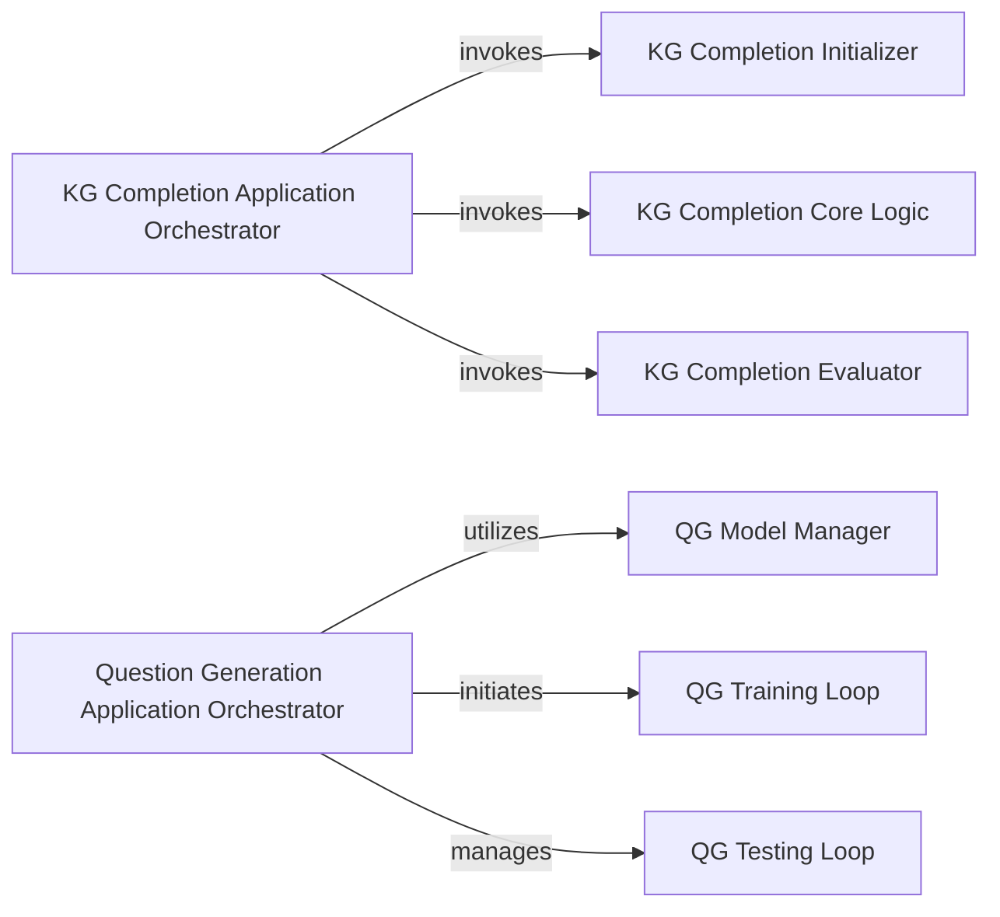

## Details

The system is composed of two main applications: Knowledge Graph Completion (KGC) and Question Generation (QG). The KGC application is orchestrated by the `KG Completion Application Orchestrator`, which initializes the environment, executes the core KGC logic, and evaluates the model's performance. The QG application is managed by the `Question Generation Application Orchestrator`, responsible for the overall workflow including model management, training, and testing phases. Both applications follow a typical machine learning pipeline structure, with distinct components handling data preparation, model execution, and evaluation.

### KG Completion Application Orchestrator
This component serves as the primary entry point and top-level controller for the Knowledge Graph Completion application. It is responsible for parsing command-line arguments, initializing the overall process, and coordinating the execution flow of the KG Completion task, including setup, core algorithm execution, and evaluation.

**Related Classes/Methods**:

- <a href="https://github.com/graph4ai/graph4nlp/blob/master/examples/pytorch/kg_completion/inference.py#L124-L185" target="_blank" rel="noopener noreferrer">`main`:124-185</a>

### Question Generation Application Orchestrator
This component acts as the main entry point and high-level coordinator for the Question Generation application. It manages the entire workflow, including argument parsing, model management, training, testing, and inference phases for the Question Generation task.

**Related Classes/Methods**:

- <a href="https://github.com/graph4ai/graph4nlp/blob/master/examples/pytorch/kg_completion/inference.py#L124-L185" target="_blank" rel="noopener noreferrer">`main`:124-185</a>

### KG Completion Initializer
Responsible for setting up the environment and preparing necessary components (e.g., data loaders, models) specifically for the Knowledge Graph Completion task.

**Related Classes/Methods**:

- <a href="https://github.com/graph4ai/graph4nlp/blob/master/examples/pytorch/kg_completion/inference_advance.py#L46-L47" target="_blank" rel="noopener noreferrer">`init`:46-47</a>

### KG Completion Core Logic
Encapsulates the main algorithmic execution for the Knowledge Graph Completion task, performing the core computations and model interactions.

**Related Classes/Methods**:

- <a href="https://github.com/graph4ai/graph4nlp/blob/master/examples/pytorch/kg_completion/inference_advance.py#L21-L69" target="_blank" rel="noopener noreferrer">`KGC`:21-69</a>

### KG Completion Evaluator
Handles the task-specific evaluation metrics and procedures for assessing the performance of the Knowledge Graph Completion model.

**Related Classes/Methods**:

- <a href="https://github.com/graph4ai/graph4nlp/blob/master/examples/pytorch/kg_completion/inference.py#L23-L121" target="_blank" rel="noopener noreferrer">`ranking_and_hits_this`:23-121</a>

### QG Model Manager
Manages the lifecycle of the Question Generation model, including its instantiation, loading pre-trained weights, and saving trained models.

**Related Classes/Methods**:

- <a href="https://github.com/graph4ai/graph4nlp/blob/master/examples/pytorch/question_generation/inference.py#L25-L70" target="_blank" rel="noopener noreferrer">`ModelHandler`:25-70</a>

### QG Training Loop
Orchestrates the training process for the Question Generation model, including iterating over epochs, managing batches, and performing optimization steps.

**Related Classes/Methods**:

- <a href="https://github.com/graph4ai/graph4nlp/blob/master/examples/pytorch/math_word_problem/mathqa/src/runner.py#L155-L169" target="_blank" rel="noopener noreferrer">`train`:155-169</a>

### QG Testing Loop
Manages the inference and testing phase for the Question Generation model, evaluating its performance on unseen data.

**Related Classes/Methods**:

- <a href="https://github.com/graph4ai/graph4nlp/blob/master/examples/pytorch/name_entity_recognition/inference_advance.py#L191-L210" target="_blank" rel="noopener noreferrer">`test`:191-210</a>

### [FAQ](https://github.com/CodeBoarding/GeneratedOnBoardings/tree/main?tab=readme-ov-file#faq)