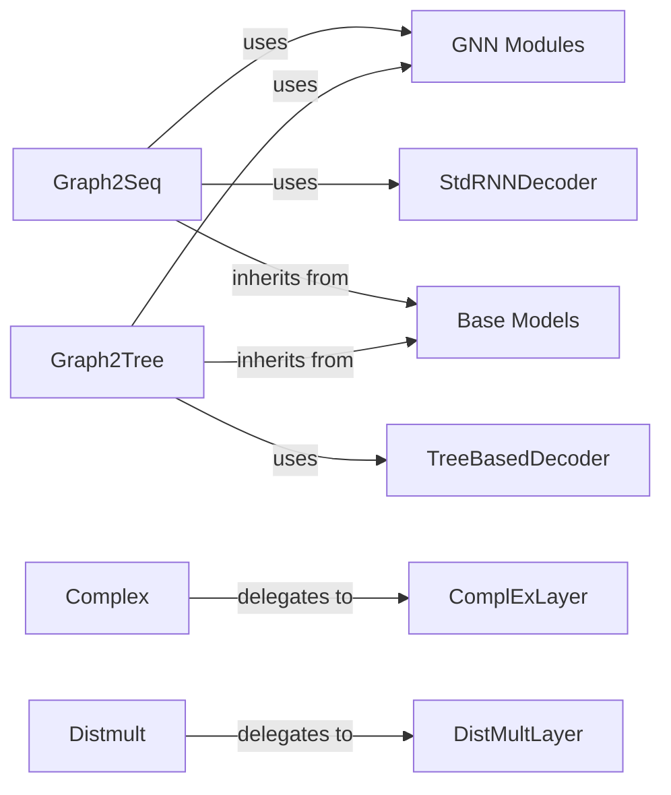

## Details

The `graph4nlp` project's core architecture for graph-to-sequence and graph-to-tree tasks revolves around two primary orchestrators: `Graph2Seq` and `Graph2Tree`. Both inherit from `Base Models`, establishing a common foundation for graph-based neural network models. `Graph2Seq` leverages `GNN Modules` for graph representation learning and `StdRNNDecoder` for sequence generation, making it suitable for tasks like neural machine translation. Similarly, `Graph2Tree` utilizes `GNN Modules` for graph encoding but employs a `TreeBasedDecoder` to produce structured tree outputs, catering to tasks suchs as semantic parsing. For knowledge graph completion, the `Complex` and `Distmult` models are provided, which delegate their core prediction logic to `ComplExLayer` and `DistMultLayer` respectively. This modular design allows for flexible integration of various GNN encoders and decoders, promoting reusability and extensibility across different graph-based NLP tasks.

### Graph2Seq
Orchestrates the end-to-end Graph-to-Sequence pipeline, managing the flow from input graph processing through graph representation learning to output sequence decoding. It is designed for tasks like Neural Machine Translation or Summarization.

**Related Classes/Methods**:

- <a href="https://github.com/graph4ai/graph4nlp/blob/master/graph4nlp/pytorch/models/graph2seq.py#L14-L367" target="_blank" rel="noopener noreferrer">`graph4nlp.pytorch.models.graph2seq.Graph2Seq`:14-367</a>

### Graph2Tree
Orchestrates the end-to-end Graph-to-Tree pipeline, integrating graph representation learning with the generation of tree structures. This is crucial for tasks such as semantic parsing where the output is a structured tree.

**Related Classes/Methods**:

- <a href="https://github.com/graph4ai/graph4nlp/blob/master/graph4nlp/pytorch/models/graph2tree.py#L13-L413" target="_blank" rel="noopener noreferrer">`graph4nlp.pytorch.models.graph2tree.Graph2Tree`:13-413</a>

### Complex
Implements the ComplEx model, a specific knowledge graph embedding model used for Knowledge Graph Completion tasks. It handles the complex-valued embeddings and their interaction for link prediction.

**Related Classes/Methods**:

- <a href="https://github.com/graph4ai/graph4nlp/blob/master/examples/pytorch/kg_completion/model.py" target="_blank" rel="noopener noreferrer">`examples.pytorch.kg_completion.model.Complex`</a>

### Distmult
Implements the DistMult model, another knowledge graph embedding model for Knowledge Graph Completion. It focuses on a simpler, element-wise multiplication interaction for link prediction.

**Related Classes/Methods**:

- <a href="https://github.com/graph4ai/graph4nlp/blob/master/examples/pytorch/kg_completion/model.py" target="_blank" rel="noopener noreferrer">`examples.pytorch.kg_completion.model.Distmult`</a>

### Base Models
Provides a foundational abstract layer for building various graph neural network (GNN) encoders and embedding encoders. It promotes code reuse and defines common interfaces for higher-level models.

**Related Classes/Methods**:

- <a href="https://github.com/graph4ai/graph4nlp/blob/master/graph4nlp/pytorch/models/base.py" target="_blank" rel="noopener noreferrer">`graph4nlp.pytorch.models.base.BaseModels`</a>

### GNN Modules
Represents various Graph Neural Network (GNN) layers used for learning graph representations.

**Related Classes/Methods**:

- <a href="https://github.com/graph4ai/graph4nlp/blob/master/graph4nlp/pytorch/modules/graph_embedding_learning/gcn.py#L9-L193" target="_blank" rel="noopener noreferrer">`graph4nlp.pytorch.modules.graph_embedding_learning.gcn.GCN`:9-193</a>

### StdRNNDecoder
A standard RNN-based decoder for generating output sequences.

**Related Classes/Methods**:

- <a href="https://github.com/graph4ai/graph4nlp/blob/master/pytorch/modules/prediction/generation/StdRNNDecoder.py" target="_blank" rel="noopener noreferrer">`graph4nlp.pytorch.modules.prediction.generation.StdRNNDecoder`</a>

### TreeBasedDecoder
A specialized tree-based decoder for generating structured tree outputs.

**Related Classes/Methods**:

- <a href="https://github.com/graph4ai/graph4nlp/blob/master/pytorch/modules/prediction/generation/TreeBasedDecoder.py" target="_blank" rel="noopener noreferrer">`graph4nlp.pytorch.modules.prediction.generation.TreeBasedDecoder`</a>

### ComplExLayer
Component responsible for the core complex-valued prediction logic in the ComplEx model.

**Related Classes/Methods**:

- <a href="https://github.com/graph4ai/graph4nlp/blob/master/pytorch/modules/prediction/classification/kg_completion/ComplExLayer.py" target="_blank" rel="noopener noreferrer">`graph4nlp.pytorch.modules.prediction.classification.kg_completion.ComplExLayer`</a>

### DistMultLayer
Component responsible for the core element-wise multiplication prediction logic in the DistMult model.

**Related Classes/Methods**:

- <a href="https://github.com/graph4ai/graph4nlp/blob/master/pytorch/modules/prediction/classification/kg_completion/DistMultLayer.py" target="_blank" rel="noopener noreferrer">`graph4nlp.pytorch.modules.prediction.classification.kg_completion.DistMultLayer`</a>

### [FAQ](https://github.com/CodeBoarding/GeneratedOnBoardings/tree/main?tab=readme-ov-file#faq)