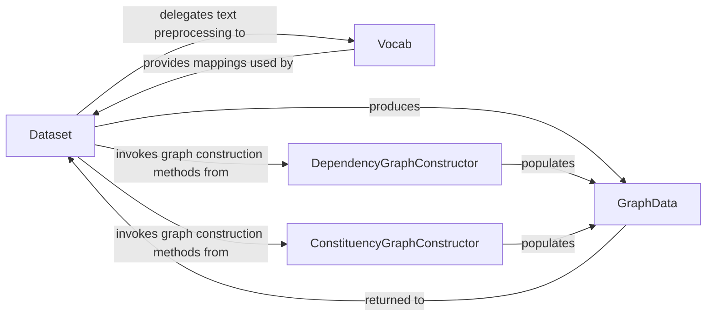

## Details

The `graph4nlp` data processing subsystem orchestrates the transformation of raw input data into a graph-based representation suitable for neural network consumption. The `Dataset` component initiates this pipeline, managing data ingestion and coordinating with `Vocab` for text preprocessing and `DependencyGraphConstructor` or `ConstituencyGraphConstructor` for generating specific graph topologies. The ultimate output of this subsystem is the `GraphData` object, which encapsulates the structured graph information for downstream model processing. This clear separation of concerns ensures modularity and facilitates the integration of various graph construction techniques.

### Dataset
Acts as the primary orchestrator for the data pipeline within this subsystem. It handles raw data ingestion, coordinates preprocessing steps like tokenization and vocabulary building, and invokes specific graph construction modules to generate graph topologies. Its ultimate responsibility is to produce vectorized `GraphData` instances ready for model consumption.

**Related Classes/Methods**:

- <a href="https://github.com/graph4ai/graph4nlp/blob/master/graph4nlp/pytorch/data/dataset.py#L236-L824" target="_blank" rel="noopener noreferrer">`graph4nlp.pytorch.data.dataset.Dataset`:236-824</a>

### Vocab
Manages the vocabulary for text data. This includes building the vocabulary from raw text, providing mappings between words and numerical indices, and supporting the loading of pre-trained word embeddings. It's a crucial utility for text-to-ID conversion.

**Related Classes/Methods**:

### DependencyGraphConstructor
Specializes in constructing dependency graphs from input text. It parses text to identify syntactic dependency relations and builds the corresponding graph structure, populating a `GraphData` instance with nodes (words) and edges (dependencies).

**Related Classes/Methods**:

### ConstituencyGraphConstructor
Specializes in constructing constituency graphs from input text. It parses text to identify constituency structures (e.g., noun phrases, verb phrases) and builds the corresponding graph structure, populating a `GraphData` instance with phrase-level nodes and their hierarchical relationships.

**Related Classes/Methods**:

### GraphData
Serves as the fundamental data structure for representing a single graph within the system. It encapsulates nodes, edges, and their associated features/attributes, providing a standardized format for graph manipulation and interaction across different components. It is the primary output of this subsystem.

**Related Classes/Methods**:

- <a href="https://github.com/graph4ai/graph4nlp/blob/master/graph4nlp/pytorch/data/data.py#L54-L1068" target="_blank" rel="noopener noreferrer">`graph4nlp.pytorch.data.data.GraphData`:54-1068</a>

### [FAQ](https://github.com/CodeBoarding/GeneratedOnBoardings/tree/main?tab=readme-ov-file#faq)