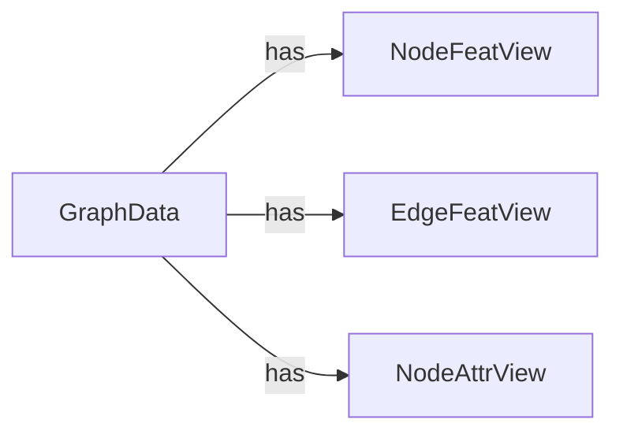

## Details

Updated analysis of graph4nlp/pytorch/data components with source code references.

### GraphData
Represents a graph data structure, encapsulating nodes, edges, and their features. It serves as the fundamental data container within the graph4nlp framework.

**Related Classes/Methods**:

- <a href="https://github.com/graph4ai/graph4nlp/blob/master/graph4nlp/pytorch/data/data.py#L54-L1068" target="_blank" rel="noopener noreferrer">`graph4nlp.pytorch.data.data.GraphData`:54-1068</a>

### NodeFeatView
Provides a view for accessing and manipulating node features within a GraphData object.

**Related Classes/Methods**:

- <a href="https://github.com/graph4ai/graph4nlp/blob/master/graph4nlp/pytorch/data/views.py#L60-L79" target="_blank" rel="noopener noreferrer">`graph4nlp.pytorch.data.views.NodeFeatView`:60-79</a>

### EdgeFeatView
Provides a view for accessing and manipulating edge features within a GraphData object.

**Related Classes/Methods**:

- <a href="https://github.com/graph4ai/graph4nlp/blob/master/graph4nlp/pytorch/data/views.py#L127-L139" target="_blank" rel="noopener noreferrer">`graph4nlp.pytorch.data.views.EdgeFeatView`:127-139</a>

### NodeAttrView
Provides a view for accessing and manipulating node attributes within a GraphData object.

**Related Classes/Methods**:

- <a href="https://github.com/graph4ai/graph4nlp/blob/master/graph4nlp/pytorch/data/views.py#L82-L106" target="_blank" rel="noopener noreferrer">`graph4nlp.pytorch.data.views.NodeAttrView`:82-106</a>

### [FAQ](https://github.com/CodeBoarding/GeneratedOnBoardings/tree/main?tab=readme-ov-file#faq)