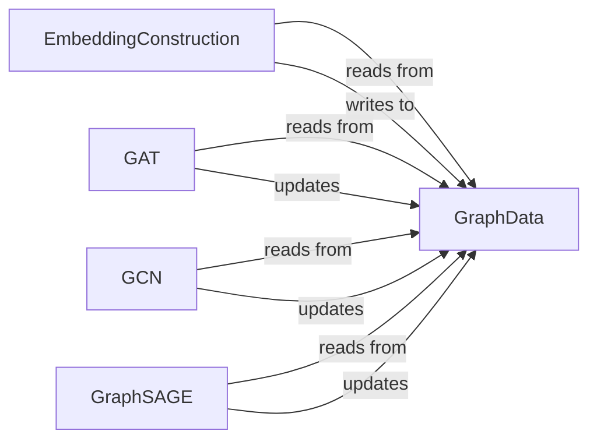

## Details

The core of this subsystem revolves around the GraphData component, which serves as the central repository for graph topology and feature embeddings. The process begins with the EmbeddingConstruction component, responsible for initializing numerical embeddings by reading raw graph features from GraphData and subsequently writing the processed embeddings back into it. Following this initialization, various Graph Neural Network (GNN) models, specifically GAT, GCN, and GraphSAGE, interact with GraphData. Each GNN model reads the current graph structure and embeddings from GraphData, performs its specialized embedding learning operations, and then updates GraphData with the refined embeddings. This iterative read-and-update pattern forms the critical interaction pathway, allowing the GNNs to progressively learn and refine the graph representations stored within GraphData.

### GraphData
Serves as the central, mutable data structure for the entire subsystem. It holds the graph topology, initial node/edge features, and is updated with the learned embeddings by the GNN components. It acts as the primary interface for data input and output within this subsystem.

**Related Classes/Methods**:

- <a href="https://github.com/graph4ai/graph4nlp/blob/master/graph4nlp/pytorch/data/data.py" target="_blank" rel="noopener noreferrer">`graph4nlp.pytorch.data.data`</a>

### EmbeddingConstruction
Initializes numerical embeddings for nodes and edges within a GraphData object. It prepares the raw graph features by converting them into a suitable numerical format, often leveraging pre-trained word embeddings or simple aggregation methods.

**Related Classes/Methods**:

- <a href="https://github.com/graph4ai/graph4nlp/blob/master/graph4nlp/pytorch/modules/graph_embedding_initialization/embedding_construction.py" target="_blank" rel="noopener noreferrer">`graph4nlp.pytorch.modules.graph_embedding_initialization.embedding_construction`</a>

### GAT
Implements the Graph Attention Network architecture. It learns graph embeddings by applying attention mechanisms over graph neighborhoods, allowing nodes to selectively attend to their neighbors.

**Related Classes/Methods**:

- <a href="https://github.com/graph4ai/graph4nlp/blob/master/graph4nlp/pytorch/modules/graph_embedding_learning/gat.py" target="_blank" rel="noopener noreferrer">`graph4nlp.pytorch.modules.graph_embedding_learning.gat`</a>

### GCN
Implements the Graph Convolutional Network architecture. It learns graph embeddings through convolutional operations that aggregate information from neighboring nodes, typically using a fixed aggregation scheme.

**Related Classes/Methods**:

- <a href="https://github.com/graph4ai/graph4nlp/blob/master/graph4nlp/pytorch/modules/graph_embedding_learning/gcn.py" target="_blank" rel="noopener noreferrer">`graph4nlp.pytorch.modules.graph_embedding_learning.gcn`</a>

### GraphSAGE
Implements the GraphSAGE architecture. It learns node embeddings by sampling and aggregating features from a node's local neighborhood, making it suitable for large-scale graphs.

**Related Classes/Methods**:

- <a href="https://github.com/graph4ai/graph4nlp/blob/master/graph4nlp/pytorch/modules/graph_embedding_learning/graphsage.py" target="_blank" rel="noopener noreferrer">`graph4nlp.pytorch.modules.graph_embedding_learning.graphsage`</a>

### [FAQ](https://github.com/CodeBoarding/GeneratedOnBoardings/tree/main?tab=readme-ov-file#faq)