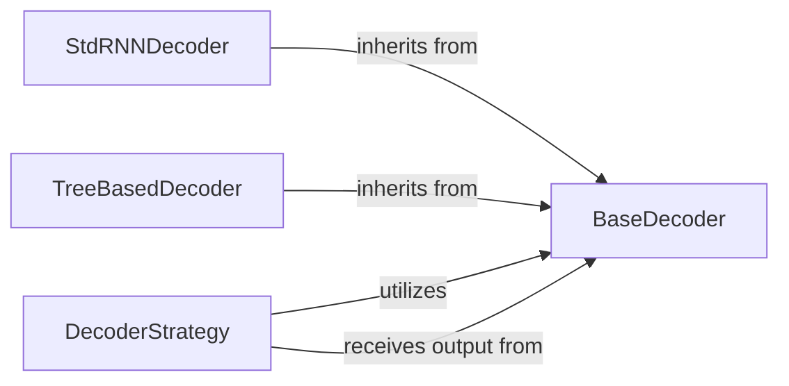

## Details

The `Prediction & Decoding` subsystem is a core part of the `graph4nlp` framework, specifically responsible for transforming encoded graph representations into final, human-interpretable outputs such as text sequences or tree structures. This subsystem encapsulates the logic for sequence and tree generation, incorporating various search algorithms for optimal inference. It acts as the final stage in the model's pipeline, converting internal representations into actionable results.

### BaseDecoder
This abstract base class serves as the foundational interface for all decoder implementations within the `graph4nlp` framework. It defines the common contract and essential functionalities that any concrete decoder must adhere to, ensuring architectural consistency and extensibility for various output formats (sequences, trees). Its importance lies in establishing a unified API for decoding operations.

**Related Classes/Methods**:

- <a href="https://github.com/graph4ai/graph4nlp/blob/master/graph4nlp/pytorch/modules/prediction/generation/base.py" target="_blank" rel="noopener noreferrer">`BaseDecoder`</a>

### StdRNNDecoder
A concrete implementation of `BaseDecoder` tailored for generating sequential outputs, typically text. It leverages Recurrent Neural Networks (RNNs) and incorporates mechanisms like attention and out-of-vocabulary (OOV) token handling to produce high-quality sequences step-by-step. This component is crucial for tasks like Neural Machine Translation or summarization.

**Related Classes/Methods**:

- <a href="https://github.com/graph4ai/graph4nlp/blob/master/graph4nlp/pytorch/modules/prediction/generation/StdRNNDecoder.py#L18-L629" target="_blank" rel="noopener noreferrer">`StdRNNDecoder`:18-629</a>

### TreeBasedDecoder
Another concrete implementation of `BaseDecoder`, this component specializes in generating tree-structured outputs. It adapts the recurrent decoding paradigm to construct hierarchical data structures, which is essential for tasks like semantic parsing or code generation where the output has a defined structural grammar.

**Related Classes/Methods**:

- <a href="https://github.com/graph4ai/graph4nlp/blob/master/graph4nlp/pytorch/modules/prediction/generation/TreeBasedDecoder.py" target="_blank" rel="noopener noreferrer">`TreeBasedDecoder`</a>

### DecoderStrategy
This component is responsible for orchestrating the overall search process to find the optimal output sequence or tree. It implements various search algorithms, such as beam search, by iteratively interacting with a `BaseDecoder` instance. It manages hypotheses, explores possible output structures, and selects the best candidate, making it vital for inference-time performance and quality.

**Related Classes/Methods**:

- <a href="https://github.com/graph4ai/graph4nlp/blob/master/graph4nlp/pytorch/modules/prediction/generation/decoder_strategy.py#L90-L538" target="_blank" rel="noopener noreferrer">`DecoderStrategy`:90-538</a>

### [FAQ](https://github.com/CodeBoarding/GeneratedOnBoardings/tree/main?tab=readme-ov-file#faq)