```mermaid
graph LR
    Data_Ingestion_Graph_Construction["Data Ingestion & Graph Construction"]
    Graph_Data_Structure["Graph Data Structure"]
    Graph_Representation_Learning["Graph Representation Learning"]
    Core_Models["Core Models"]
    Prediction_Decoding["Prediction & Decoding"]
    Evaluation_Loss["Evaluation & Loss"]
    Application_Orchestrator["Application Orchestrator"]
    Application_Orchestrator -- "Configures & Initiates" --> Data_Ingestion_Graph_Construction
    Application_Orchestrator -- "Configures & Invokes" --> Core_Models
    Application_Orchestrator -- "Utilizes for Metrics & Loss" --> Evaluation_Loss
    Data_Ingestion_Graph_Construction -- "Generates & Populates" --> Graph_Data_Structure
    Graph_Data_Structure -- "Provides Input Graph" --> Graph_Representation_Learning
    Graph_Representation_Learning -- "Updates with Embeddings" --> Graph_Data_Structure
    Graph_Representation_Learning -- "Provides Encoded Features" --> Core_Models
    Core_Models -- "Utilizes for Output Generation" --> Prediction_Decoding
    Prediction_Decoding -- "Returns Predictions" --> Core_Models
    Core_Models -- "Outputs Final Results" --> Application_Orchestrator
    click Data_Ingestion_Graph_Construction href "https://github.com/CodeBoarding/GeneratedOnBoardings/blob/main/graph4nlp/Data_Ingestion_Graph_Construction.md" "Details"
    click Graph_Data_Structure href "https://github.com/CodeBoarding/GeneratedOnBoardings/blob/main/graph4nlp/Graph_Data_Structure.md" "Details"
    click Graph_Representation_Learning href "https://github.com/CodeBoarding/GeneratedOnBoardings/blob/main/graph4nlp/Graph_Representation_Learning.md" "Details"
    click Core_Models href "https://github.com/CodeBoarding/GeneratedOnBoardings/blob/main/graph4nlp/Core_Models.md" "Details"
    click Prediction_Decoding href "https://github.com/CodeBoarding/GeneratedOnBoardings/blob/main/graph4nlp/Prediction_Decoding.md" "Details"
    click Application_Orchestrator href "https://github.com/CodeBoarding/GeneratedOnBoardings/blob/main/graph4nlp/Application_Orchestrator.md" "Details"
```

## Details

The graph4nlp library is structured around a clear data flow pipeline for NLP tasks leveraging graph neural networks. The Application Orchestrator serves as the entry point, configuring and initiating the entire process. It first directs Data Ingestion & Graph Construction to process raw text into a Graph Data Structure, which is the central data representation. This Graph Data Structure then feeds into Graph Representation Learning, where various GNN models learn rich embeddings, updating the graph data. These learned representations are then consumed by Core Models, which are high-level implementations for specific NLP tasks (e.g., Graph2Seq, Graph2Tree, Knowledge Graph Completion). The Core Models interact with the Prediction & Decoding component to generate final outputs. Throughout the training and evaluation phases, the Evaluation & Loss component provides metrics and loss functions to assess model performance, with results ultimately reported back to the Application Orchestrator. This modular design facilitates clear separation of concerns and enables flexible integration of different graph processing and NLP techniques.

### Data Ingestion & Graph Construction [[Expand]](./Data_Ingestion_Graph_Construction.md)
Responsible for loading raw text data, tokenization, vocabulary building, and constructing various graph topologies (e.g., dependency, constituency) from the preprocessed text. It prepares the initial GraphData instances.

**Related Classes/Methods**:

- <a href="https://github.com/graph4ai/graph4nlp/blob/master/graph4nlp/pytorch/data/dataset.py#L236-L824" target="_blank" rel="noopener noreferrer">`graph4nlp.pytorch.data.dataset.Dataset`:236-824</a>
- <a href="https://github.com/graph4ai/graph4nlp/blob/master/graph4nlp/pytorch/modules/utils/vocab_utils.py#L345-L546" target="_blank" rel="noopener noreferrer">`graph4nlp.pytorch.modules.utils.vocab_utils.Vocab`:345-546</a>
- <a href="https://github.com/graph4ai/graph4nlp/blob/master/graph4nlp/pytorch/modules/graph_construction/dependency_graph_construction.py#L132-L196" target="_blank" rel="noopener noreferrer">`graph4nlp.pytorch.modules.graph_construction.dependency_graph_construction.static_topology`:132-196</a>
- <a href="https://github.com/graph4ai/graph4nlp/blob/master/graph4nlp/pytorch/modules/graph_construction/constituency_graph_construction.py#L71-L203" target="_blank" rel="noopener noreferrer">`graph4nlp.pytorch.modules.graph_construction.constituency_graph_construction.static_topology`:71-203</a>

### Graph Data Structure [[Expand]](./Graph_Data_Structure.md)
The fundamental and central data structure (GraphData) for representing graphs within the library. It encapsulates nodes, edges, their features, and attributes, serving as the primary intermediate representation passed between components.

**Related Classes/Methods**:

- <a href="https://github.com/graph4ai/graph4nlp/blob/master/graph4nlp/pytorch/data/data.py#L54-L1068" target="_blank" rel="noopener noreferrer">`graph4nlp.pytorch.data.data.GraphData`:54-1068</a>

### Graph Representation Learning [[Expand]](./Graph_Representation_Learning.md)
Initializes numerical embeddings for nodes and edges and applies various Graph Neural Network (GNN) architectures (e.g., GAT, GCN, GraphSAGE) to learn rich, context-aware graph embeddings. It updates the GraphData object with these learned representations.

**Related Classes/Methods**:

- <a href="https://github.com/graph4ai/graph4nlp/blob/master/graph4nlp/pytorch/modules/graph_embedding_initialization/embedding_construction.py#L43-L319" target="_blank" rel="noopener noreferrer">`graph4nlp.pytorch.modules.graph_embedding_initialization.embedding_construction.EmbeddingConstruction`:43-319</a>
- <a href="https://github.com/graph4ai/graph4nlp/blob/master/graph4nlp/pytorch/modules/graph_embedding_learning/gat.py#L13-L186" target="_blank" rel="noopener noreferrer">`graph4nlp.pytorch.modules.graph_embedding_learning.gat.GAT`:13-186</a>
- <a href="https://github.com/graph4ai/graph4nlp/blob/master/graph4nlp/pytorch/modules/graph_embedding_learning/gcn.py#L9-L193" target="_blank" rel="noopener noreferrer">`graph4nlp.pytorch.modules.graph_embedding_learning.gcn.GCN`:9-193</a>
- <a href="https://github.com/graph4ai/graph4nlp/blob/master/graph4nlp/pytorch/modules/graph_embedding_learning/graphsage.py#L11-L164" target="_blank" rel="noopener noreferrer">`graph4nlp.pytorch.modules.graph_embedding_learning.graphsage.GraphSAGE`:11-164</a>

### Core Models [[Expand]](./Core_Models.md)
High-level model implementations that orchestrate the entire pipeline for specific NLP tasks (e.g., Graph2Seq, Graph2Tree, Knowledge Graph Completion). They integrate graph representation learning with prediction components to perform end-to-end operations.

**Related Classes/Methods**:

- <a href="https://github.com/graph4ai/graph4nlp/blob/master/graph4nlp/pytorch/models/graph2seq.py#L14-L367" target="_blank" rel="noopener noreferrer">`graph4nlp.pytorch.models.graph2seq.Graph2Seq`:14-367</a>
- <a href="https://github.com/graph4ai/graph4nlp/blob/master/graph4nlp/pytorch/models/graph2tree.py#L13-L413" target="_blank" rel="noopener noreferrer">`graph4nlp.pytorch.models.graph2tree.Graph2Tree`:13-413</a>
- <a href="https://github.com/graph4ai/graph4nlp/blob/master/examples/pytorch/kg_completion/model.py" target="_blank" rel="noopener noreferrer">`examples.pytorch.kg_completion.model.Complex`</a>
- <a href="https://github.com/graph4ai/graph4nlp/blob/master/examples/pytorch/kg_completion/model.py" target="_blank" rel="noopener noreferrer">`examples.pytorch.kg_completion.model.Distmult`</a>

### Prediction & Decoding [[Expand]](./Prediction_Decoding.md)
Generates final outputs (e.g., text sequences) based on the encoded graph representations. This component includes sequence decoders (e.g., RNN-based) and implements various search algorithms (e.g., beam search) for inference.

**Related Classes/Methods**:

- <a href="https://github.com/graph4ai/graph4nlp/blob/master/graph4nlp/pytorch/modules/prediction/generation/StdRNNDecoder.py#L18-L299" target="_blank" rel="noopener noreferrer">`graph4nlp.pytorch.modules.prediction.generation.StdRNNDecoder`:18-299</a>
- <a href="https://github.com/graph4ai/graph4nlp/blob/master/graph4nlp/pytorch/modules/prediction/generation/decoder_strategy.py#L90-L538" target="_blank" rel="noopener noreferrer">`graph4nlp.pytorch.modules.prediction.generation.decoder_strategy.DecoderStrategy`:90-538</a>

### Evaluation & Loss
Provides a collection of standard NLP and graph-specific evaluation metrics (e.g., BLEU, Accuracy) and various loss functions used for training and assessing model performance.

**Related Classes/Methods**:

- <a href="https://github.com/graph4ai/graph4nlp/blob/master/graph4nlp/pytorch/modules/evaluation/bleu.py#L5-L71" target="_blank" rel="noopener noreferrer">`graph4nlp.pytorch.modules.evaluation.bleu.BLEU`:5-71</a>
- <a href="https://github.com/graph4ai/graph4nlp/blob/master/graph4nlp/pytorch/modules/evaluation/accuracy.py#L9-L269" target="_blank" rel="noopener noreferrer">`graph4nlp.pytorch.modules.evaluation.accuracy.Accuracy`:9-269</a>
- <a href="https://github.com/graph4ai/graph4nlp/blob/master/graph4nlp/pytorch/modules/loss/kg_loss.py#L75-L198" target="_blank" rel="noopener noreferrer">`graph4nlp.pytorch.modules.loss.kg_loss.KGLoss`:75-198</a>

### Application Orchestrator [[Expand]](./Application_Orchestrator.md)
Example scripts and main entry points that demonstrate the end-to-end usage of the graph4nlp library for specific NLP tasks. These scripts configure, initialize, and coordinate the data flow and interactions between all other components.

**Related Classes/Methods**:

- <a href="https://github.com/graph4ai/graph4nlp/blob/master/examples/pytorch/kg_completion/main.py#L193-L366" target="_blank" rel="noopener noreferrer">`examples.pytorch.kg_completion.main.main`:193-366</a>
- <a href="https://github.com/graph4ai/graph4nlp/blob/master/examples/pytorch/question_generation/main.py#L403-L431" target="_blank" rel="noopener noreferrer">`examples.pytorch.question_generation.main.main`:403-431</a>

### [FAQ](https://github.com/CodeBoarding/GeneratedOnBoardings/tree/main?tab=readme-ov-file#faq)