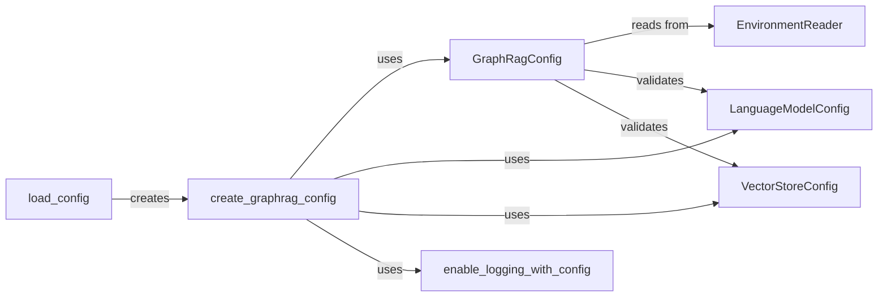

## Component Details

The Configuration Management component is responsible for loading, validating, and providing access to the application's configuration settings. It reads configuration parameters from a configuration file and environment variables, merges them, and creates a `GraphRagConfig` object. This object encapsulates all configuration settings, including those for the language model, vector store, and logging. The component ensures that all required settings are present and valid, providing a centralized and consistent way to manage the application's behavior.

### EnvironmentReader
The EnvironmentReader class is responsible for reading configuration values from environment variables. It provides methods for reading strings, integers, booleans, floats, and lists from the environment, with a specified prefix for the environment variables.
- **Related Classes/Methods**: `graphrag.graphrag.config.environment_reader.EnvironmentReader`

### load_config
The load_config function is responsible for loading the configuration from a file and merging it with environment variables. It determines the configuration file path and reads the configuration from the file.
- **Related Classes/Methods**: `graphrag.graphrag.config.load_config:load_config`, `graphrag.graphrag.config.load_config:_get_config_path`

### create_graphrag_config
The create_graphrag_config function is responsible for creating the GraphRagConfig object from the loaded configuration. It instantiates the configuration object with the loaded values.
- **Related Classes/Methods**: `graphrag.graphrag.config.create_graphrag_config:create_graphrag_config`

### enable_logging_with_config
The enable_logging_with_config function configures the logging system based on the loaded configuration. It sets up the logging level and format based on the configuration settings.
- **Related Classes/Methods**: `graphrag.graphrag.config.logging:enable_logging_with_config`

### GraphRagConfig
The GraphRagConfig class holds the overall configuration settings for the GraphRAG application. It includes validation logic to ensure that the models are properly configured.
- **Related Classes/Methods**: `graphrag.graphrag.config.models.graph_rag_config.GraphRagConfig`, `graphrag.graphrag.config.models.graph_rag_config.GraphRagConfig:_validate_models`, `graphrag.graphrag.config.models.graph_rag_config.GraphRagConfig:_validate_model`

### LanguageModelConfig
The LanguageModelConfig class holds the configuration settings for the language model. It includes validation logic to ensure that the API key, authentication type, model type, API base, API version, deployment name, and Azure settings are properly configured.
- **Related Classes/Methods**: `graphrag.graphrag.config.models.language_model_config.LanguageModelConfig`, `graphrag.graphrag.config.models.language_model_config.LanguageModelConfig:_validate_api_key`, `graphrag.graphrag.config.models.language_model_config.LanguageModelConfig:_validate_auth_type`, `graphrag.graphrag.config.models.language_model_config.LanguageModelConfig:_validate_type`, `graphrag.graphrag.config.models.language_model_config.LanguageModelConfig:_validate_api_base`, `graphrag.graphrag.config.models.language_model_config.LanguageModelConfig:_validate_api_version`, `graphrag.graphrag.config.models.language_model_config.LanguageModelConfig:_validate_deployment_name`, `graphrag.graphrag.config.models.language_model_config.LanguageModelConfig:_validate_azure_settings`, `graphrag.graphrag.config.models.language_model_config.LanguageModelConfig:_validate_model`

### VectorStoreConfig
The VectorStoreConfig class holds the configuration settings for the vector store. It includes validation logic to ensure that the model is properly configured.
- **Related Classes/Methods**: `graphrag.graphrag.config.models.vector_store_config.VectorStoreConfig`, `graphrag.graphrag.config.models.vector_store_config.VectorStoreConfig:_validate_model`
