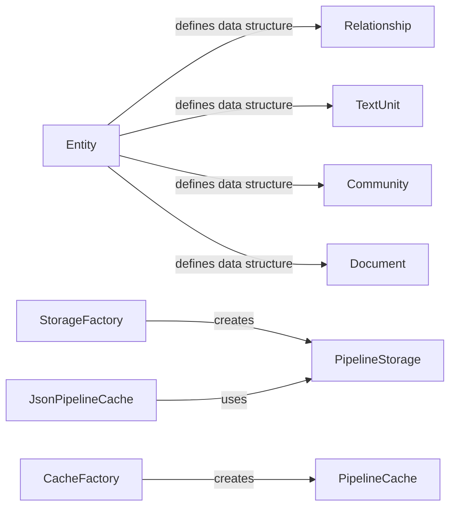

## Component Details

### Entity
Represents a generic entity within the data model. It serves as a base class for more specific entity types and provides common attributes and methods for managing entity properties. It's a fundamental building block for representing data in the graph.
- **Related Classes/Methods**: `graphrag.data_model.entity`

### Relationship
Defines the relationships between entities in the graph. It specifies the types of connections that can exist between entities and provides a way to navigate and query the graph structure. Relationships are crucial for understanding the connections and dependencies between different data elements.
- **Related Classes/Methods**: `graphrag.data_model.relationship`

### TextUnit
Represents a unit of text within a document, such as a sentence or paragraph. It stores the text content and metadata associated with the text unit. Text units are used for analyzing and extracting information from textual data.
- **Related Classes/Methods**: `graphrag.data_model.text_unit`

### Community
Represents a group of entities or text units that are related to each other. It provides a way to organize and analyze data based on community structures. Communities can be used to identify clusters of related information and understand the relationships between different groups of entities.
- **Related Classes/Methods**: `graphrag.data_model.community`

### Document
Represents a document in the system. It contains metadata about the document, such as its title, author, and publication date, as well as the text content of the document. Documents are the primary source of information for the graph.
- **Related Classes/Methods**: `graphrag.data_model.document`

### StorageFactory
A factory class responsible for creating different storage implementations based on the provided configuration. It abstracts the instantiation logic for various storage solutions, allowing the application to easily switch between different storage backends without modifying the core code.
- **Related Classes/Methods**: `graphrag.storage.factory`

### PipelineStorage
Abstract base class for pipeline storage implementations. Defines the common interface for interacting with different storage backends. Implementations include file-based, blob storage, CosmosDB, and in-memory storage.
- **Related Classes/Methods**: `graphrag.storage.pipeline_storage`

### CacheFactory
A factory class responsible for creating different cache implementations based on the provided configuration. It abstracts the instantiation logic for various cache solutions, allowing the application to easily switch between different cache backends without modifying the core code.
- **Related Classes/Methods**: `graphrag.cache.factory`

### PipelineCache
Abstract base class for pipeline cache implementations. Defines the common interface for interacting with different cache backends. Implementations include in-memory, JSON file-based, and no-op caches.
- **Related Classes/Methods**: `graphrag.cache.pipeline_cache`

### JsonPipelineCache
A cache implementation that stores data as JSON files using a PipelineStorage instance. It provides methods for getting, setting, checking, and deleting data, as well as creating child caches. It serializes and deserializes data to/from JSON format.
- **Related Classes/Methods**: `graphrag.cache.json_pipeline_cache`
