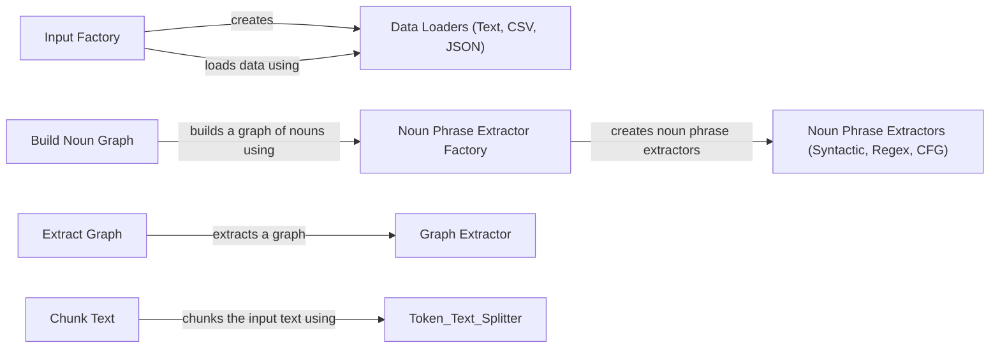

## Component Details

The Data Ingestion & Graph Construction component is responsible for transforming raw data into a structured knowledge graph. It begins by loading data from various sources such as text files, CSV files, and JSON files, utilizing an Input Factory to select the appropriate loader. The loaded data is then split into smaller chunks using a Chunk Text component with a specified chunking strategy. Subsequently, a Build Noun Graph component constructs a graph where nodes represent nouns or noun phrases extracted from the text, and edges represent relationships between them. The Noun Phrase Extractor Factory is used to create different types of noun phrase extractors. Finally, the Extract Graph component extracts a graph from the processed data, employing a specific graph extraction strategy to create the final knowledge graph.

### Input Factory
The Input Factory is responsible for creating input loaders based on the file type. It determines which loader to use (text, CSV, or JSON) and returns the appropriate loader.
- **Related Classes/Methods**: `graphrag.graphrag.index.input.factory`

### Data Loaders (Text, CSV, JSON)
These loaders are responsible for loading data from their respective file types. The Text Loader loads data from text files, the CSV Loader loads data from CSV files, and the JSON Loader loads data from JSON files.
- **Related Classes/Methods**: `graphrag.graphrag.index.input.text`, `graphrag.graphrag.index.input.csv`, `graphrag.graphrag.index.input.json`

### Chunk Text
The Chunk Text component is responsible for dividing the input text into smaller chunks using different strategies. It loads and runs a specified chunking strategy.
- **Related Classes/Methods**: `graphrag.graphrag.index.text_splitting.chunk_text`

### Build Noun Graph
The Build Noun Graph component constructs a graph where nodes represent nouns or noun phrases and edges represent relationships between them. It extracts nodes and edges from the input text.
- **Related Classes/Methods**: `graphrag.graphrag.index.operations.build_noun_graph.build_noun_graph`

### Noun Phrase Extractor Factory
The Noun Phrase Extractor Factory creates noun phrase extractors. It determines which extractor to use and returns it.
- **Related Classes/Methods**: `graphrag.graphrag.index.operations.build_noun_graph.np_extractors.factory`

### Noun Phrase Extractors (Syntactic, Regex, CFG)
These extractors are responsible for extracting noun phrases using different methods. The Syntactic Noun Phrase Extractor uses syntactic parsing, the Regex EN Noun Phrase Extractor uses regular expressions, and the CFG Noun Phrase Extractor uses Context-Free Grammar.
- **Related Classes/Methods**: `graphrag.graphrag.index.operations.build_noun_graph.np_extractors.syntactic_parsing_extractor`, `graphrag.graphrag.index.operations.build_noun_graph.np_extractors.regex_extractor`, `graphrag.graphrag.index.operations.build_noun_graph.np_extractors.cfg_extractor`

### Graph Extractor
The Graph Extractor extracts a graph from the processed data using a specific strategy.
- **Related Classes/Methods**: `graphrag.graphrag.index.operations.extract_graph.graph_extractor`

### Extract Graph
The Extract Graph component extracts a graph using a specific strategy.
- **Related Classes/Methods**: `graphrag.graphrag.index.operations.extract_graph.extract_graph`
