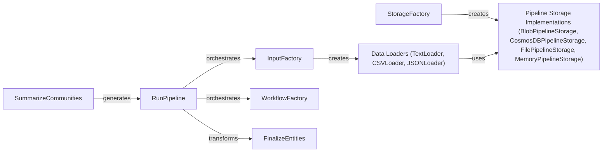

## Component Details

### RunPipeline
The RunPipeline component orchestrates the entire indexing process. It takes the configuration, creates input data using the InputFactory, and executes the workflows managed by the WorkflowFactory to build the knowledge graph. It manages the overall flow of data and operations within the indexing pipeline, coordinating the activities of other components.
- **Related Classes/Methods**: `graphrag.index.run.run_pipeline:run_pipeline`

### InputFactory
The InputFactory is responsible for creating input data loaders based on the configuration. It supports different input types like Blob, File, CSV, JSON, and Text. It acts as a central point for creating input data loaders, abstracting away the details of which loader to use based on the configuration, and providing a consistent interface for the RunPipeline component.
- **Related Classes/Methods**: `graphrag.index.input.factory:create_input`

### WorkflowFactory
The WorkflowFactory is responsible for creating and managing the different workflows used in the indexing pipeline. It registers and creates workflow instances based on the configuration, allowing for a modular and extensible pipeline. It provides a mechanism for the RunPipeline to execute different workflows based on the configuration.
- **Related Classes/Methods**: `graphrag.index.workflows.factory`

### Data Loaders (TextLoader, CSVLoader, JSONLoader)
These components (TextLoader, CSVLoader, JSONLoader) are responsible for loading data from different file formats (text, CSV, JSON) from a specified storage. They read the data and prepare it for further processing in the indexing pipeline. They are used by the InputFactory to load data from different sources.
- **Related Classes/Methods**: `graphrag.index.input.text:load_text`, `graphrag.index.input.csv:load_csv`, `graphrag.index.input.json:load_json`

### FinalizeEntities
The FinalizeEntities component transforms the final entities by creating a graph, embedding it (if enabled), laying it out, and computing degrees. It prepares the entities for storage and retrieval in the knowledge graph. It receives data from the RunPipeline and prepares it for storage.
- **Related Classes/Methods**: `graphrag.index.operations.finalize_entities:finalize_entities`

### SummarizeCommunities
The SummarizeCommunities component generates summaries for communities within the knowledge graph. It loads a strategy, builds level contexts, and generates reports for each community, providing a high-level overview of the graph's structure. It uses BuildLocalContext and RunGraphIntelligence to generate the summaries.
- **Related Classes/Methods**: `graphrag.index.operations.summarize_communities.summarize_communities:summarize_communities`

### StorageFactory
The StorageFactory is responsible for creating storage implementations (Blob, CosmosDB, File, Memory). It allows registering custom storage implementations. It provides a way to abstract the storage implementation from the rest of the pipeline.
- **Related Classes/Methods**: `graphrag.storage.factory:StorageFactory`

### Pipeline Storage Implementations (BlobPipelineStorage, CosmosDBPipelineStorage, FilePipelineStorage, MemoryPipelineStorage)
These components (BlobPipelineStorage, CosmosDBPipelineStorage, FilePipelineStorage, MemoryPipelineStorage) are implementations of the PipelineStorage interface using different storage technologies (Azure Blob Storage, Azure CosmosDB, File System, Memory). They handle storing and retrieving data in their respective storage systems. They are created by the StorageFactory.
- **Related Classes/Methods**: `graphrag.storage.blob_pipeline_storage:BlobPipelineStorage`, `graphrag.storage.cosmosdb_pipeline_storage:CosmosDBPipelineStorage`, `graphrag.storage.file_pipeline_storage:FilePipelineStorage`, `graphrag.storage.memory_pipeline_storage:MemoryPipelineStorage`
