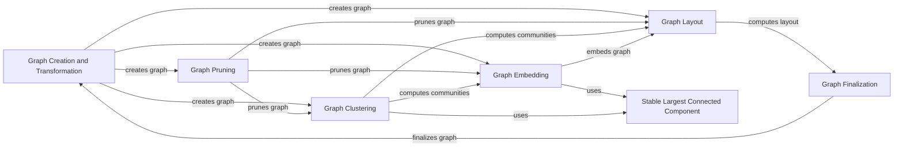

## Component Details

### Graph Creation and Transformation
This component focuses on creating and transforming graph structures from various data sources. It includes functionalities for building graphs from noun phrases, converting graphs to and from DataFrame representations, and computing node degrees. It acts as the foundation for subsequent graph analysis and manipulation steps.
- **Related Classes/Methods**: `graphrag.index.operations.build_noun_graph.build_noun_graph`, `graphrag.index.operations.create_graph`, `graphrag.index.operations.graph_to_dataframes`, `graphrag.index.operations.compute_degree`

### Graph Pruning
This component is responsible for pruning the graph by removing irrelevant or noisy nodes and edges based on various criteria such as frequency, degree, and weight thresholds. It helps to simplify the graph structure and improve the efficiency of downstream analysis tasks.
- **Related Classes/Methods**: `graphrag.index.operations.prune_graph:prune_graph`

### Graph Clustering
This component focuses on identifying communities or clusters within the graph using hierarchical clustering algorithms like the Leiden algorithm. It helps to reveal the underlying structure of the graph and group related nodes together.
- **Related Classes/Methods**: `graphrag.index.operations.cluster_graph:cluster_graph`, `graphrag.index.operations.cluster_graph:_compute_leiden_communities`

### Graph Embedding
This component embeds the graph into a vector space using the Node2Vec algorithm. It generates node embeddings that capture the structural relationships between nodes, enabling downstream tasks such as node classification and link prediction.
- **Related Classes/Methods**: `graphrag.index.operations.embed_graph.embed_node2vec:embed_node2vec`, `graphrag.index.operations.embed_graph.embed_graph:embed_graph`

### Graph Layout
This component applies layout algorithms to determine the positions of nodes in the graph for visualization purposes. It uses either UMAP or a zero-layout strategy to compute node positions, allowing for effective visualization of the graph structure.
- **Related Classes/Methods**: `graphrag.index.operations.layout_graph.layout_graph:layout_graph`, `graphrag.index.operations.layout_graph.umap:run`, `graphrag.index.operations.layout_graph.umap:compute_umap_positions`, `graphrag.index.operations.layout_graph.zero:run`, `graphrag.index.operations.layout_graph.zero:get_zero_positions`

### Graph Finalization
This component orchestrates the final transformation of entities and relationships by merging layout, degree, and other relevant information. It ensures that all necessary data is combined into a final entities DataFrame, preparing the graph for subsequent use in indexing and querying pipelines.
- **Related Classes/Methods**: `graphrag.index.operations.finalize_entities:finalize_entities`, `graphrag.index.operations.finalize_relationships:finalize_relationships`, `graphrag.index.operations.compute_edge_combined_degree:compute_edge_combined_degree`

### Stable Largest Connected Component
This component identifies the largest connected component of the graph, ensuring stability in node and edge ordering. It is used to focus analysis on the most significant portion of the graph.
- **Related Classes/Methods**: `graphrag.index.utils.stable_lcc:stable_largest_connected_component`
