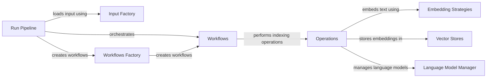

## Component Details

The Indexing & Embedding Management component is responsible for transforming raw data into a searchable graph representation. It encompasses the entire indexing pipeline, from loading input data to storing graph embeddings in a vector store. The process begins with the CLI or API Index triggering the Run Pipeline, which orchestrates the data loading, graph extraction, embedding generation, and storage. Workflows define the specific steps for each stage, while Operations perform the actual tasks like clustering, embedding, and summarization. The component leverages factories for creating input loaders, workflows, vector stores, and language models, providing flexibility and extensibility. Callbacks are used to monitor and report the progress of the indexing process.

### Run Pipeline
The Run Pipeline component orchestrates the overall indexing process. It loads the configuration, input data, and executes the defined workflows. It manages the execution of various operations to build the graph index and uses callbacks for monitoring and reporting progress.
- **Related Classes/Methods**: `graphrag.graphrag.index.run.run_pipeline:run_pipeline`, `graphrag.graphrag.index.run.run_pipeline:_run_pipeline`, `graphrag.graphrag.index.run.run_pipeline:_copy_previous_output`

### Workflows
The Workflows component defines the specific steps involved in the indexing process. It includes workflows for graph extraction, embedding generation, community creation, and report generation. Each workflow consists of a sequence of operations that are executed in a specific order.
- **Related Classes/Methods**: `graphrag.graphrag.index.workflows.create_final_text_units:run_workflow`, `graphrag.graphrag.index.workflows.update_communities:run_workflow`, `graphrag.graphrag.index.workflows.update_community_reports:run_workflow`, `graphrag.graphrag.index.workflows.create_final_documents:run_workflow`, `graphrag.graphrag.index.workflows.extract_graph:run_workflow`, `graphrag.graphrag.index.workflows.create_communities:run_workflow`, `graphrag.graphrag.index.workflows.extract_graph_nlp:run_workflow`, `graphrag.graphrag.index.workflows.generate_text_embeddings:run_workflow`, `graphrag.graphrag.index.workflows.update_text_embeddings:run_workflow`, `graphrag.graphrag.index.workflows.create_community_reports_text:run_workflow`, `graphrag.graphrag.index.workflows.update_text_units:run_workflow`, `graphrag.graphrag.index.workflows.update_entities_relationships:run_workflow`, `graphrag.graphrag.index.workflows.update_final_documents:run_workflow`, `graphrag.graphrag.index.workflows.finalize_graph:run_workflow`, `graphrag.graphrag.index.workflows.update_clean_state:run_workflow`, `graphrag.graphrag.index.workflows.extract_covariates:run_workflow`, `graphrag.graphrag.index.workflows.create_community_reports:run_workflow`, `graphrag.graphrag.index.workflows.prune_graph:run_workflow`, `graphrag.graphrag.index.workflows.create_base_text_units:run_workflow`, `graphrag.graphrag.index.workflows.update_covariates:run_workflow`

### Operations
The Operations component contains the individual operations performed during the indexing process. These operations include graph clustering, embedding text and graph elements, summarizing communities, and extracting graph structures. It leverages embedding strategies, vector stores, and language models to perform these tasks.
- **Related Classes/Methods**: `graphrag.graphrag.index.operations.cluster_graph:cluster_graph`, `graphrag.graphrag.index.operations.compute_edge_combined_degree:compute_edge_combined_degree`, `graphrag.graphrag.index.operations.finalize_entities:finalize_entities`, `graphrag.graphrag.index.operations.prune_graph:prune_graph`, `graphrag.graphrag.index.operations.finalize_relationships:finalize_relationships`, `graphrag.graphrag.index.operations.summarize_communities.summarize_communities:summarize_communities`, `graphrag.graphrag.index.operations.embed_text.embed_text:embed_text`, `graphrag.graphrag.index.operations.extract_graph.extract_graph:extract_graph`, `graphrag.graphrag.index.operations.embed_graph.embed_graph:embed_graph`, `graphrag.graphrag.index.operations.extract_covariates.extract_covariates:extract_covariates`, `graphrag.graphrag.index.operations.layout_graph.layout_graph:layout_graph`, `graphrag.graphrag.index.operations.build_noun_graph.build_noun_graph:build_noun_graph`, `graphrag.graphrag.index.operations.summarize_descriptions.summarize_descriptions:summarize_descriptions`, `graphrag.graphrag.index.operations.chunk_text.chunk_text:chunk_text`

### Embedding Strategies
The Embedding Strategies component defines different strategies for embedding text, such as using OpenAI or mock embeddings. The strategies handle the process of splitting text into chunks, preparing embeddings, and reconstituting the embeddings. It interacts with the Language Model Manager component to get the language models.
- **Related Classes/Methods**: `graphrag.graphrag.index.operations.embed_text.strategies.openai:run`, `graphrag.graphrag.index.operations.embed_text.strategies.mock:run`

### Vector Stores
The Vector Stores component provides the storage and retrieval mechanism for vector embeddings. It includes implementations for different vector stores like CosmosDB, Azure AI Search, and LanceDB. It interacts with the Vector Stores Factory component to create vector store instances.
- **Related Classes/Methods**: `graphrag.graphrag.vector_stores.cosmosdb.CosmosDBVectorStore:__init__`, `graphrag.graphrag.vector_stores.azure_ai_search.AzureAISearchVectorStore:__init__`, `graphrag.graphrag.vector_stores.lancedb.LanceDBVectorStore:__init__`

### Language Model Manager
The Language Model Manager component manages the language models used for text embedding and summarization. It registers, creates, and retrieves language model instances. It interacts with the Language Model Providers component to create language model instances.
- **Related Classes/Methods**: `graphrag.graphrag.language_model.manager.ModelManager:get_instance`, `graphrag.graphrag.language_model.manager.ModelManager:register_chat`, `graphrag.graphrag.language_model.manager.ModelManager:register_embedding`, `graphrag.graphrag.language_model.manager.ModelManager:get_or_create_chat_model`, `graphrag.graphrag.language_model.manager.ModelManager:get_or_create_embedding_model`

### Input Factory
The Input Factory component is responsible for creating input loaders based on the file type. It determines which loader to use (e.g., text, CSV, JSON) and returns an appropriate loader instance. It interacts with the Input Loaders component to load data from different sources.
- **Related Classes/Methods**: `graphrag.graphrag.index.input.factory:create_input`

### Workflows Factory
The Workflows Factory component provides a factory for creating different indexing workflows. It registers and creates pipeline instances. It interacts with the Workflows component to create different indexing workflows.
- **Related Classes/Methods**: `graphrag.graphrag.index.workflows.factory.PipelineFactory:register_all`, `graphrag.graphrag.index.workflows.factory.PipelineFactory:create_pipeline`
