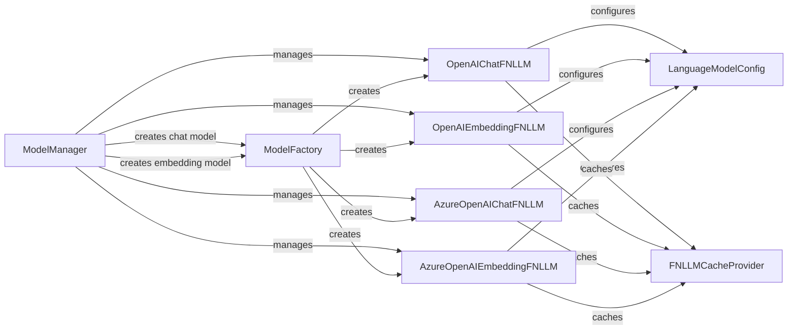

## Component Details

### ModelManager
The ModelManager is a singleton class responsible for managing and caching language models (both chat and embedding models). It provides methods to register new models, retrieve existing models, and create models if they don't exist. It acts as a central point for accessing and reusing language models throughout the application, ensuring efficient resource utilization and consistent model access across the system.
- **Related Classes/Methods**: `graphrag.language_model.manager.ModelManager`

### ModelFactory
The ModelFactory is responsible for creating instances of language models (both chat and embedding models) based on their configuration. It encapsulates the logic for instantiating different types of models, handling provider-specific initialization, and ensuring that the models are created with the correct parameters. This abstraction simplifies the process of adding or modifying language model integrations.
- **Related Classes/Methods**: `graphrag.language_model.factory.ModelFactory`

### LanguageModelConfig
The LanguageModelConfig class represents the configuration for a language model. It stores information such as the model name, provider, and other parameters required to initialize the model. It is used to pass configuration information to the ModelFactory when creating new models, providing a structured way to define and manage language model settings.
- **Related Classes/Methods**: `graphrag.config.models.language_model_config.LanguageModelConfig`

### FNLLMCacheProvider
The FNLLMCacheProvider is responsible for caching the responses from the language models. It provides a way to store and retrieve responses, so that the same request does not have to be sent to the language model multiple times. This improves performance and reduces costs by avoiding redundant API calls to the language model providers.
- **Related Classes/Methods**: `graphrag.language_model.providers.fnllm.cache.FNLLMCacheProvider`

### OpenAIChatFNLLM
The OpenAIChatFNLLM class is a concrete implementation of a chat language model that uses the OpenAI API. It provides methods for generating responses to chat messages. It uses the FNLLMCacheProvider to cache the responses from the OpenAI API, optimizing performance and reducing costs.
- **Related Classes/Methods**: `graphrag.language_model.providers.fnllm.models.OpenAIChatFNLLM`

### OpenAIEmbeddingFNLLM
The OpenAIEmbeddingFNLLM class is a concrete implementation of an embedding language model that uses the OpenAI API. It provides methods for generating embeddings for text. It uses the FNLLMCacheProvider to cache the responses from the OpenAI API, optimizing performance and reducing costs.
- **Related Classes/Methods**: `graphrag.language_model.providers.fnllm.models.OpenAIEmbeddingFNLLM`

### AzureOpenAIChatFNLLM
The AzureOpenAIChatFNLLM class is a concrete implementation of a chat language model that uses the Azure OpenAI API. It provides methods for generating responses to chat messages. It uses the FNLLMCacheProvider to cache the responses from the Azure OpenAI API, optimizing performance and reducing costs.
- **Related Classes/Methods**: `graphrag.language_model.providers.fnllm.models.AzureOpenAIChatFNLLM`

### AzureOpenAIEmbeddingFNLLM
The AzureOpenAIEmbeddingFNLLM class is a concrete implementation of an embedding language model that uses the Azure OpenAI API. It provides methods for generating embeddings for text. It uses the FNLLMCacheProvider to cache the responses from the Azure OpenAI API, optimizing performance and reducing costs.
- **Related Classes/Methods**: `graphrag.language_model.providers.fnllm.models.AzureOpenAIEmbeddingFNLLM`
