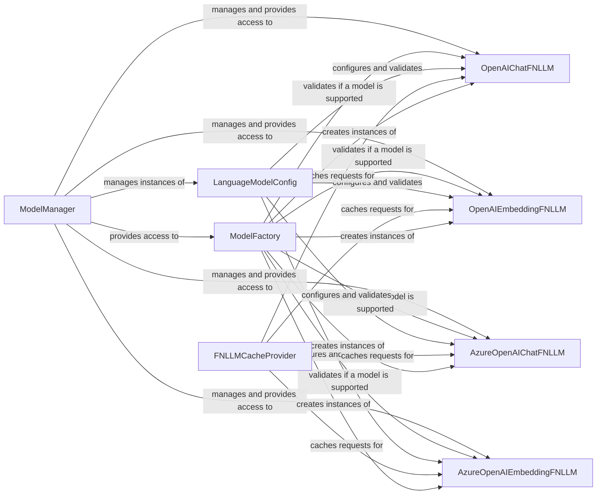

## Component Details

The Language Model Integration component provides a unified interface for interacting with various language models, such as OpenAI and Azure OpenAI. It manages the configuration, instantiation, caching, and access to these models, ensuring consistent and efficient usage throughout the GraphRAG system. The central flow involves the ModelManager providing access to language models based on configurations validated by LanguageModelConfig and created by ModelFactory. Concrete implementations like OpenAIChatFNLLM and AzureOpenAIEmbeddingFNLLM handle the actual API calls, potentially leveraging FNLLMCacheProvider for performance optimization.

### ModelManager
The ModelManager is a singleton responsible for managing and providing access to language models (both chat and embedding models). It maintains a registry of available models, ensuring that only one instance of each model exists. It acts as a central point for retrieving and reusing language model instances.
- **Related Classes/Methods**: `graphrag.graphrag.language_model.manager.ModelManager`

### ModelFactory
The ModelFactory is responsible for creating instances of language models. It determines if a given model is supported by the system and handles the instantiation process based on the provided configuration. It ensures that only valid and supported models are created.
- **Related Classes/Methods**: `graphrag.graphrag.language_model.factory.ModelFactory`

### LanguageModelConfig
The LanguageModelConfig defines the configuration schema for language models. It includes validation logic for API keys, authentication types, model types, and other settings specific to different language model providers (e.g., OpenAI, Azure OpenAI). It ensures that the language model configurations are valid before being used.
- **Related Classes/Methods**: `graphrag.graphrag.config.models.language_model_config.LanguageModelConfig`

### OpenAIChatFNLLM
The OpenAIChatFNLLM is a concrete implementation of a chat language model using the OpenAI API. It provides methods for generating chat completions (`chat` and `achat`). It handles the specific details of interacting with the OpenAI chat API.
- **Related Classes/Methods**: `graphrag.graphrag.language_model.providers.fnllm.models.OpenAIChatFNLLM`

### OpenAIEmbeddingFNLLM
The OpenAIEmbeddingFNLLM is a concrete implementation of an embedding language model using the OpenAI API. It provides methods for generating embeddings for text (`embed` and `embed_batch`). It handles the specific details of interacting with the OpenAI embedding API.
- **Related Classes/Methods**: `graphrag.graphrag.language_model.providers.fnllm.models.OpenAIEmbeddingFNLLM`

### AzureOpenAIChatFNLLM
The AzureOpenAIChatFNLLM is a concrete implementation of a chat language model using the Azure OpenAI API. It provides methods for generating chat completions (`chat` and `achat`). It handles the specific details of interacting with the Azure OpenAI chat API.
- **Related Classes/Methods**: `graphrag.graphrag.language_model.providers.fnllm.models.AzureOpenAIChatFNLLM`

### AzureOpenAIEmbeddingFNLLM
The AzureOpenAIEmbeddingFNLLM is a concrete implementation of an embedding language model using the Azure OpenAI API. It provides methods for generating embeddings for text (`embed` and `embed_batch`). It handles the specific details of interacting with the Azure OpenAI embedding API.
- **Related Classes/Methods**: `graphrag.graphrag.language_model.providers.fnllm.models.AzureOpenAIEmbeddingFNLLM`

### FNLLMCacheProvider
The FNLLMCacheProvider provides caching functionality for language model requests. It can improve performance by reducing the number of API calls to the language model provider. It stores and retrieves responses to avoid redundant API requests.
- **Related Classes/Methods**: `graphrag.graphrag.language_model.providers.fnllm.cache.FNLLMCacheProvider`
