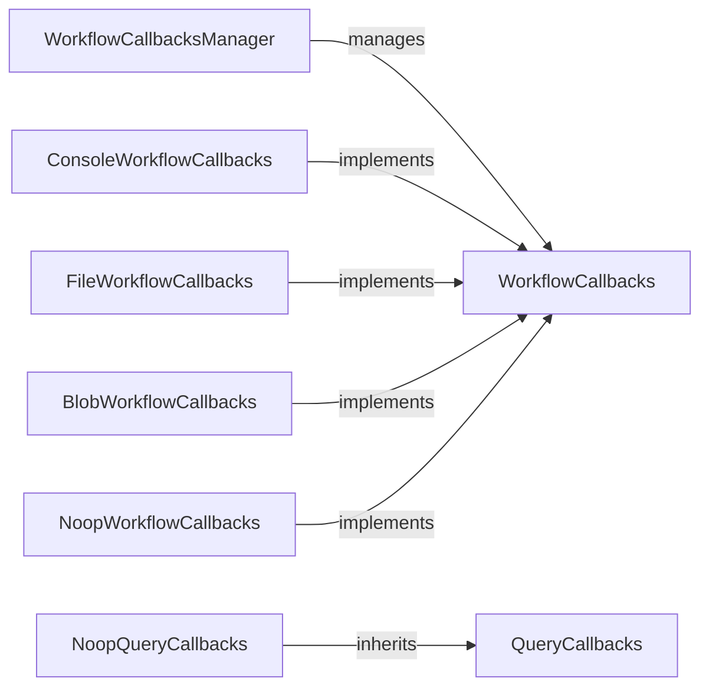

## Component Details

### WorkflowCallbacks
Defines the interface for callbacks during indexing and querying workflows. It allows registration of callbacks to monitor pipeline start, workflow start/end, progress, and warnings, providing a contract for different callback implementations.
- **Related Classes/Methods**: `graphrag.callbacks.workflow_callbacks.WorkflowCallbacks`

### WorkflowCallbacksManager
Manages the registered WorkflowCallbacks. It allows registering multiple callback instances and invokes them during the indexing and querying workflows, acting as a central point for triggering callbacks.
- **Related Classes/Methods**: `graphrag.callbacks.workflow_callbacks_manager.WorkflowCallbacksManager`

### ConsoleWorkflowCallbacks
An implementation of WorkflowCallbacks that logs messages to the console. It uses a ConsoleReporter to log the messages, providing real-time feedback on the workflow's progress.
- **Related Classes/Methods**: `graphrag.callbacks.console_workflow_callbacks.ConsoleWorkflowCallbacks`

### FileWorkflowCallbacks
An implementation of WorkflowCallbacks that logs messages to a file. It uses a FileReporter to log the messages, enabling persistent logging for auditing and debugging.
- **Related Classes/Methods**: `graphrag.callbacks.file_workflow_callbacks.FileWorkflowCallbacks`

### BlobWorkflowCallbacks
An implementation of WorkflowCallbacks that logs messages to a blob storage. It uses a BlobReporter to log the messages, allowing for centralized logging in cloud environments.
- **Related Classes/Methods**: `graphrag.callbacks.blob_workflow_callbacks.BlobWorkflowCallbacks`

### QueryCallbacks
Defines an interface for callbacks during the query workflows. It allows registration of callbacks to monitor query workflow, providing a contract for different query callback implementations.
- **Related Classes/Methods**: `graphrag.callbacks.query_callbacks.QueryCallbacks`

### NoopWorkflowCallbacks
A no-op implementation of the WorkflowCallbacks interface. It does nothing when the callback methods are invoked. It's useful when no callbacks are needed, providing a default behavior when monitoring is not required.
- **Related Classes/Methods**: `graphrag.callbacks.noop_workflow_callbacks.NoopWorkflowCallbacks`

### NoopQueryCallbacks
A no-op implementation of the QueryCallbacks interface. It does nothing when the callback methods are invoked. It's useful when no query callbacks are needed, providing a default behavior when monitoring is not required.
- **Related Classes/Methods**: `graphrag.callbacks.noop_query_callbacks.NoopQueryCallbacks`
