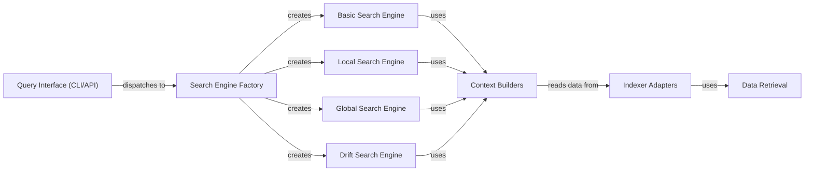

## Component Details

The Query Processing & Context Building component is the core of the question answering system. It receives queries from the CLI or API, orchestrates the search process using different search strategies (basic, local, global, drift), builds relevant context by retrieving information from the vector store and graph database, and ultimately generates a response using a language model. It acts as the brain of the system, coordinating search and retrieval to provide accurate and informative answers.

### Query Interface (CLI/API)
The Query Interface serves as the entry point for user queries, whether through the command-line interface (CLI) or the application programming interface (API). It receives the query, parses it, and then dispatches it to the appropriate search engine factory for processing. This component abstracts away the underlying search mechanisms from the user.
- **Related Classes/Methods**: `graphrag.graphrag.cli.main:_query_cli`, `graphrag.graphrag.cli.query:run_global_search`, `graphrag.graphrag.cli.query:run_local_search`, `graphrag.graphrag.cli.query:run_drift_search`, `graphrag.graphrag.cli.query:run_basic_search`, `graphrag.graphrag.api.query:global_search`, `graphrag.graphrag.api.query:global_search_streaming`, `graphrag.graphrag.api.query:multi_index_global_search`, `graphrag.graphrag.api.query:local_search`, `graphrag.graphrag.api.query:local_search_streaming`, `graphrag.graphrag.api.query:multi_index_local_search`, `graphrag.graphrag.api.query:drift_search`, `graphrag.graphrag.api.query:drift_search_streaming`, `graphrag.graphrag.api.query:multi_index_drift_search`, `graphrag.graphrag.api.query:basic_search`, `graphrag.graphrag.api.query:basic_search_streaming`, `graphrag.graphrag.api.query:multi_index_basic_search`

### Search Engine Factory
The Search Engine Factory is a creational component responsible for instantiating the appropriate search engine based on the query type. It provides methods to obtain instances of global, local, drift, and basic search engines, centralizing the creation logic and promoting code reusability.
- **Related Classes/Methods**: `graphrag.graphrag.query.factory:get_local_search_engine`, `graphrag.graphrag.query.factory:get_global_search_engine`, `graphrag.graphrag.query.factory:get_drift_search_engine`, `graphrag.graphrag.query.factory:get_basic_search_engine`

### Basic Search Engine
The Basic Search Engine performs a straightforward search based on the query and the context built by the BasicSearchContext. It's the simplest search strategy, suitable for queries that don't require advanced context or relationship analysis.
- **Related Classes/Methods**: `graphrag.graphrag.query.structured_search.basic_search.search.BasicSearch:__init__`, `graphrag.graphrag.query.structured_search.basic_search.search.BasicSearch:search`, `graphrag.graphrag.query.structured_search.basic_search.basic_context.BasicSearchContext:__init__`, `graphrag.graphrag.query.structured_search.basic_search.basic_context.BasicSearchContext:build_context`

### Local Search Engine
The Local Search Engine focuses on searching within a local context, considering entities, relationships, and covariates. It leverages the LocalSearchMixedContext to build a comprehensive context that combines community, text unit, and local information, enabling more nuanced and relevant search results.
- **Related Classes/Methods**: `graphrag.graphrag.query.structured_search.local_search.search.LocalSearch:__init__`, `graphrag.graphrag.query.structured_search.local_search.search.LocalSearch:search`, `graphrag.graphrag.query.structured_search.local_search.mixed_context.LocalSearchMixedContext:build_context`, `graphrag.graphrag.query.structured_search.local_search.mixed_context.LocalSearchMixedContext:_build_community_context`, `graphrag.graphrag.query.structured_search.local_search.mixed_context.LocalSearchMixedContext:_build_text_unit_context`, `graphrag.graphrag.query.structured_search.local_search.mixed_context.LocalSearchMixedContext:_build_local_context`

### Global Search Engine
The Global Search Engine performs a search across the entire knowledge graph, with a particular emphasis on communities. It utilizes the GlobalCommunityContext to build the search context, allowing it to identify and retrieve information relevant to the query from across the entire knowledge base.
- **Related Classes/Methods**: `graphrag.graphrag.query.structured_search.global_search.search.GlobalSearch:__init__`, `graphrag.graphrag.query.structured_search.global_search.search.GlobalSearch:stream_search`, `graphrag.graphrag.query.structured_search.global_search.search.GlobalSearch:search`, `graphrag.graphrag.query.structured_search.global_search.search.GlobalSearch:_map_response_single_batch`, `graphrag.graphrag.query.structured_search.global_search.search.GlobalSearch:_parse_search_response`, `graphrag.graphrag.query.structured_search.global_search.search.GlobalSearch:_reduce_response`, `graphrag.graphrag.query.structured_search.global_search.search.GlobalSearch:_stream_reduce_response`, `graphrag.graphrag.query.structured_search.global_search.community_context.GlobalCommunityContext:__init__`, `graphrag.graphrag.query.structured_search.global_search.community_context.GlobalCommunityContext:build_context`

### Drift Search Engine
The Drift Search Engine is designed to handle queries that evolve over time, adapting to changes in the underlying data or user intent. It uses a DRIFTSearchContextBuilder to build the context and a PrimerQueryProcessor to expand the query, enabling it to track and respond to shifts in the information landscape.
- **Related Classes/Methods**: `graphrag.graphrag.query.structured_search.drift_search.search.DRIFTSearch:__init__`, `graphrag.graphrag.query.structured_search.drift_search.search.DRIFTSearch:init_local_search`, `graphrag.graphrag.query.structured_search.drift_search.search.DRIFTSearch:_process_primer_results`, `graphrag.graphrag.query.structured_search.drift_search.search.DRIFTSearch:search`, `graphrag.graphrag.query.structured_search.drift_search.search.DRIFTSearch:stream_search`, `graphrag.graphrag.query.structured_search.drift_search.search.DRIFTSearch:_reduce_response`, `graphrag.graphrag.query.structured_search.drift_search.drift_context.DRIFTSearchContextBuilder:__init__`, `graphrag.graphrag.query.structured_search.drift_search.drift_context.DRIFTSearchContextBuilder:init_local_context_builder`, `graphrag.graphrag.query.structured_search.drift_search.drift_context.DRIFTSearchContextBuilder:build_context`, `graphrag.graphrag.query.structured_search.drift_search.primer.PrimerQueryProcessor:expand_query`, `graphrag.graphrag.query.structured_search.drift_search.primer.PrimerQueryProcessor:__call__`, `graphrag.graphrag.query.structured_search.drift_search.state.QueryState:add_all_follow_ups`, `graphrag.graphrag.query.structured_search.drift_search.state.QueryState:rank_incomplete_actions`, `graphrag.graphrag.query.structured_search.drift_search.state.QueryState:deserialize`

### Context Builders
The Context Builders are responsible for gathering and preparing the data needed by the search engines. They retrieve data from the Indexer Adapters and format it into a suitable context for the search. Specific context builders exist for community, source (text units), and local contexts (entities, covariates, relationships), allowing for tailored context construction based on the search requirements.
- **Related Classes/Methods**: `graphrag.graphrag.query.context_builder.community_context:build_community_context`, `graphrag.graphrag.query.context_builder.community_context:_rank_report_context`, `graphrag.graphrag.query.context_builder.community_context:_convert_report_context_to_df`, `graphrag.graphrag.query.context_builder.source_context:build_text_unit_context`, `graphrag.graphrag.query.context_builder.local_context:build_entity_context`, `graphrag.graphrag.query.context_builder.local_context:build_covariates_context`, `graphrag.graphrag.query.context_builder.local_context:build_relationship_context`, `graphrag.graphrag.query.context_builder.local_context:_filter_relationships`, `graphrag.graphrag.query.context_builder.local_context:get_candidate_context`

### Indexer Adapters
The Indexer Adapters provide an abstraction layer for accessing data from the underlying indexer. They offer methods to read different types of data, such as text units, covariates, relationships, reports, entities, and communities, decoupling the search engines and context builders from the specific indexer implementation.
- **Related Classes/Methods**: `graphrag.graphrag.query.indexer_adapters:read_indexer_text_units`, `graphrag.graphrag.query.indexer_adapters:read_indexer_covariates`, `graphrag.graphrag.query.indexer_adapters:read_indexer_relationships`, `graphrag.graphrag.query.indexer_adapters:read_indexer_reports`, `graphrag.graphrag.query.indexer_adapters:read_indexer_entities`, `graphrag.graphrag.query.indexer_adapters:read_indexer_communities`

### Data Retrieval
The Data Retrieval modules are responsible for fetching specific data elements from the underlying data store based on the query and context. This includes retrieving relationships, text units, entities, covariates, and community reports. These modules provide the raw data that is then processed and formatted by the Context Builders.
- **Related Classes/Methods**: `graphrag.graphrag.query.input.retrieval.relationships:get_in_network_relationships`, `graphrag.graphrag.query.input.retrieval.relationships:get_out_network_relationships`, `graphrag.graphrag.query.input.retrieval.relationships:to_relationship_dataframe`, `graphrag.graphrag.query.input.retrieval.text_units:get_candidate_text_units`, `graphrag.graphrag.query.input.retrieval.text_units:to_text_unit_dataframe`, `graphrag.graphrag.query.input.retrieval.entities:get_entity_by_id`, `graphrag.graphrag.query.input.retrieval.entities:get_entity_by_key`, `graphrag.graphrag.query.input.retrieval.entities:to_entity_dataframe`, `graphrag.graphrag.query.input.retrieval.covariates:to_covariate_dataframe`, `graphrag.graphrag.query.input.retrieval.community_reports:get_candidate_communities`, `graphrag.graphrag.query.input.retrieval.community_reports:to_community_report_dataframe`
