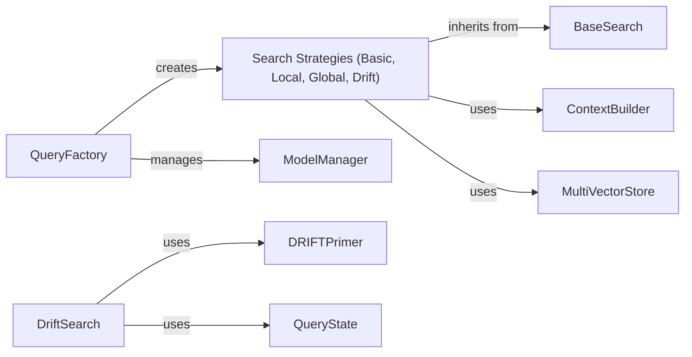

## Component Details

### QueryFactory
The QueryFactory is responsible for creating and configuring search engines based on the specified type (basic, local, global, drift). It orchestrates the retrieval of data, manages language models, and sets up the context for the search. It serves as the entry point for creating different search strategies.
- **Related Classes/Methods**: `graphrag.query.factory`

### BaseSearch
BaseSearch provides a common interface for different search strategies. It defines the basic structure for performing a search, including context building and result processing. It is an abstract class that is inherited by different search strategies.
- **Related Classes/Methods**: `graphrag.query.structured_search.base`

### Search Strategies (Basic, Local, Global, Drift)
These components implement different search strategies, each tailored to a specific type of information retrieval. BasicSearch performs a simple vector store query. LocalSearch incorporates local context. GlobalSearch performs a broad search across multiple communities. DriftSearch explores and adapts to evolving information landscapes. Each strategy uses a specific context builder.
- **Related Classes/Methods**: `graphrag.query.structured_search.basic_search.search`, `graphrag.query.structured_search.local_search.search`, `graphrag.query.structured_search.global_search.search`, `graphrag.query.structured_search.drift_search.search`

### ContextBuilder
The ContextBuilder component is responsible for constructing the context used by the search engines. It gathers relevant information, such as conversation history, entities, relationships, and community reports, to provide a comprehensive context for the query. It is used by the different search strategies to build the context for the query.
- **Related Classes/Methods**: `graphrag.query.context_builder`

### ModelManager
The ModelManager manages the retrieval and creation of language models (chat and embedding models). It provides a centralized point for accessing and configuring language models used throughout the query processing pipeline. It is used by the QueryFactory to manage the language models.
- **Related Classes/Methods**: `graphrag.language_model.manager`

### MultiVectorStore
The MultiVectorStore component allows searching across multiple vector stores. It aggregates results from different indexes, providing a unified search interface. It is used by the different search strategies to search across multiple vector stores.
- **Related Classes/Methods**: `graphrag.utils.api`

### DRIFTPrimer
The DRIFTPrimer component is responsible for generating initial queries and follow-up questions in the drift search strategy. It uses language models to create relevant prompts that guide the search process. It is used by the DriftSearch strategy to generate initial queries and follow-up questions.
- **Related Classes/Methods**: `graphrag.query.structured_search.drift_search.primer`

### QueryState
The QueryState component maintains the state of the drift search, tracking actions, follow-ups, and their relationships. It helps manage the iterative nature of the drift search process. It is used by the DriftSearch strategy to maintain the state of the search.
- **Related Classes/Methods**: `graphrag.query.structured_search.drift_search.state`
