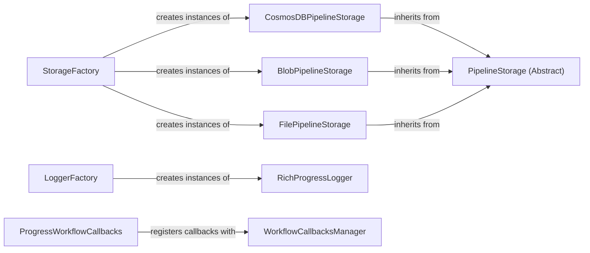

## Component Details

The Storage & Logging component provides a unified interface for managing data persistence and monitoring the execution of indexing and querying processes. It abstracts away the complexities of interacting with different storage systems like CosmosDB, Blob Storage, and the file system, allowing the system to seamlessly switch between them. Additionally, it offers comprehensive logging and callback mechanisms to track progress, report warnings, and handle workflow events, ensuring transparency and control over the system's operations.

### StorageFactory
The StorageFactory class serves as a central point for creating instances of different storage types, including CosmosDB, Blob Storage, File Storage, and Memory Storage. It encapsulates the logic for instantiating the appropriate storage backend based on configuration or other criteria, providing a consistent and flexible way to manage data persistence.
- **Related Classes/Methods**: `graphrag.graphrag.storage.factory.StorageFactory:create_storage`

### PipelineStorage (Abstract)
The PipelineStorage abstract class defines the common interface for all storage implementations. It specifies the methods for setting, getting, finding, deleting, and checking the existence of data, as well as creating child storage instances. Concrete storage classes like CosmosDBPipelineStorage, BlobPipelineStorage, and FilePipelineStorage inherit from this class and provide specific implementations for each storage backend.
- **Related Classes/Methods**: _None_

### CosmosDBPipelineStorage
The CosmosDBPipelineStorage class provides an implementation for storing pipeline data in Azure Cosmos DB. It handles operations such as setting, getting, finding, deleting, and checking the existence of data in Cosmos DB containers. It leverages the Azure Cosmos DB SDK to interact with the database and perform CRUD operations on the stored data.
- **Related Classes/Methods**: `graphrag.graphrag.storage.cosmosdb_pipeline_storage.CosmosDBPipelineStorage:__init__`, `graphrag.graphrag.storage.cosmosdb_pipeline_storage.CosmosDBPipelineStorage:find`, `graphrag.graphrag.storage.cosmosdb_pipeline_storage.CosmosDBPipelineStorage:get`, `graphrag.graphrag.storage.cosmosdb_pipeline_storage.CosmosDBPipelineStorage:set`, `graphrag.graphrag.storage.cosmosdb_pipeline_storage.CosmosDBPipelineStorage:has`, `graphrag.graphrag.storage.cosmosdb_pipeline_storage.CosmosDBPipelineStorage:delete`, `graphrag.graphrag.storage.cosmosdb_pipeline_storage.CosmosDBPipelineStorage:clear`, `graphrag.graphrag.storage.cosmosdb_pipeline_storage.CosmosDBPipelineStorage:get_creation_date`, `graphrag.graphrag.storage.cosmosdb_pipeline_storage:create_cosmosdb_storage`, `graphrag.graphrag.storage.cosmosdb_pipeline_storage:_create_progress_status`

### BlobPipelineStorage
The BlobPipelineStorage class provides an implementation for storing pipeline data in Azure Blob Storage. It handles operations such as setting, getting, finding, deleting, and checking the existence of data in Blob containers. It uses the Azure Blob Storage SDK to interact with the storage service and manage the stored data.
- **Related Classes/Methods**: `graphrag.graphrag.storage.blob_pipeline_storage.BlobPipelineStorage:__init__`, `graphrag.graphrag.storage.blob_pipeline_storage.BlobPipelineStorage:_create_container`, `graphrag.graphrag.storage.blob_pipeline_storage.BlobPipelineStorage:_delete_container`, `graphrag.graphrag.storage.blob_pipeline_storage.BlobPipelineStorage:find`, `graphrag.graphrag.storage.blob_pipeline_storage.BlobPipelineStorage:get`, `graphrag.graphrag.storage.blob_pipeline_storage.BlobPipelineStorage:set`, `graphrag.graphrag.storage.blob_pipeline_storage.BlobPipelineStorage:_set_df_json`, `graphrag.graphrag.storage.blob_pipeline_storage.BlobPipelineStorage:_set_df_parquet`, `graphrag.graphrag.storage.blob_pipeline_storage.BlobPipelineStorage:has`, `graphrag.graphrag.storage.blob_pipeline_storage.BlobPipelineStorage:delete`, `graphrag.graphrag.storage.blob_pipeline_storage.BlobPipelineStorage:child`, `graphrag.graphrag.storage.blob_pipeline_storage.BlobPipelineStorage:get_creation_date`, `graphrag.graphrag.storage.blob_pipeline_storage:create_blob_storage`, `graphrag.graphrag.storage.blob_pipeline_storage:_create_progress_status`

### FilePipelineStorage
The FilePipelineStorage class provides an implementation for storing pipeline data in the file system. It handles operations such as setting, getting, finding, deleting, and checking the existence of data in files. It interacts directly with the file system to manage the stored data.
- **Related Classes/Methods**: `graphrag.graphrag.storage.file_pipeline_storage.FilePipelineStorage:find`, `graphrag.graphrag.storage.file_pipeline_storage.FilePipelineStorage:get`, `graphrag.graphrag.storage.file_pipeline_storage.FilePipelineStorage:set`, `graphrag.graphrag.storage.file_pipeline_storage.FilePipelineStorage:has`, `graphrag.graphrag.storage.file_pipeline_storage.FilePipelineStorage:delete`, `graphrag.graphrag.storage.file_pipeline_storage.FilePipelineStorage:child`, `graphrag.graphrag.storage.file_pipeline_storage.FilePipelineStorage:get_creation_date`, `graphrag.graphrag.storage.file_pipeline_storage:create_file_storage`, `graphrag.graphrag.storage.file_pipeline_storage:_create_progress_status`

### LoggerFactory
The LoggerFactory class is responsible for creating instances of different logger types. It acts as a central point for instantiating logging backends based on configuration or other criteria.
- **Related Classes/Methods**: `graphrag.graphrag.logger.factory.LoggerFactory:create_logger`

### RichProgressLogger
The RichProgressLogger class provides a rich console-based progress reporting mechanism using the `rich` library. It allows for displaying progress bars, status messages, and other information in a visually appealing way, enhancing the user experience during long-running operations.
- **Related Classes/Methods**: `graphrag.graphrag.logger.rich_progress.RichProgressLogger:__init__`, `graphrag.graphrag.logger.rich_progress.RichProgressLogger:refresh`, `graphrag.graphrag.logger.rich_progress.RichProgressLogger:child`, `graphrag.graphrag.logger.rich_progress.RichProgressLogger:__call__`

### WorkflowCallbacksManager
The WorkflowCallbacksManager class provides a mechanism for registering callbacks for different workflow events. It allows the system to execute custom logic at specific points in the workflow, such as when a workflow starts or ends, enabling features like progress reporting and monitoring.
- **Related Classes/Methods**: `graphrag.graphrag.callbacks.workflow_callbacks_manager.WorkflowCallbacksManager:register`

### ProgressWorkflowCallbacks
The ProgressWorkflowCallbacks class provides callbacks for workflow start and end events, allowing for progress updates to be pushed to a logging system. It leverages the WorkflowCallbacksManager to register these callbacks and trigger the appropriate logging actions.
- **Related Classes/Methods**: `graphrag.graphrag.callbacks.progress_workflow_callbacks.ProgressWorkflowCallbacks:_push`, `graphrag.graphrag.callbacks.progress_workflow_callbacks.ProgressWorkflowCallbacks:workflow_start`, `graphrag.graphrag.callbacks.progress_workflow_callbacks.ProgressWorkflowCallbacks:workflow_end`
