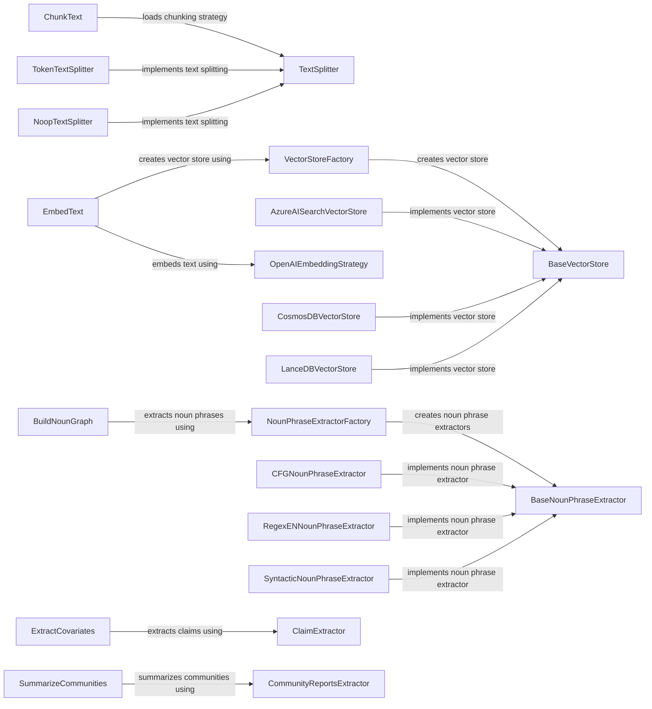

## Component Details

### ChunkText
The ChunkText component is responsible for dividing the input text into smaller, more manageable segments called chunks. It orchestrates the process of loading a specific chunking strategy based on the provided configuration, and then applies this strategy to generate the text chunks. The component interacts with the configuration settings to determine the chunking approach and utilizes the selected strategy to perform the actual chunking.
- **Related Classes/Methods**: `graphrag.index.operations.chunk_text.chunk_text`

### TextSplitter
The TextSplitter component provides the base interface for splitting text. TokenTextSplitter and NoopTextSplitter inherit from this class. It defines the basic contract for splitting text into smaller parts, providing a common interface for different splitting strategies.
- **Related Classes/Methods**: `graphrag.index.text_splitting.text_splitting`

### EmbedText
The EmbedText component is the main entry point for embedding text. It determines whether to embed the text in memory or using a vector store, creates the vector store if necessary, and calls the appropriate embedding strategy. It interacts with the VectorStoreFactory to create vector stores and with different embedding strategies to generate the embeddings.
- **Related Classes/Methods**: `graphrag.index.operations.embed_text.embed_text`

### VectorStoreFactory
The VectorStoreFactory component is responsible for creating vector stores. It uses the provided configuration to determine the type of vector store to create and initializes it accordingly. It interacts with the different vector store implementations to create the vector store.
- **Related Classes/Methods**: `graphrag.vector_stores.factory`

### BaseVectorStore
The BaseVectorStore component defines the base interface for interacting with vector stores. It provides methods for loading documents, searching by ID, and performing similarity searches. AzureAISearchVectorStore, CosmosDBVectorStore and LanceDBVectorStore inherit from this class.
- **Related Classes/Methods**: `graphrag.vector_stores.base`

### BuildNounGraph
The BuildNounGraph component constructs a noun graph from the input text. It extracts noun phrases as nodes and identifies relationships between them as edges. It uses a noun phrase extractor to identify the nodes and then determines the edges based on the relationships between the nodes.
- **Related Classes/Methods**: `graphrag.index.operations.build_noun_graph.build_noun_graph`

### NounPhraseExtractorFactory
The NounPhraseExtractorFactory component is responsible for creating noun phrase extractors based on the provided configuration. It determines the type of extractor to create and initializes it accordingly. It interacts with the different noun phrase extractor implementations to create the extractor.
- **Related Classes/Methods**: `graphrag.index.operations.build_noun_graph.np_extractors.factory`

### BaseNounPhraseExtractor
The BaseNounPhraseExtractor component defines the base interface for noun phrase extractors. CFGNounPhraseExtractor, RegexENNounPhraseExtractor and SyntacticNounPhraseExtractor inherit from this class.
- **Related Classes/Methods**: `graphrag.index.operations.build_noun_graph.np_extractors.base`

### ExtractCovariates
The ExtractCovariates component extracts covariates (claims) from the input text. It runs the claim extraction process and creates rows from the claim data. It interacts with the ClaimExtractor to extract the claims and with a language model to run the claim extraction process.
- **Related Classes/Methods**: `graphrag.index.operations.extract_covariates.extract_covariates`

### SummarizeCommunities
The SummarizeCommunities component summarizes the communities in the graph. It loads the summarization strategy, generates reports, and derives rows from the results. It interacts with the CommunityReportsExtractor to extract community reports and with different summarization strategies to generate the summaries.
- **Related Classes/Methods**: `graphrag.index.operations.summarize_communities.summarize_communities`
