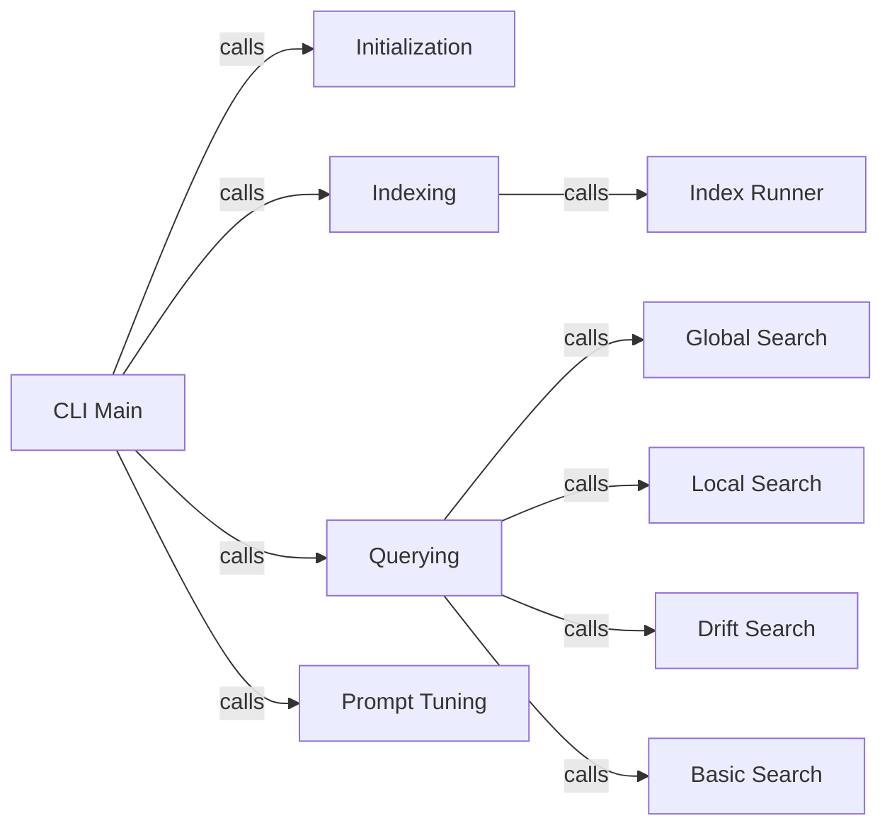

## Component Details

The User Interface & Orchestration component provides the command-line interface for users to interact with the GraphRAG system. It uses `argparse` to handle command-line arguments and dispatches to different subcommands for initialization, indexing, querying, and prompt tuning. The component orchestrates the execution of these workflows and presents the results to the user, acting as the central entry point for the system's functionality.

### CLI Main
The main entry point of the CLI application. It parses command-line arguments using `argparse` and calls the appropriate subcommand handler functions based on the parsed arguments. It sets up the overall structure and flow of the CLI.
- **Related Classes/Methods**: `graphrag.graphrag.cli.main:main`

### Initialization
Handles the `init` subcommand, responsible for initializing a new GraphRAG project. It creates the necessary directories and files to set up the project structure.
- **Related Classes/Methods**: `graphrag.graphrag.cli.main:_initialize_cli`

### Indexing
Handles the `index` and `update` subcommands, triggering the indexing or updating process of the knowledge graph. It takes arguments related to indexing and calls the `_run_index` function to perform the actual indexing.
- **Related Classes/Methods**: `graphrag.graphrag.cli.main:_index_cli`, `graphrag.graphrag.cli.main:_update_cli`, `graphrag.graphrag.cli.index:index_cli`, `graphrag.graphrag.cli.index:update_cli`

### Querying
Handles the `query` subcommand, dispatching to different search methods based on the specified search type (global, local, drift, basic). It orchestrates the execution of the selected search and presents the results.
- **Related Classes/Methods**: `graphrag.graphrag.cli.main:_query_cli`

### Prompt Tuning
Handles the `prompt_tune` subcommand, allowing users to tune the prompts used for querying the graph. It provides a way to optimize the prompts for better search results.
- **Related Classes/Methods**: `graphrag.graphrag.cli.main:_prompt_tune_cli`, `graphrag.graphrag.cli.prompt_tune:prompt_tune`

### Global Search
Executes a global search query, searching the entire graph for relevant information. It calls `_resolve_output_files` to determine where to save the search results.
- **Related Classes/Methods**: `graphrag.graphrag.cli.query:run_global_search`

### Local Search
Executes a local search query, searching a specific part of the graph for relevant information. It calls `_resolve_output_files` to determine where to save the search results.
- **Related Classes/Methods**: `graphrag.graphrag.cli.query:run_local_search`

### Drift Search
Executes a drift search query, searching for changes or drifts in the graph over time. It calls `_resolve_output_files` to determine where to save the search results.
- **Related Classes/Methods**: `graphrag.graphrag.cli.query:run_drift_search`

### Basic Search
Executes a basic search query, performing a simple keyword-based search on the graph. It calls `_resolve_output_files` to determine where to save the search results.
- **Related Classes/Methods**: `graphrag.graphrag.cli.query:run_basic_search`

### Index Runner
Runs the indexing process. It takes the data and builds the graph index.
- **Related Classes/Methods**: `graphrag.graphrag.cli.index:_run_index`
