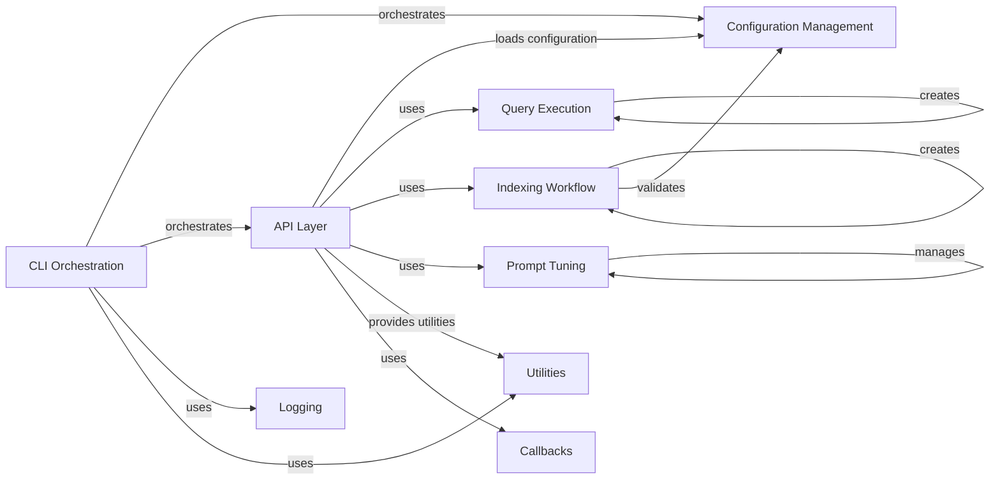

## Component Details

### CLI Orchestration
This component serves as the entry point for user interaction with the GraphRAG system. It parses command-line arguments, determines the desired action (indexing, querying, prompt tuning, or initialization), and orchestrates the corresponding workflow. It handles the overall control flow based on user input.
- **Related Classes/Methods**: `graphrag.cli.main`, `graphrag.cli.index`, `graphrag.cli.query`, `graphrag.cli.initialize`, `graphrag.cli.prompt_tune`

### Configuration Management
This component is responsible for loading, parsing, validating, and providing access to the application's configuration. It supports loading configurations from various sources (e.g., environment variables, default values) and provides a consistent interface for accessing configuration values throughout the application. It defines the data models for the configuration.
- **Related Classes/Methods**: `graphrag.config.load_config`, `graphrag.config.models`, `graphrag.config.environment_reader`, `graphrag.config.defaults`, `graphrag.config.enums`

### API Layer
This component provides a high-level API for core functionalities such as indexing, querying, and prompt tuning. It acts as an intermediary between the CLI and the underlying implementation, abstracting away the complexities of the core logic. It receives requests from the CLI, processes them, and invokes the appropriate core components.
- **Related Classes/Methods**: `graphrag.api.index`, `graphrag.api.query`, `graphrag.api.prompt_tune`

### Query Execution
This component focuses on the creation and execution of search queries against the knowledge graph. It provides factory functions for creating different types of search engines and implements the structured search functionality, enabling users to retrieve relevant information from the graph based on their queries.
- **Related Classes/Methods**: `graphrag.query.factory`, `graphrag.query.structured_search`

### Indexing Workflow
This component manages the end-to-end indexing process, which involves extracting information from data sources, transforming it into a graph representation, and storing it in a graph database. It provides a factory for creating indexing pipelines and functions for running the indexing process.
- **Related Classes/Methods**: `graphrag.index.workflows.factory`, `graphrag.index.run`, `graphrag.index.validate_config`

### Prompt Tuning
This component is responsible for optimizing prompts used in conjunction with language models to improve the quality of generated responses. It includes functionalities for tuning prompts and managing the language models used for prompt generation.
- **Related Classes/Methods**: `graphrag.prompt_tune`, `graphrag.language_model`

### Utilities
This component provides a collection of utility functions used throughout the GraphRAG system. It includes API-specific utilities and general-purpose utilities that support various aspects of the application's functionality.
- **Related Classes/Methods**: `graphrag.utils.api`, `graphrag.utils`

### Logging
This component provides logging functionalities for the GraphRAG system, enabling developers to track the application's behavior, diagnose issues, and monitor performance. It provides a centralized logging mechanism for all components of the system.
- **Related Classes/Methods**: `graphrag.logger`

### Callbacks
This component defines callback functions that can be triggered at different stages of the indexing and querying workflows. These callbacks allow developers to extend the system's functionality and customize its behavior without modifying the core code.
- **Related Classes/Methods**: `graphrag.callbacks`
