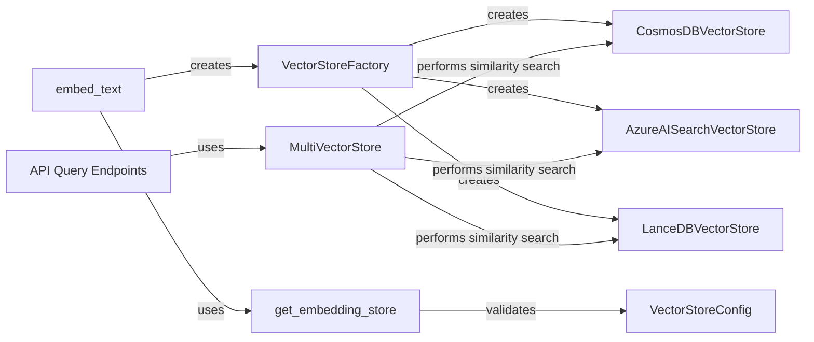

## Component Details

The Vector Store Abstraction component provides a unified interface for interacting with different vector store implementations (CosmosDB, Azure AI Search, LanceDB). It allows the system to store, retrieve, and search embeddings efficiently, enabling similarity search and retrieval of relevant context. The main flow involves creating a vector store instance using the VectorStoreFactory based on the configuration, loading documents into the vector store, and performing similarity searches using either text or vector embeddings. The API query endpoints use the MultiVectorStore to perform searches across multiple vector stores.

### VectorStoreFactory
The VectorStoreFactory is responsible for creating vector store instances based on the provided configuration. It acts as a central point for instantiating different vector store implementations like CosmosDB, Azure AI Search, and LanceDB. It uses the VectorStoreConfig to determine which vector store to create and initializes it with the appropriate parameters.
- **Related Classes/Methods**: `graphrag.graphrag.vector_stores.factory.VectorStoreFactory:create_vector_store`

### CosmosDBVectorStore
The CosmosDBVectorStore class implements the vector store interface using Azure Cosmos DB as the backend. It handles connecting to the database, creating containers, loading documents, performing similarity searches, and clearing the store. It interacts with Azure Cosmos DB to store and retrieve vector embeddings.
- **Related Classes/Methods**: `graphrag.graphrag.vector_stores.cosmosdb.CosmosDBVectorStore:__init__`, `graphrag.graphrag.vector_stores.cosmosdb.CosmosDBVectorStore:connect`, `graphrag.graphrag.vector_stores.cosmosdb.CosmosDBVectorStore:_delete_database`, `graphrag.graphrag.vector_stores.cosmosdb.CosmosDBVectorStore:_delete_container`, `graphrag.graphrag.vector_stores.cosmosdb.CosmosDBVectorStore:load_documents`, `graphrag.graphrag.vector_stores.cosmosdb.CosmosDBVectorStore:similarity_search_by_vector`, `graphrag.graphrag.vector_stores.cosmosdb.CosmosDBVectorStore:similarity_search_by_text`, `graphrag.graphrag.vector_stores.cosmosdb.CosmosDBVectorStore:search_by_id`, `graphrag.graphrag.vector_stores.cosmosdb.CosmosDBVectorStore:clear`

### AzureAISearchVectorStore
The AzureAISearchVectorStore class implements the vector store interface using Azure AI Search as the backend. It handles connecting to the search service, creating indexes, loading documents, and performing similarity searches. It interacts with Azure AI Search to store and retrieve vector embeddings.
- **Related Classes/Methods**: `graphrag.graphrag.vector_stores.azure_ai_search.AzureAISearchVectorStore:__init__`, `graphrag.graphrag.vector_stores.azure_ai_search.AzureAISearchVectorStore:similarity_search_by_vector`, `graphrag.graphrag.vector_stores.azure_ai_search.AzureAISearchVectorStore:similarity_search_by_text`, `graphrag.graphrag.vector_stores.azure_ai_search.AzureAISearchVectorStore:search_by_id`

### LanceDBVectorStore
The LanceDBVectorStore class implements the vector store interface using LanceDB as the backend. It handles creating and connecting to the LanceDB database, loading documents, and performing similarity searches. It interacts with LanceDB to store and retrieve vector embeddings.
- **Related Classes/Methods**: `graphrag.graphrag.vector_stores.lancedb.LanceDBVectorStore:__init__`, `graphrag.graphrag.vector_stores.lancedb.LanceDBVectorStore:similarity_search_by_vector`, `graphrag.graphrag.vector_stores.lancedb.LanceDBVectorStore:similarity_search_by_text`, `graphrag.graphrag.vector_stores.lancedb.LanceDBVectorStore:search_by_id`

### embed_text
The `embed_text` module contains functions for embedding text and interacting with vector stores. It includes functions for creating vector stores, embedding text with a vector store, and retrieving collection names. It uses the `VectorStoreFactory` to create vector stores and the embedding models to generate embeddings.
- **Related Classes/Methods**: `graphrag.graphrag.index.operations.embed_text.embed_text:_create_vector_store`, `graphrag.graphrag.index.operations.embed_text.embed_text:_text_embed_with_vector_store`, `graphrag.graphrag.index.operations.embed_text.embed_text:_get_collection_name`

### get_embedding_store
The `get_embedding_store` function is responsible for retrieving the appropriate embedding store based on the configuration. It uses the `VectorStoreConfig` to determine which vector store to retrieve.
- **Related Classes/Methods**: `graphrag.graphrag.utils.api:get_embedding_store`

### VectorStoreConfig
The `VectorStoreConfig` model defines the configuration for the vector store, including the type of vector store and its specific settings. It also includes validation logic to ensure the configuration is valid. It is used by the `VectorStoreFactory` to create and configure vector stores.
- **Related Classes/Methods**: `graphrag.graphrag.config.models.vector_store_config.VectorStoreConfig:_validate_model`

### MultiVectorStore
The `MultiVectorStore` class manages multiple vector stores and provides a unified interface for searching across them. It receives queries and distributes them to the underlying vector stores, aggregating the results. It interacts with the individual vector store implementations (CosmosDB, Azure AI Search, LanceDB) to perform the searches.
- **Related Classes/Methods**: `graphrag.graphrag.utils.api.MultiVectorStore:similarity_search_by_text`

### API Query Endpoints
The API query endpoints define the entry points for performing different types of searches, including global search, local search, drift search, and basic search. These endpoints likely delegate the actual search operations to other components, such as the `MultiVectorStore` or specific vector store implementations.
- **Related Classes/Methods**: `graphrag.graphrag.api.query:global_search`, `graphrag.graphrag.api.query:global_search_streaming`, `graphrag.graphrag.api.query:multi_index_global_search`, `graphrag.graphrag.api.query:local_search`, `graphrag.graphrag.api.query:local_search_streaming`, `graphrag.graphrag.api.query:multi_index_local_search`, `graphrag.graphrag.api.query:drift_search`, `graphrag.graphrag.api.query:drift_search_streaming`, `graphrag.graphrag.api.query:multi_index_drift_search`, `graphrag.graphrag.api.query:basic_search`, `graphrag.graphrag.api.query:basic_search_streaming`, `graphrag.graphrag.api.query:multi_index_basic_search`
