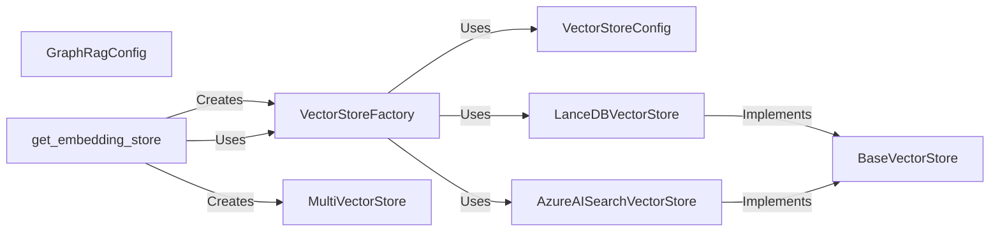

## Component Details

### VectorStoreFactory
The VectorStoreFactory is responsible for creating and managing vector store instances. It uses the configuration to determine the appropriate vector store implementation (e.g., LanceDB, Azure AI Search, Cosmos DB) and instantiates it. This factory centralizes the creation logic for different vector store types, providing a consistent interface for accessing them.
- **Related Classes/Methods**: `graphrag.vector_stores.factory.VectorStoreFactory`

### BaseVectorStore
BaseVectorStore is an abstract base class that defines the common interface for all vector store implementations. It specifies the methods that all vector stores must implement, such as connect, load_documents, similarity_search_by_vector, similarity_search_by_text, and search_by_id. This ensures that all vector store implementations adhere to a consistent API, making it easier to switch between different vector store types.
- **Related Classes/Methods**: `graphrag.vector_stores.base.VectorStore`

### VectorStoreConfig
VectorStoreConfig holds the configuration parameters for a specific vector store. This includes information such as the vector store type, connection details, and collection name. It is used by the VectorStoreFactory to create vector store instances with the correct settings. The configuration is validated to ensure that all required parameters are present and valid.
- **Related Classes/Methods**: `repos.graphrag.graphrag.config.models.vector_store_config.VectorStoreConfig`

### GraphRagConfig
GraphRagConfig represents the overall configuration for the GraphRAG system. It includes the VectorStoreConfig, embedding model configuration, and other system-wide settings. It provides a central place to manage all configuration settings for the system, making it easier to configure and deploy the GraphRAG system.
- **Related Classes/Methods**: `repos.graphrag.graphrag.config.models.graph_rag_config.GraphRagConfig`

### get_embedding_store
The `get_embedding_store` function retrieves or creates an embedding store based on the provided configuration. It utilizes the VectorStoreFactory to instantiate the vector store and may manage multiple vector stores using the MultiVectorStore class. This function acts as a central point for accessing and managing vector stores within the GraphRAG system.
- **Related Classes/Methods**: `repos.graphrag.graphrag.utils.api:get_embedding_store`

### MultiVectorStore
The MultiVectorStore class manages multiple vector stores, enabling searching across them simultaneously. This is useful for combining results from different vector store types or sharding data across multiple stores. It provides a unified interface for querying multiple vector stores and aggregating the results.
- **Related Classes/Methods**: `repos.graphrag.graphrag.utils.api.MultiVectorStore`

### LanceDBVectorStore
LanceDBVectorStore is a concrete implementation of the BaseVectorStore interface, specifically for interacting with LanceDB. It handles the connection to LanceDB, loading documents into the vector store, and performing similarity searches using LanceDB's capabilities. It encapsulates the specific details of interacting with LanceDB, providing a consistent interface for the rest of the system.
- **Related Classes/Methods**: `graphrag.vector_stores.lancedb`

### AzureAISearchVectorStore
AzureAISearchVectorStore is a concrete implementation of the BaseVectorStore interface, specifically for interacting with Azure AI Search. It manages the connection to Azure AI Search, indexing documents, and performing similarity searches using Azure AI Search's capabilities. It encapsulates the specific details of interacting with Azure AI Search, providing a consistent interface for the rest of the system.
- **Related Classes/Methods**: `graphrag.vector_stores.azure_ai_search`
