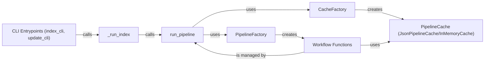

## Component Details

The Workflow Management & Caching component orchestrates the indexing and updating processes in the graph RAG system. It defines the sequence of steps (workflows) to be executed, manages their execution, and provides caching mechanisms to improve performance. The component utilizes a factory pattern to create pipelines and caches based on configuration, allowing for flexibility and extensibility. It handles both in-memory and JSON-based caching, enabling the reuse of intermediate results across pipeline runs. The core flow involves receiving a request to index or update the graph, creating a pipeline based on the configuration, executing the pipeline steps (workflows), and storing intermediate results in the cache. The purpose of this component is to ensure efficient and reliable execution of the indexing and updating processes, while also optimizing performance through caching.

### CLI Entrypoints (index_cli, update_cli)
These are the command-line interface entry points for initiating the indexing process. `index_cli` likely starts a fresh index, while `update_cli` updates an existing one. They both call `_run_index` to handle the core indexing logic.
- **Related Classes/Methods**: `graphrag.graphrag.cli.index:index_cli`, `graphrag.graphrag.cli.index:update_cli`

### _run_index
This function orchestrates the overall indexing process based on the CLI command. It handles configuration loading, data source selection, and calling the main indexing pipeline.
- **Related Classes/Methods**: `graphrag.graphrag.cli.index:_run_index`

### run_pipeline
This function is the core of the indexing pipeline. It manages the execution of different workflows in a specific order, potentially with caching and error handling.
- **Related Classes/Methods**: `graphrag.graphrag.index.run.run_pipeline:run_pipeline`, `graphrag.graphrag.index.run.run_pipeline:_run_pipeline`

### PipelineFactory
This component is responsible for creating the indexing pipeline based on the configuration. It registers all available workflows and creates the pipeline based on the specified workflow configuration.
- **Related Classes/Methods**: `graphrag.graphrag.index.workflows.factory.PipelineFactory:create_pipeline`, `graphrag.graphrag.index.workflows.factory.PipelineFactory:register_all`

### CacheFactory
This component creates and manages the cache used during the indexing process. It allows to reuse the results of previous computations, which can significantly improve the performance of the pipeline.
- **Related Classes/Methods**: `graphrag.graphrag.cache.factory.CacheFactory:create_cache`

### PipelineCache (JsonPipelineCache/InMemoryCache)
These components implement the caching mechanism. `JsonPipelineCache` persists the cache to disk using JSON format, while `InMemoryCache` stores the cache in memory. They provide methods for getting, setting, deleting, and checking the existence of cached data.
- **Related Classes/Methods**: `graphrag.graphrag.cache.json_pipeline_cache.JsonPipelineCache:get`, `graphrag.graphrag.cache.json_pipeline_cache.JsonPipelineCache:delete`, `graphrag.graphrag.cache.json_pipeline_cache.JsonPipelineCache:child`, `graphrag.graphrag.cache.memory_pipeline_cache.InMemoryCache:get`, `graphrag.graphrag.cache.memory_pipeline_cache.InMemoryCache:set`, `graphrag.graphrag.cache.memory_pipeline_cache.InMemoryCache:has`, `graphrag.graphrag.cache.memory_pipeline_cache.InMemoryCache:delete`, `graphrag.graphrag.cache.memory_pipeline_cache.InMemoryCache:child`

### Workflow Functions
These functions represent the individual steps in the indexing pipeline. They perform specific tasks such as extracting graph data, creating communities, generating text embeddings, and creating final documents.
- **Related Classes/Methods**: `graphrag.graphrag.index.workflows.create_final_text_units:run_workflow`, `graphrag.graphrag.index.workflows.create_final_text_units:create_final_text_units`, `graphrag.graphrag.index.workflows.update_communities:run_workflow`, `graphrag.graphrag.index.workflows.update_community_reports:run_workflow`, `graphrag.graphrag.index.workflows.create_final_documents:run_workflow`, `graphrag.graphrag.index.workflows.extract_graph:run_workflow`, `graphrag.graphrag.index.workflows.extract_graph:extract_graph`, `graphrag.graphrag.index.workflows.extract_graph:get_summarized_entities_relationships`, `graphrag.graphrag.index.workflows.create_communities:run_workflow`, `graphrag.graphrag.index.workflows.create_communities:create_communities`, `graphrag.graphrag.index.workflows.extract_graph_nlp:run_workflow`, `graphrag.graphrag.index.workflows.extract_graph_nlp:extract_graph_nlp`, `graphrag.graphrag.index.workflows.generate_text_embeddings:run_workflow`, `graphrag.graphrag.index.workflows.generate_text_embeddings:generate_text_embeddings`, `graphrag.graphrag.index.workflows.generate_text_embeddings:_run_embeddings`, `graphrag.graphrag.index.workflows.update_text_embeddings:run_workflow`, `graphrag.graphrag.index.workflows.create_community_reports_text:run_workflow`, `graphrag.graphrag.index.workflows.create_community_reports_text:create_community_reports_text`, `graphrag.graphrag.index.workflows.update_text_units:run_workflow`, `graphrag.graphrag.index.workflows.update_entities_relationships:run_workflow`, `graphrag.graphrag.index.workflows.update_final_documents:run_workflow`, `graphrag.graphrag.index.workflows.finalize_graph:run_workflow`, `graphrag.graphrag.index.workflows.finalize_graph:finalize_graph`, `graphrag.graphrag.index.workflows.update_clean_state:run_workflow`, `graphrag.graphrag.index.workflows.extract_covariates:run_workflow`, `graphrag.graphrag.index.workflows.create_community_reports:run_workflow`, `graphrag.graphrag.index.workflows.prune_graph:run_workflow`, `graphrag.graphrag.index.workflows.create_base_text_units:run_workflow`, `graphrag.graphrag.index.workflows.update_covariates:run_workflow`
