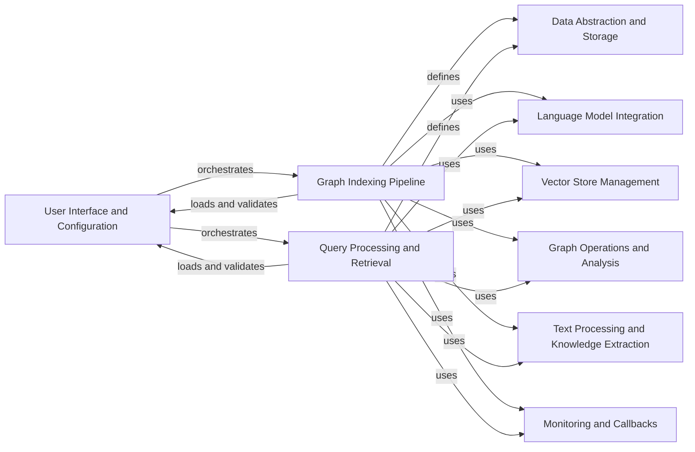

## Component Details

### User Interface and Configuration
This component provides the entry point for users to interact with the GraphRAG system. It handles command-line argument parsing, configuration loading, and management, orchestrating the indexing and querying tasks based on user input and configuration settings. It is responsible for loading configurations from various sources and providing a consistent interface for accessing configuration values.
- **Related Classes/Methods**: `graphrag.cli.main`, `graphrag.cli.index`, `graphrag.cli.query`, `graphrag.cli.initialize`, `graphrag.cli.prompt_tune`, `graphrag.config.load_config`, `graphrag.config.models.graph_rag_config`, `graphrag.config.environment_reader`, `graphrag.config.defaults`, `graphrag.config.enums`

### Data Abstraction and Storage
This component defines the data model used throughout the application, including entities, relationships, text units, and communities. It provides a consistent way to represent and manipulate data, and includes schema definitions for validation. It also abstracts the storage and caching mechanisms, providing a unified interface for interacting with different storage backends and cache implementations, ensuring data persistence and efficient retrieval.
- **Related Classes/Methods**: `graphrag.data_model.entity`, `graphrag.data_model.relationship`, `graphrag.data_model.text_unit`, `graphrag.data_model.community`, `graphrag.data_model.community_report`, `graphrag.data_model.covariate`, `graphrag.data_model.document`, `graphrag.storage.factory`, `graphrag.storage.blob_pipeline_storage`, `graphrag.storage.cosmosdb_pipeline_storage`, `graphrag.storage.file_pipeline_storage`, `graphrag.storage.memory_pipeline_storage`, `graphrag.storage.pipeline_storage`, `graphrag.cache.factory`, `graphrag.cache.memory_pipeline_cache`, `graphrag.cache.json_pipeline_cache`, `graphrag.cache.noop_pipeline_cache`, `graphrag.cache.pipeline_cache`

### Language Model Integration
This component manages integration with different language models, such as OpenAI and Azure OpenAI. It provides a consistent interface for calling language models for tasks such as text embedding, graph extraction, and community summarization. It abstracts the underlying language model providers and handles caching of language model responses, optimizing language model usage.
- **Related Classes/Methods**: `graphrag.language_model.manager`, `graphrag.language_model.factory`, `graphrag.language_model.providers.fnllm.models`, `graphrag.language_model.providers.fnllm.utils`, `graphrag.language_model.providers.fnllm.cache`, `graphrag.language_model.protocol`

### Vector Store Management
This component provides an abstraction layer for interacting with different vector stores, such as LanceDB, Azure AI Search, and Cosmos DB. It defines a common interface for storing and searching vector embeddings, and handles the details of connecting to and interacting with each vector store, enabling efficient similarity searches.
- **Related Classes/Methods**: `graphrag.vector_stores.factory`, `graphrag.vector_stores.lancedb`, `graphrag.vector_stores.azure_ai_search`, `graphrag.vector_stores.cosmosdb`, `graphrag.vector_stores.base`

### Graph Indexing Pipeline
This component defines the workflow for indexing data and building the knowledge graph. It includes steps for reading input data, extracting entities and relationships, computing embeddings, and storing the graph in a vector store. It orchestrates the various operations involved in building the knowledge graph, transforming raw data into a structured knowledge representation.
- **Related Classes/Methods**: `graphrag.index.run.run_pipeline`, `graphrag.index.workflows.factory`, `graphrag.index.workflows`, `graphrag.index.input.factory`, `graphrag.index.operations`, `graphrag.index.utils`, `graphrag.index.update`

### Query Processing and Retrieval
This component handles querying the knowledge graph and retrieving relevant information. It supports different search strategies, such as local search, global search, and drift search, and integrates with the language model to generate answers. It orchestrates the search process and generates the final response, providing users with relevant and informative answers.
- **Related Classes/Methods**: `graphrag.query`, `graphrag.query.factory`, `graphrag.query.structured_search`, `graphrag.query.context_builder`, `graphrag.query.input`, `graphrag.query.llm`, `graphrag.query.question_gen`

### Graph Operations and Analysis
This component provides functionalities for creating, manipulating, and analyzing graphs. It includes operations for clustering, pruning, embedding, and laying out graphs, as well as utilities for working with graph data structures. These operations are used during the indexing and querying pipelines, enabling graph-based reasoning and analysis.
- **Related Classes/Methods**: `graphrag.index.operations.create_graph`, `graphrag.index.operations.cluster_graph`, `graphrag.index.operations.prune_graph`, `graphrag.index.operations.embed_graph`, `graphrag.index.operations.layout_graph`, `graphrag.index.operations.graph_to_dataframes`

### Text Processing and Knowledge Extraction
This component provides functionalities for processing text data, such as chunking, splitting, and embedding. It includes strategies for different chunking methods and integrates with the language model to compute text embeddings. It also includes functionalities for extracting noun phrases, covariates, community summaries, and description summaries, enriching the knowledge graph with extracted information.
- **Related Classes/Methods**: `graphrag.index.operations.chunk_text`, `graphrag.index.operations.embed_text`, `graphrag.index.text_splitting`, `graphrag.index.operations.build_noun_graph.np_extractors`, `graphrag.index.operations.extract_covariates`, `graphrag.index.operations.summarize_communities`, `graphrag.index.operations.summarize_descriptions`

### Monitoring and Callbacks
This component provides a flexible callback system for monitoring and logging the progress of indexing and querying tasks. It supports different callback types, such as console, file, and blob storage, and allows users to customize the behavior of the application. It provides insights into the execution of the pipelines, facilitating debugging and performance optimization.
- **Related Classes/Methods**: `graphrag.callbacks`