```mermaid
graph LR
    User_Interface_Orchestration["User Interface & Orchestration"]
    Configuration_Management["Configuration Management"]
    Data_Ingestion_Graph_Construction["Data Ingestion & Graph Construction"]
    Indexing_Embedding_Management["Indexing & Embedding Management"]
    Vector_Store_Abstraction["Vector Store Abstraction"]
    Language_Model_Integration["Language Model Integration"]
    Query_Processing_Context_Building["Query Processing & Context Building"]
    Workflow_Management_Caching["Workflow Management & Caching"]
    Storage_Logging["Storage & Logging"]
    User_Interface_Orchestration -- "orchestrates" --> Data_Ingestion_Graph_Construction
    User_Interface_Orchestration -- "orchestrates" --> Indexing_Embedding_Management
    User_Interface_Orchestration -- "orchestrates" --> Query_Processing_Context_Building
    User_Interface_Orchestration -- "loads" --> Configuration_Management
    Configuration_Management -- "provides configuration to" --> Data_Ingestion_Graph_Construction
    Configuration_Management -- "provides configuration to" --> Indexing_Embedding_Management
    Configuration_Management -- "provides configuration to" --> Query_Processing_Context_Building
    Configuration_Management -- "provides configuration to" --> Vector_Store_Abstraction
    Configuration_Management -- "provides configuration to" --> Language_Model_Integration
    Configuration_Management -- "provides configuration to" --> Workflow_Management_Caching
    Configuration_Management -- "provides configuration to" --> Storage_Logging
    Data_Ingestion_Graph_Construction -- "chunks data for" --> Indexing_Embedding_Management
    Data_Ingestion_Graph_Construction -- "extracts entities and relationships for" --> Indexing_Embedding_Management
    Indexing_Embedding_Management -- "stores embeddings in" --> Vector_Store_Abstraction
    Indexing_Embedding_Management -- "uses" --> Language_Model_Integration
    Query_Processing_Context_Building -- "retrieves embeddings from" --> Vector_Store_Abstraction
    Query_Processing_Context_Building -- "uses" --> Language_Model_Integration
    Query_Processing_Context_Building -- "builds context with" --> Query_Processing_Context_Building
    Workflow_Management_Caching -- "manages" --> Data_Ingestion_Graph_Construction
    Workflow_Management_Caching -- "manages" --> Indexing_Embedding_Management
    Indexing_Embedding_Management -- "persists data using" --> Storage_Logging
    Workflow_Management_Caching -- "caches data within" --> Workflow_Management_Caching
    Workflow_Management_Caching -- "logs progress through" --> Storage_Logging
    Query_Processing_Context_Building -- "logs progress through" --> Storage_Logging
    click User_Interface_Orchestration href "https://github.com/CodeBoarding/GeneratedOnBoardings/blob/main/graphrag/User Interface & Orchestration.md" "Details"
    click Configuration_Management href "https://github.com/CodeBoarding/GeneratedOnBoardings/blob/main/graphrag/Configuration Management.md" "Details"
    click Data_Ingestion_Graph_Construction href "https://github.com/CodeBoarding/GeneratedOnBoardings/blob/main/graphrag/Data Ingestion & Graph Construction.md" "Details"
    click Indexing_Embedding_Management href "https://github.com/CodeBoarding/GeneratedOnBoardings/blob/main/graphrag/Indexing & Embedding Management.md" "Details"
    click Vector_Store_Abstraction href "https://github.com/CodeBoarding/GeneratedOnBoardings/blob/main/graphrag/Vector Store Abstraction.md" "Details"
    click Language_Model_Integration href "https://github.com/CodeBoarding/GeneratedOnBoardings/blob/main/graphrag/Language Model Integration.md" "Details"
    click Query_Processing_Context_Building href "https://github.com/CodeBoarding/GeneratedOnBoardings/blob/main/graphrag/Query Processing & Context Building.md" "Details"
    click Workflow_Management_Caching href "https://github.com/CodeBoarding/GeneratedOnBoardings/blob/main/graphrag/Workflow Management & Caching.md" "Details"
    click Storage_Logging href "https://github.com/CodeBoarding/GeneratedOnBoardings/blob/main/graphrag/Storage & Logging.md" "Details"
```

## Component Details

The GraphRAG system enhances question answering by integrating knowledge graphs with retrieval-augmented generation. It ingests data from various sources, constructs a graph representation by extracting entities and relationships, and indexes both text and graph embeddings for efficient retrieval. During querying, it retrieves relevant context from the vector store and graph, leveraging language models to generate accurate and informative answers. The system also includes components for configuration management, workflow orchestration, caching, storage abstraction, and logging, ensuring efficient and reliable operation.

### User Interface & Orchestration
This component provides the primary interface for users to interact with the GraphRAG system. It handles command-line arguments, orchestrates the execution of indexing and querying workflows, and presents results to the user. It acts as the entry point and central coordinator for the system's functionality.
- **Related Classes/Methods**: `graphrag.graphrag.cli.main`, `graphrag.graphrag.cli.initialize`, `graphrag.graphrag.cli.index`, `graphrag.graphrag.cli.query`, `graphrag.graphrag.cli.prompt_tune`

### Configuration Management
This component manages the system's configuration, loading parameters from files and environment variables. It ensures that all required settings are valid and provides a central point of access for configuration values. This promotes consistency and simplifies management of the system's behavior.
- **Related Classes/Methods**: `graphrag.graphrag.config.load_config`, `graphrag.graphrag.config.create_graphrag_config`, `graphrag.graphrag.config.models.graph_rag_config`, `graphrag.graphrag.config.environment_reader`

### Data Ingestion & Graph Construction
This component handles the ingestion, processing, and transformation of raw data into a structured knowledge graph. It includes functionalities for loading data from various sources, chunking text, extracting entities and relationships, and building the graph representation. It acts as the foundation for the GraphRAG system, converting unstructured data into a structured format suitable for indexing and querying.
- **Related Classes/Methods**: `graphrag.graphrag.index.input.factory`, `graphrag.graphrag.index.input.text`, `graphrag.graphrag.index.input.csv`, `graphrag.graphrag.index.input.json`, `graphrag.graphrag.index.input.util`, `graphrag.graphrag.index.text_splitting.chunk_text`, `graphrag.graphrag.index.text_splitting.text_splitting`, `graphrag.graphrag.index.operations.build_noun_graph.build_noun_graph`, `graphrag.graphrag.index.operations.build_noun_graph.np_extractors.factory`, `graphrag.graphrag.index.operations.extract_graph.extract_graph`, `graphrag.graphrag.index.operations.extract_graph.graph_extractor`

### Indexing & Embedding Management
This component is responsible for indexing the graph data for efficient retrieval. It embeds the text and graph nodes using language models and stores the embeddings in a vector store. It also clusters the graph to identify communities and summarizes the communities to provide context for search. This component prepares the data for efficient querying by creating searchable representations of the text and graph.
- **Related Classes/Methods**: `graphrag.graphrag.index.operations.embed_text.embed_text`, `graphrag.graphrag.index.operations.embed_graph.embed_graph`, `graphrag.graphrag.index.operations.cluster_graph.cluster_graph`, `graphrag.graphrag.index.operations.summarize_communities.summarize_communities`

### Vector Store Abstraction
This component provides an abstraction layer for interacting with different vector stores, such as CosmosDB, Azure AI Search, and LanceDB. It allows the system to store and retrieve embeddings efficiently, enabling similarity search and retrieval of relevant context for question answering. It acts as the data repository for the embeddings, providing a consistent interface for accessing them.
- **Related Classes/Methods**: `graphrag.graphrag.vector_stores.factory`, `graphrag.graphrag.vector_stores.cosmosdb`, `graphrag.graphrag.vector_stores.azure_ai_search`, `graphrag.graphrag.vector_stores.lancedb`, `graphrag.graphrag.utils.api`

### Language Model Integration
This component manages the integration with various language models, such as OpenAI and Azure OpenAI. It provides a factory for creating language model instances and a manager for caching and reusing models. It also handles authentication and rate limiting for the language models. It acts as the interface to the language models, providing a consistent way to access their capabilities.
- **Related Classes/Methods**: `graphrag.graphrag.language_model.factory`, `graphrag.graphrag.language_model.manager`, `graphrag.graphrag.language_model.providers.fnllm.models`

### Query Processing & Context Building
This component implements the query engine that performs search and question answering. It supports different search methods, including basic, local, global, and drift search. It retrieves relevant context from the vector store and graph, and it uses a language model to generate a response. It acts as the brain of the system, orchestrating the search and retrieval process to generate accurate and informative answers.
- **Related Classes/Methods**: `graphrag.graphrag.query.factory`, `graphrag.graphrag.query.structured_search.basic_search.search`, `graphrag.graphrag.query.structured_search.local_search.search`, `graphrag.graphrag.query.structured_search.global_search.search`, `graphrag.graphrag.query.structured_search.drift_search.search`, `graphrag.graphrag.query.context_builder.community_context`, `graphrag.graphrag.query.context_builder.source_context`, `graphrag.graphrag.query.context_builder.local_context`, `graphrag.graphrag.query.context_builder.global_context`, `graphrag.graphrag.query.context_builder.drift_context`

### Workflow Management & Caching
This component manages the execution of workflows for indexing and updating the graph RAG system. It defines the steps in the workflow and orchestrates the execution of these steps. It also handles caching and error handling for the workflows. It acts as the orchestrator of the indexing and updating processes, ensuring that they are executed efficiently and reliably. It also provides caching mechanisms for the pipeline, improving performance by storing intermediate results and reusing them in subsequent runs.
- **Related Classes/Methods**: `graphrag.graphrag.index.workflows.factory`, `graphrag.graphrag.index.run.run_pipeline`, `graphrag.graphrag.cache.factory`, `graphrag.graphrag.cache.memory_pipeline_cache`, `graphrag.graphrag.cache.json_pipeline_cache`

### Storage & Logging
This component provides an abstraction layer for interacting with different storage systems and handles logging and callbacks. It allows the system to store and retrieve data efficiently, enabling persistence of the graph and vector store. It also provides logging and callback mechanisms for monitoring the progress of the indexing and querying processes.
- **Related Classes/Methods**: `graphrag.graphrag.storage.factory`, `graphrag.graphrag.storage.blob_pipeline_storage`, `graphrag.graphrag.storage.cosmosdb_pipeline_storage`, `graphrag.graphrag.storage.file_pipeline_storage`, `graphrag.graphrag.logger.factory`, `graphrag.graphrag.logger.console`, `graphrag.graphrag.logger.rich_progress`, `graphrag.graphrag.callbacks.workflow_callbacks_manager`