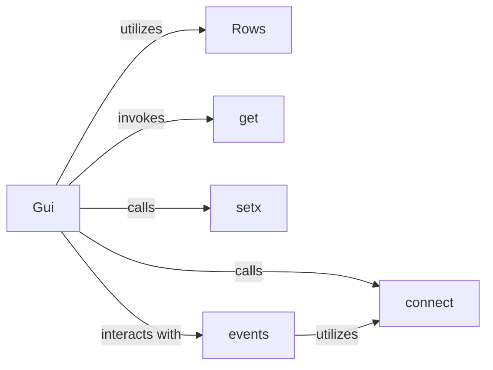

## Details

The `guietta` subsystem provides a high-level abstraction for building graphical user interfaces, primarily focusing on simplifying Qt interactions. The `Gui` component acts as the central orchestrator, managing the application's lifecycle and serving as the primary interface for GUI definition and interaction. It leverages `Rows` for declarative, row-based widget layout, enabling structured view definition. Data flow between the GUI and application logic is managed through `get` for retrieving widget states and `setx` for programmatically updating them. Event handling is a core aspect, with `events` providing an abstracted mechanism for managing GUI events. Both `Gui` and `events` utilize the `connect` utility to establish direct links between widget signals and application logic, forming the backbone of the event-action mapping within the system. This architecture emphasizes clear separation of concerns, simplifying GUI development by abstracting underlying complexities.

### Gui
Serves as the central orchestrator and facade for the entire GUI. It initializes the GUI application, manages its lifecycle, and provides the main interface for defining and interacting with GUI elements. It embodies the "Guietta Abstraction" by simplifying complex Qt interactions.

**Related Classes/Methods**:

- <a href="https://github.com/alfiopuglisi/guietta/blob/master/guietta/guietta.py" target="_blank" rel="noopener noreferrer">`guietta.guietta.Gui`</a>

### Rows
Manages the declarative, row-based layout of widgets. It acts as a container and structural element for organizing GUI components, directly contributing to the "View Definition" aspect of the architecture.

**Related Classes/Methods**:

- <a href="https://github.com/alfiopuglisi/guietta/blob/master/guietta/guietta.py" target="_blank" rel="noopener noreferrer">`guietta.guietta.Rows`</a>

### connect
A fundamental utility for establishing direct links between GUI widget signals (user actions) and Python callables (application logic "slots"). It is a core mechanism for "Event-Action Mapping."

**Related Classes/Methods**:

- <a href="https://github.com/alfiopuglisi/guietta/blob/master/guietta/guietta.py#L1817-L1846" target="_blank" rel="noopener noreferrer">`guietta.guietta.connect`:1817-1846</a>

### get
Provides a mechanism for retrieving the current value or state of a specified GUI widget. This is crucial for "Data Flow" from the GUI to the application logic.

**Related Classes/Methods**:

- <a href="https://github.com/alfiopuglisi/guietta/blob/master/guietta/guietta.py#L2542-L2544" target="_blank" rel="noopener noreferrer">`guietta.guietta.get`:2542-2544</a>

### setx
Provides a mechanism for programmatically setting or updating the value or state of a specified GUI widget. This is essential for "Data Flow" from the application logic to the GUI.

**Related Classes/Methods**:

- <a href="https://github.com/alfiopuglisi/guietta/blob/master/guietta/guietta.py#L498-L500" target="_blank" rel="noopener noreferrer">`guietta.guietta.setx`:498-500</a>

### events
Offers a structured and potentially higher-level approach to manage and respond to various GUI events, abstracting common event handling patterns. It enhances "Event-Action Mapping."

**Related Classes/Methods**:

- <a href="https://github.com/alfiopuglisi/guietta/blob/master/guietta/guietta.py#L2144-L2174" target="_blank" rel="noopener noreferrer">`guietta.guietta.events`:2144-2174</a>

### [FAQ](https://github.com/CodeBoarding/GeneratedOnBoardings/tree/main?tab=readme-ov-file#faq)