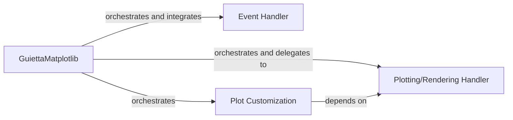

## Details

The `Matplotlib Integration` subsystem is a specialized module within `guietta` designed to embed and manage Matplotlib plots directly within `guietta`'s GUI applications. It acts as a bridge, enabling `guietta` to leverage Matplotlib's powerful plotting and rendering capabilities.

### GuiettaMatplotlib
This is the central facade and primary entry point for interacting with Matplotlib within `guietta`. It encapsulates the core Matplotlib `Figure` and `FigureCanvas` objects, providing a simplified, `guietta`-compatible API for plot creation and management. It orchestrates interactions with other components within this subsystem.

**Related Classes/Methods**:

- <a href="https://github.com/alfiopuglisi/guietta/blob/master/guietta/guietta_matplotlib.py" target="_blank" rel="noopener noreferrer">`GuiettaMatplotlib`</a>

### Plotting/Rendering Handler
Responsible for the actual rendering of various plot types (e.g., images, lines, scatter plots) onto the Matplotlib canvas. It dynamically exposes Matplotlib's extensive plotting methods (e.g., `plot`, `imshow`) by leveraging `GuiettaMatplotlib`'s `__getattr__` mechanism, allowing direct access to underlying Matplotlib axes/figure functionalities without explicit wrapping.

**Related Classes/Methods**:

- <a href="https://github.com/alfiopuglisi/guietta/blob/master/guietta/guietta_matplotlib.py" target="_blank" rel="noopener noreferrer">`Plotting/Rendering Handler`</a>

### Event Handler
Manages user interactions within the embedded Matplotlib plot area. It captures low-level Matplotlib events (e.g., mouse clicks, key presses, scroll events) and translates them into actionable signals or callbacks that can be processed by the `guietta` application, enabling interactive plot features like zooming, panning, and data selection.

**Related Classes/Methods**:

- <a href="https://github.com/alfiopuglisi/guietta/blob/master/guietta/guietta_matplotlib.py" target="_blank" rel="noopener noreferrer">`Event Handler`</a>

### Plot Customization
Provides functionalities for enhancing and customizing the visual presentation of plots. This includes adding elements like colorbars, setting plot titles, axis labels, legends, and adjusting visual properties. It builds upon the core rendering capabilities provided by the `Plotting/Rendering Handler` to refine the plot's appearance.

**Related Classes/Methods**:

- <a href="https://github.com/alfiopuglisi/guietta/blob/master/guietta/guietta_matplotlib.py" target="_blank" rel="noopener noreferrer">`Plot Customization`</a>

### [FAQ](https://github.com/CodeBoarding/GeneratedOnBoardings/tree/main?tab=readme-ov-file#faq)