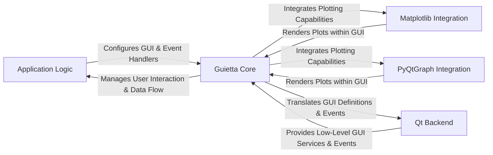

## Details

The `guietta` architecture is designed around a clear separation of concerns, enabling declarative GUI development. The `Application Logic` defines the user interface and its behavior by interacting with the `Guietta Core`. This core component acts as the central orchestrator, translating high-level GUI descriptions into concrete elements and managing the flow of user interactions. It dispatches events back to the `Application Logic` for processing and retrieves necessary data. For advanced visualization needs, `Guietta Core` integrates with `Matplotlib Integration` and `PyQtGraph Integration` modules, allowing seamless embedding of plots. All these interactions ultimately rely on the `Qt Backend`, which provides the fundamental rendering and event processing services, abstracted by `Guietta Core` to simplify development. This layered approach ensures maintainability and allows developers to focus on application logic rather than low-level GUI details.

### Application Logic
The user-defined code that implements the application's specific business logic, data models, and event handlers. It defines the GUI structure using `guietta`'s API.

**Related Classes/Methods**:

- <a href="https://github.com/alfiopuglisi/guietta/blob/master/guietta/examples/calculator.py" target="_blank" rel="noopener noreferrer">`guietta/examples/calculator.py`</a>

### Guietta Core [[Expand]](./Guietta_Core.md)
The central abstraction layer of the `guietta` library. It handles declarative GUI definition, widget creation, layout management, event registration and dispatch, and basic data binding. It acts as the primary interface for `Application Logic`.

**Related Classes/Methods**:

- <a href="https://github.com/alfiopuglisi/guietta/blob/master/guietta/guietta.py" target="_blank" rel="noopener noreferrer">`guietta.guietta.Gui`</a>
- <a href="https://github.com/alfiopuglisi/guietta/blob/master/guietta/guietta.py" target="_blank" rel="noopener noreferrer">`guietta.guietta.Rows`</a>
- <a href="https://github.com/alfiopuglisi/guietta/blob/master/guietta/guietta.py#L1817-L1846" target="_blank" rel="noopener noreferrer">`guietta.guietta.connect`:1817-1846</a>
- <a href="https://github.com/alfiopuglisi/guietta/blob/master/guietta/guietta.py#L2542-L2544" target="_blank" rel="noopener noreferrer">`guietta.guietta.get`:2542-2544</a>
- <a href="https://github.com/alfiopuglisi/guietta/blob/master/guietta/guietta.py#L498-L500" target="_blank" rel="noopener noreferrer">`guietta.guietta.setx`:498-500</a>
- <a href="https://github.com/alfiopuglisi/guietta/blob/master/guietta/guietta.py#L2144-L2174" target="_blank" rel="noopener noreferrer">`guietta.guietta.events`:2144-2174</a>

### Matplotlib Integration [[Expand]](./Matplotlib_Integration.md)
A specialized module for embedding and managing Matplotlib plots within `guietta` GUIs. It provides the necessary bridge between `guietta`'s display capabilities and Matplotlib's rendering.

**Related Classes/Methods**:

- <a href="https://github.com/alfiopuglisi/guietta/blob/master/guietta/guietta_matplotlib.py" target="_blank" rel="noopener noreferrer">`guietta.guietta_matplotlib.GuiettaMatplotlib`</a>

### PyQtGraph Integration
A specialized module for integrating high-performance PyQtGraph plots into `guietta` applications, similar to Matplotlib integration but for PyQtGraph's specific features.

**Related Classes/Methods**:

- <a href="https://github.com/alfiopuglisi/guietta/blob/master/guietta/guietta_pyqtgraph.py" target="_blank" rel="noopener noreferrer">`guietta.guietta_pyqtgraph.GuiettaPyQtGraph`</a>

### Qt Backend
Represents the underlying Qt framework (PySide2/PyQt5) that `guietta` abstracts. It is responsible for the actual rendering of GUI elements, low-level event processing, and window management. `Guietta Core` interacts with this layer.

**Related Classes/Methods**:

- <a href="https://github.com/alfiopuglisi/guietta/blob/master/guietta/guietta.py" target="_blank" rel="noopener noreferrer">`guietta/guietta.py`</a>

### [FAQ](https://github.com/CodeBoarding/GeneratedOnBoardings/tree/main?tab=readme-ov-file#faq)