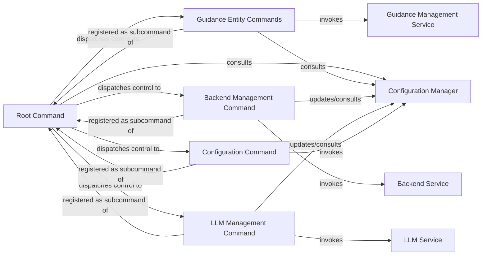

## Details

The gydnc application's architecture is centered around a robust Command Line Interface (CLI) that facilitates the management of AI guidance entities and system configurations. The Root Command acts as the primary entry point, orchestrating the execution flow by dispatching control to specialized subcommands. These subcommands, including Guidance Entity Commands, Backend Management Command, LLM Management Command, and Configuration Command, encapsulate distinct functionalities. Each subcommand interacts with its respective service layer—Guidance Management Service, Backend Service, and LLM Service—to perform core operations, ensuring a clear separation of concerns. All commands consistently consult the Configuration Manager to access and modify application-wide settings, maintaining a centralized and consistent configuration state. This design promotes modularity, allowing for independent development and maintenance of different functional areas while ensuring cohesive system operation.

### Root Command
The foundational component of the CLI, responsible for initializing the application, defining global flags, and orchestrating the execution of all subcommands. It acts as the main entry entry point for the gydnc tool.

**Related Classes/Methods**:

- `cmd/root.go`

### Guidance Entity Commands
A group of commands dedicated to managing AI guidance entities. Each command handles specific CRUD (Create, Read, Update, Delete) operations, parsing relevant arguments and validating user input for guidance entity manipulation.

**Related Classes/Methods**:

- `cmd/create.go`
- `cmd/get.go`
- `cmd/list.go`
- `cmd/update.go`
- `cmd/delete.go`

### Backend Management Command
Manages interactions with different storage or processing backends. This includes operations like listing available backends, setting the active backend, or configuring backend-specific parameters.

**Related Classes/Methods**:

- `cmd/backends.go`

### LLM Management Command
Handles commands related to configuring and interacting with Large Language Models (LLMs), such as setting default LLM providers or parameters for AI guidance generation.

**Related Classes/Methods**:

- `cmd/llm.go`

### Configuration Command
Provides an interface for users to view, set, or reset application-wide configuration settings, ensuring robust configuration management.

**Related Classes/Methods**:

- `cmd/config.go`

### Configuration Manager
Manages application-wide configuration settings, providing an interface for other components to retrieve and update configuration data.

**Related Classes/Methods**:

### Guidance Management Service
Provides core business logic and operations for managing AI guidance entities, abstracting the underlying data storage and manipulation.

**Related Classes/Methods**:

### Backend Service
Manages interactions with various storage or processing backends, providing a unified interface for backend operations.

**Related Classes/Methods**:

### LLM Service
Handles the integration and interaction with Large Language Models (LLMs), providing an interface for LLM-related operations like text generation or embedding.

**Related Classes/Methods**:

### [FAQ](https://github.com/CodeBoarding/GeneratedOnBoardings/tree/main?tab=readme-ov-file#faq)