```mermaid
graph LR
    Command_Layer["Command Layer"]
    Service_Layer["Service Layer"]
    Storage_Layer["Storage Layer"]
    Data_Models["Data Models"]
    Command_Layer -- "delegates requests to" --> Service_Layer
    Service_Layer -- "requests data operations from" --> Storage_Layer
    Storage_Layer -- "interacts with" --> Data_Models
    click Command_Layer href "https://github.com/CodeBoarding/GeneratedOnBoardings/blob/main/gydnc/Command_Layer.md" "Details"
    click Storage_Layer href "https://github.com/CodeBoarding/GeneratedOnBoardings/blob/main/gydnc/Storage_Layer.md" "Details"
```

## Details

The project's architecture is structured around a clear separation of concerns, facilitating a modular and maintainable codebase. The main flow begins with the Command Layer, which acts as the primary interface for user interactions, processing commands and delegating them to the appropriate services. The Service Layer then encapsulates the core business logic, orchestrating operations and managing the application's state. It relies on the Storage Layer to persist and retrieve data, abstracting the underlying file system details. Finally, the Data Models define the fundamental data structures used across all layers, ensuring consistent data representation and manipulation.

### Command Layer [[Expand]](./Command_Layer.md)
The entry point for user interactions in the CLI application, responsible for parsing commands and delegating requests to the Service Layer.

**Related Classes/Methods**:

- `cmd/root.go`

### Service Layer
Encapsulates the application's business logic, orchestrating operations and requesting data services from the Storage Layer.

**Related Classes/Methods**:

- `core/services/guidance_service.go`

### Storage Layer [[Expand]](./Storage_Layer.md)
Manages persistent storage and retrieval of guidance entities, abstracting the underlying file-based mechanism. It handles low-level file system operations for `.g6e` files, persists and retrieves `GuidanceEntity` data, and manages serialization/deserialization of `Data Models`.

**Related Classes/Methods**:

- `core/persistence/fs.go`

### Data Models
Represents the data structures, such as `GuidanceEntity`, used throughout the application for content representation, and are specifically utilized by the Storage Layer for serialization and deserialization.

**Related Classes/Methods**:

- `core/content/guidance.go`

### [FAQ](https://github.com/CodeBoarding/GeneratedOnBoardings/tree/main?tab=readme-ov-file#faq)