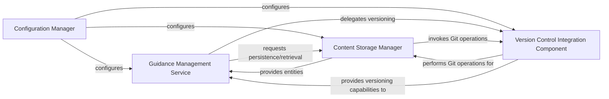

## Details

The `gydnc` project's architecture is structured around a clear separation of concerns for managing guidance content. The `Configuration Manager` establishes the foundational settings, which are then consumed by the higher-level services. The `Guidance Management Service` serves as the primary interface for business logic related to guidance entities, delegating data handling to the `Content Storage Manager`. Crucially, the `Content Storage Manager` is responsible for abstracting the underlying storage, and when Git is used, it directly interacts with the `Version Control Integration Component` to ensure all content changes are versioned and tracked. This layered approach ensures modularity and allows for different storage backends while maintaining a consistent versioning mechanism.

### Configuration Manager
This component is responsible for loading, parsing, and providing application configurations. It ensures that other components, such as the `Version Control Integration Component` and `Content Storage Manager`, are correctly initialized and operate according to user or system settings (e.g., specifying the Git repository path or storage backend type). The `cmd/config.go` handles CLI commands for configuration, while `pkg/config/config.go` defines the configuration structure, and `pkg/service/config.go` provides the service layer for configuration management.

**Related Classes/Methods**:

- `cmd/config.go`
- `pkg/config/config.go`
- `pkg/service/config.go`

### Guidance Management Service
This component encapsulates the core business logic for managing guidance entities, including operations like creation, reading, updating, and deletion. It orchestrates interactions between the `Content Storage Manager` for data persistence and delegates versioning-specific tasks to the `Version Control Integration Component`.

**Related Classes/Methods**:

- `pkg/service/guidance.go`

### Content Storage Manager
This component is responsible for the persistence and retrieval of guidance entities. It abstracts the underlying storage mechanism, which can include Git-managed directories. When a Git backend is configured, it implicitly utilizes the `Version Control Integration Component` to perform version-controlled storage operations. `pkg/storage/storage.go` likely defines the storage interface, while `pkg/storage/git.go` implements Git-specific storage.

**Related Classes/Methods**:

- `pkg/storage/storage.go`
- `pkg/storage/git.go`

### Version Control Integration Component [[Expand]](./Version_Control_Integration_Component.md)
This component provides the core versioning capabilities for guidance entities by directly interacting with Git. It is responsible for tracking changes, managing history, and ensuring data integrity for content stored in Git-managed directories. It acts as the primary interface for all Git operations within the `gydnc` project.

**Related Classes/Methods**:

- `pkg/vcs/git.go`

### [FAQ](https://github.com/CodeBoarding/GeneratedOnBoardings/tree/main?tab=readme-ov-file#faq)