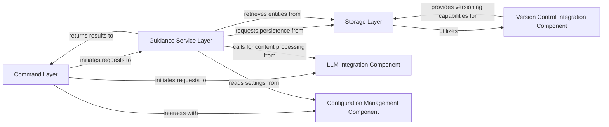

## Details

The gydnc project is structured around a command-line interface (CLI) for managing "guidance entities." The core flow involves the Command Layer receiving user input, which then interacts with the Guidance Service Layer to perform business logic operations. These operations often require persistent storage, handled by the Storage Layer, which in turn leverages the Version Control Integration Component for tracking changes. Additionally, the system integrates with LLM Integration Component for content processing and relies on the Configuration Management Component for application settings.

### Command Layer [[Expand]](./Command_Layer.md)
Handles CLI input, argument parsing, and dispatches requests to the appropriate service layer functions. It serves as the primary user interface for the gydnc tool.

**Related Classes/Methods**:

- `cmd/root.go`
- `cmd/create.go`
- `cmd/get.go`
- `cmd/list.go`
- `cmd/update.go`
- `cmd/delete.go`
- `cmd/backends.go`
- `cmd/llm.go`
- `cmd/config.go`

### Guidance Service Layer
Encapsulates core business logic for managing guidance entities. It orchestrates operations such as creation, retrieval, updating, and deletion, applying business rules and interacting with the Storage Layer.

**Related Classes/Methods**:

- `core/content/guidance.go`

### Storage Layer [[Expand]](./Storage_Layer.md)
Manages persistent storage and retrieval of guidance entities, abstracting the underlying file-based mechanism. It interacts with the file system to read, write, and manage .g6e files.

**Related Classes/Methods**:

- `.gydnc/`

### Version Control Integration Component [[Expand]](./Version_Control_Integration_Component.md)
Provides versioning capabilities for guidance entities, leveraging Git for tracking changes and history. This component is implicitly used by the Storage Layer when the storage backend is a Git-managed directory.

**Related Classes/Methods**:

- `.git/`

### LLM Integration Component
Facilitates interaction with Language Model Models for content generation, refinement, or analysis, as exposed through specific CLI commands.

**Related Classes/Methods**:

- `cmd/llm.go`

### Configuration Management Component
Manages application-wide settings and configurations, including backend definitions and default behaviors.

**Related Classes/Methods**:

- `cmd/config.go`

### [FAQ](https://github.com/CodeBoarding/GeneratedOnBoardings/tree/main?tab=readme-ov-file#faq)