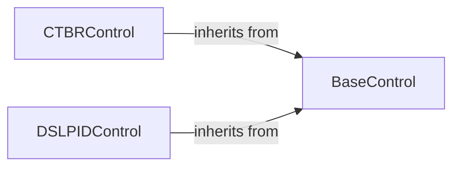

## Details

The Drone Control Modules subsystem is primarily encapsulated within the gym_pybullet_drones.control package. It encompasses the abstract definitions and concrete implementations of various drone control algorithms, serving as the "brains" that translate desired drone behaviors into actionable motor commands within the simulation.

### BaseControl
This is the foundational abstract base class for all drone control algorithms. It establishes a standardized interface (reset, computeControl) that all concrete control strategies must implement. This design promotes modularity, extensibility, and interchangeability of control algorithms.

**Related Classes/Methods**:

- <a href="https://github.com/utiasDSL/gym-pybullet-drones/blob/main/gym_pybullet_drones/control/BaseControl.py" target="_blank" rel="noopener noreferrer">`gym_pybullet_drones.control.BaseControl`</a>

### CTBRControl
A concrete implementation of an advanced drone control strategy, likely based on Control-Theoretic Backstepping. This component is responsible for calculating precise motor commands to achieve desired drone states using its specific, sophisticated control algorithm.

**Related Classes/Methods**:

- <a href="https://github.com/utiasDSL/gym-pybullet-drones/blob/main/gym_pybullet_drones/control/CTBRControl.py" target="_blank" rel="noopener noreferrer">`gym_pybullet_drones.control.CTBRControl`</a>

### DSLPIDControl
A concrete implementation of a widely used and robust PID (Proportional-Integral-Derivative) based control strategy. It manages separate PID loops for position and attitude control, translating desired drone states into motor commands for stabilization and trajectory following.

**Related Classes/Methods**:

- <a href="https://github.com/utiasDSL/gym-pybullet-drones/blob/main/gym_pybullet_drones/control/DSLPIDControl.py" target="_blank" rel="noopener noreferrer">`gym_pybullet_drones.control.DSLPIDControl`</a>

### [FAQ](https://github.com/CodeBoarding/GeneratedOnBoardings/tree/main?tab=readme-ov-file#faq)