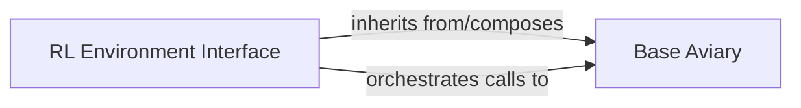

## Details

The `gym-pybullet-drones` project's core simulation subsystem is structured around two primary components: the `RL Environment Interface` and the `Base Aviary`. The `RL Environment Interface`, implemented by `BaseRLAviary`, acts as the `gymnasium`-compliant API, providing the standard interaction points for reinforcement learning agents. It is responsible for translating high-level agent actions into simulation inputs and processing raw simulation data into structured observations and rewards. This interface either inherits from or composes the `Base Aviary` component. The `Base Aviary`, represented by `BaseAviary`, provides the foundational simulation management, including PyBullet physics engine setup, drone model management, and core methods for physics updates. The `RL Environment Interface` orchestrates calls to the `Base Aviary` to execute simulation steps, manage resets, and retrieve necessary simulation states, effectively leveraging the `Base Aviary`'s core functionalities to provide a complete RL environment.

### RL Environment Interface [[Expand]](./RL_Environment_Interface.md)
This component, embodied by `gym_pybullet_drones.envs.BaseRLAviary`, serves as the `gymnasium`-compliant API. It is the primary interaction point for RL agents, handling the standard `step`, `reset`, `render`, and `close` methods. Its core responsibilities include translating high-level agent actions into low-level simulation inputs, processing raw simulation data into structured observations for the agent, calculating and returning rewards based on simulation state and agent performance, managing the episode lifecycle, and orchestrating calls to underlying simulation components.

**Related Classes/Methods**:

- <a href="https://github.com/utiasDSL/gym-pybullet-drones/blob/main/gym_pybullet_drones/envs/BaseRLAviary.py" target="_blank" rel="noopener noreferrer">`gym_pybullet_drones.envs.BaseRLAviary`</a>

### Base Aviary
This component, represented by `gym_pybullet_drones.envs.BaseAviary`, provides the foundational simulation management functionalities. It handles the setup of the PyBullet physics engine, manages the drone models within the simulation, and provides core methods for physics updates and kinematic information management. It serves as a base class or composed element for more specialized environment interfaces.

**Related Classes/Methods**:

- <a href="https://github.com/utiasDSL/gym-pybullet-drones/blob/main/gym_pybullet_drones/envs/BaseAviary.py" target="_blank" rel="noopener noreferrer">`gym_pybullet_drones.envs.BaseAviary`</a>

### [FAQ](https://github.com/CodeBoarding/GeneratedOnBoardings/tree/main?tab=readme-ov-file#faq)