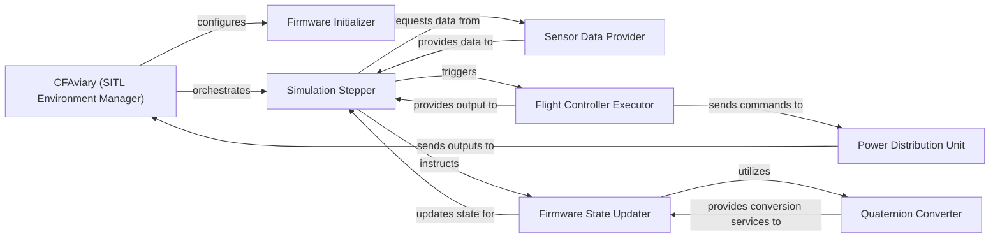

## Details

The SITL Integration subsystem is primarily encapsulated within the gym_pybullet_drones.envs.CFAviary class, which acts as the central orchestrator for emulating Crazyflie firmware within the PyBullet simulation environment. This subsystem bridges the gap between simulated physics and real-world drone control logic, aligning with the "External System Integration" architectural pattern.

### CFAviary (SITL Environment Manager)
The core component responsible for the overall management and orchestration of the SITL simulation. It initializes the environment, steps the simulation, and integrates the emulated Crazyflie firmware with the PyBullet physics engine. This aligns with the "Environment Definition" pattern.

**Related Classes/Methods**:

- <a href="https://github.com/utiasDSL/gym-pybullet-drones/blob/main/gym_pybullet_drones/envs/CFAviary.py" target="_blank" rel="noopener noreferrer">`gym_pybullet_drones.envs.CFAviary`</a>
- <a href="https://github.com/utiasDSL/gym-pybullet-drones/blob/main/gym_pybullet_drones/envs/CFAviary.py#L33-L110" target="_blank" rel="noopener noreferrer">`gym_pybullet_drones.envs.CFAviary.__init__`:33-110</a>
- <a href="https://github.com/utiasDSL/gym-pybullet-drones/blob/main/gym_pybullet_drones/envs/CFAviary.py#L451-L488" target="_blank" rel="noopener noreferrer">`gym_pybullet_drones.envs.CFAviary._sendFullStateCmd`:451-488</a>

### Firmware Initializer
Sets up the initial state and parameters for the emulated Crazyflie firmware, ensuring it starts in a defined and consistent condition for simulation runs.

**Related Classes/Methods**:

- <a href="https://github.com/utiasDSL/gym-pybullet-drones/blob/main/gym_pybullet_drones/envs/CFAviary.py#L112-L185" target="_blank" rel="noopener noreferrer">`gym_pybullet_drones.envs.CFAviary._initalize_cffirmware`:112-185</a>

### Simulation Stepper
Orchestrates the advancement of the simulation by one time step, coordinating sensor data acquisition, controller execution, and state updates. This component is crucial for the "Agent-Environment Interaction" and "Control Loop" patterns.

**Related Classes/Methods**:

- <a href="https://github.com/utiasDSL/gym-pybullet-drones/blob/main/gym_pybullet_drones/envs/CFAviary.py#L187-L261" target="_blank" rel="noopener noreferrer">`gym_pybullet_drones.envs.CFAviary.step`:187-261</a>

### Sensor Data Provider
Simulates and provides sensor readings (e.g., accelerometer, gyroscope) to the emulated firmware, mimicking real-world sensor inputs. This is a vital part of the "Environment Definition" as it provides the drone's perception.

**Related Classes/Methods**:

- <a href="https://github.com/utiasDSL/gym-pybullet-drones/blob/main/gym_pybullet_drones/envs/CFAviary.py#L272-L291" target="_blank" rel="noopener noreferrer">`gym_pybullet_drones.envs.CFAviary._update_sensorData`:272-291</a>

### Firmware State Updater
Updates the drone's kinematic and attitude state within the emulated firmware based on the simulation's progression and controller outputs. This maintains the integrity of the "Control Loop" and "Environment Definition."

**Related Classes/Methods**:

- <a href="https://github.com/utiasDSL/gym-pybullet-drones/blob/main/gym_pybullet_drones/envs/CFAviary.py#L318-L333" target="_blank" rel="noopener noreferrer">`gym_pybullet_drones.envs.CFAviary._update_state`:318-333</a>
- <a href="https://github.com/utiasDSL/gym-pybullet-drones/blob/main/gym_pybullet_drones/envs/CFAviary.py#L341-L355" target="_blank" rel="noopener noreferrer">`gym_pybullet_drones.envs.CFAviary._update_attitudeQuaternion`:341-355</a>
- <a href="https://github.com/utiasDSL/gym-pybullet-drones/blob/main/gym_pybullet_drones/envs/CFAviary.py#L298-L301" target="_blank" rel="noopener noreferrer">`gym_pybullet_drones.envs.CFAviary._update_acc`:298-301</a>
- <a href="https://github.com/utiasDSL/gym-pybullet-drones/blob/main/gym_pybullet_drones/envs/CFAviary.py#L293-L296" target="_blank" rel="noopener noreferrer">`gym_pybullet_drones.envs.CFAviary._update_gyro`:293-296</a>
- <a href="https://github.com/utiasDSL/gym-pybullet-drones/blob/main/gym_pybullet_drones/envs/CFAviary.py#L335-L339" target="_blank" rel="noopener noreferrer">`gym_pybullet_drones.envs.CFAviary._update_3D_vec`:335-339</a>
- <a href="https://github.com/utiasDSL/gym-pybullet-drones/blob/main/gym_pybullet_drones/envs/CFAviary.py#L357-L361" target="_blank" rel="noopener noreferrer">`gym_pybullet_drones.envs.CFAviary._update_attitude_t`:357-361</a>
- <a href="https://github.com/utiasDSL/gym-pybullet-drones/blob/main/gym_pybullet_drones/envs/CFAviary.py#L422-L426" target="_blank" rel="noopener noreferrer">`gym_pybullet_drones.envs.CFAviary._updateSetpoint`:422-426</a>
- <a href="https://github.com/utiasDSL/gym-pybullet-drones/blob/main/gym_pybullet_drones/envs/CFAviary.py#L428-L433" target="_blank" rel="noopener noreferrer">`gym_pybullet_drones.envs.CFAviary._process_command_queue`:428-433</a>

### Flight Controller Executor
Executes the core control logic of the emulated Crazyflie firmware, processing inputs and computing motor commands. This represents the "Control Mechanism" within the SITL context.

**Related Classes/Methods**:

- <a href="https://github.com/utiasDSL/gym-pybullet-drones/blob/main/gym_pybullet_drones/envs/CFAviary.py#L368-L420" target="_blank" rel="noopener noreferrer">`gym_pybullet_drones.envs.CFAviary._step_controller`:368-420</a>

### Power Distribution Unit
Translates the calculated control thrusts from the flight controller into individual motor commands (PWM values) and applies thrust limits, simulating the physical actuation. This is part of the "Control Loop" and "Drone Models."

**Related Classes/Methods**:

- <a href="https://github.com/utiasDSL/gym-pybullet-drones/blob/main/gym_pybullet_drones/envs/CFAviary.py#L633-L652" target="_blank" rel="noopener noreferrer">`gym_pybullet_drones.envs.CFAviary._powerDistribution`:633-652</a>
- <a href="https://github.com/utiasDSL/gym-pybullet-drones/blob/main/gym_pybullet_drones/envs/CFAviary.py#L615-L624" target="_blank" rel="noopener noreferrer">`gym_pybullet_drones.envs.CFAviary._motorsGetPWM`:615-624</a>
- <a href="https://github.com/utiasDSL/gym-pybullet-drones/blob/main/gym_pybullet_drones/envs/CFAviary.py#L626-L631" target="_blank" rel="noopener noreferrer">`gym_pybullet_drones.envs.CFAviary._limitThrust`:626-631</a>

### Quaternion Converter
Provides a utility for converting Euler angles to quaternions, essential for consistent attitude representation within the firmware and accurate drone modeling.

**Related Classes/Methods**:

- <a href="https://github.com/utiasDSL/gym-pybullet-drones/blob/main/gym_pybullet_drones/envs/CFAviary.py#L788-L804" target="_blank" rel="noopener noreferrer">`gym_pybullet_drones.envs.CFAviary._get_quaternion_from_euler`:788-804</a>

### [FAQ](https://github.com/CodeBoarding/GeneratedOnBoardings/tree/main?tab=readme-ov-file#faq)