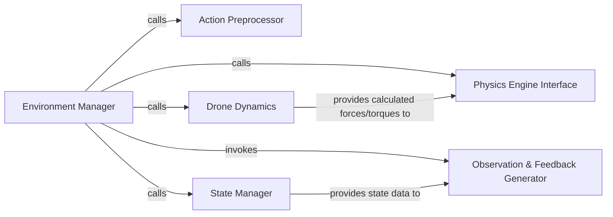

## Details

The `Simulation Core` subsystem is the heart of the `gym-pybullet-drones` project, responsible for orchestrating the simulated environment, managing drone dynamics, and providing the necessary interface for reinforcement learning agents. Its boundaries are primarily defined by the `gym_pybullet_drones.envs.BaseAviary` class and its encapsulated methods, which collectively manage the simulation's progression and state.

### Environment Manager
This is the primary orchestrator of the entire simulation environment. It initializes the PyBullet physics engine, defines the action and observation spaces, manages the simulation's step-by-step progression, and handles environment resets. It serves as the main interface for external agents (e.g., RL algorithms) to interact with the simulated world.

**Related Classes/Methods**:

- <a href="https://github.com/utiasDSL/gym-pybullet-drones/blob/main/gym_pybullet_drones/envs/BaseAviary.py" target="_blank" rel="noopener noreferrer">`gym_pybullet_drones.envs.BaseAviary`</a>

### Action Preprocessor
This component is responsible for transforming the high-level actions received from an external agent (e.g., desired motor thrusts) into a format directly usable by the PyBullet physics engine, such as specific forces or torques to be applied to the drone's rigid bodies.

**Related Classes/Methods**:

- <a href="https://github.com/utiasDSL/gym-pybullet-drones/blob/main/gym_pybullet_drones/envs/BaseAviary.py" target="_blank" rel="noopener noreferrer">`gym_pybullet_drones.envs.BaseAviary:_preprocessAction`</a>

### Physics Engine Interface
This component directly interacts with the PyBullet physics engine. It applies the calculated forces and torques to the simulated drones, updates their rigid body states, and handles collision detection within the environment. It is the bridge between the abstract dynamics and the underlying physics simulation.

**Related Classes/Methods**:

- <a href="https://github.com/utiasDSL/gym-pybullet-drones/blob/main/gym_pybullet_drones/envs/BaseAviary.py" target="_blank" rel="noopener noreferrer">`gym_pybullet_drones.envs.BaseAviary:_physics`</a>

### Drone Dynamics
This component calculates and applies drone-specific dynamics, including forces, torques, and rotational updates, based on the preprocessed actions and the drone's current state. It incorporates specialized calculations like quaternion integration (`_integrateQ`) to ensure accurate and stable drone orientation updates.

**Related Classes/Methods**:

- <a href="https://github.com/utiasDSL/gym-pybullet-drones/blob/main/gym_pybullet_drones/envs/BaseAviary.py" target="_blank" rel="noopener noreferrer">`gym_pybullet_drones.envs.BaseAviary:_dynamics`</a>
- <a href="https://github.com/utiasDSL/gym-pybullet-drones/blob/main/gym_pybullet_drones/envs/BaseAviary.py" target="_blank" rel="noopener noreferrer">`gym_pybullet_drones.envs.BaseAviary:_integrateQ`</a>

### State Manager
This component is responsible for managing and storing the current kinematic state (position, velocity, orientation) of all drones and relevant objects within the simulation. It ensures that the environment's state is consistently updated and available for observation generation and reward calculation.

**Related Classes/Methods**:

- <a href="https://github.com/utiasDSL/gym-pybullet-drones/blob/main/gym_pybullet_drones/envs/BaseAviary.py" target="_blank" rel="noopener noreferrer">`gym_pybullet_drones.envs.BaseAviary:_updateAndStoreKinematicInformation`</a>

### Observation & Feedback Generator
This composite component is responsible for gathering raw simulation data and processing it into a structured observation space suitable for an RL agent. It also calculates the reward signal based on the simulation's state and actions, and determines if the current episode has reached a terminal state (e.g., crash) or should be truncated (e.g., time limit).

**Related Classes/Methods**:

- <a href="https://github.com/utiasDSL/gym-pybullet-drones/blob/main/gym_pybullet_drones/envs/BaseAviary.py" target="_blank" rel="noopener noreferrer">`gym_pybullet_drones.envs.BaseAviary:_computeObs`</a>
- <a href="https://github.com/utiasDSL/gym-pybullet-drones/blob/main/gym_pybullet_drones/envs/BaseAviary.py" target="_blank" rel="noopener noreferrer">`gym_pybullet_drones.envs.BaseAviary:_computeReward`</a>
- <a href="https://github.com/utiasDSL/gym-pybullet-drones/blob/main/gym_pybullet_drones/envs/BaseAviary.py" target="_blank" rel="noopener noreferrer">`gym_pybullet_drones.envs.BaseAviary:_computeTerminated`</a>
- <a href="https://github.com/utiasDSL/gym-pybullet-drones/blob/main/gym_pybullet_drones/envs/BaseAviary.py" target="_blank" rel="noopener noreferrer">`gym_pybullet_drones.envs.BaseAviary:_computeTruncated`</a>

### [FAQ](https://github.com/CodeBoarding/GeneratedOnBoardings/tree/main?tab=readme-ov-file#faq)