```mermaid
graph LR
    Simulation_Core["Simulation Core"]
    RL_Environment_Interface["RL Environment Interface"]
    Drone_Control_Modules["Drone Control Modules"]
    SITL_Integration["SITL Integration"]
    Drone_Model_Asset_Management["Drone Model & Asset Management"]
    RL_Environment_Interface -- "Sends Actions To" --> Simulation_Core
    Simulation_Core -- "Provides State To" --> RL_Environment_Interface
    Drone_Control_Modules -- "Generates Actions For" --> RL_Environment_Interface
    RL_Environment_Interface -- "Provides State To" --> Drone_Control_Modules
    SITL_Integration -- "Applies Motor Commands To" --> Simulation_Core
    Simulation_Core -- "Provides Sensor Data To" --> SITL_Integration
    Drone_Model_Asset_Management -- "Configures" --> Simulation_Core
    click Simulation_Core href "https://github.com/CodeBoarding/GeneratedOnBoardings/blob/main/gym-pybullet-drones/Simulation_Core.md" "Details"
    click RL_Environment_Interface href "https://github.com/CodeBoarding/GeneratedOnBoardings/blob/main/gym-pybullet-drones/RL_Environment_Interface.md" "Details"
    click Drone_Control_Modules href "https://github.com/CodeBoarding/GeneratedOnBoardings/blob/main/gym-pybullet-drones/Drone_Control_Modules.md" "Details"
    click SITL_Integration href "https://github.com/CodeBoarding/GeneratedOnBoardings/blob/main/gym-pybullet-drones/SITL_Integration.md" "Details"
```

## Details

The `gym-pybullet-drones` project provides a modular simulation environment for drone control, emphasizing both classical and reinforcement learning approaches. At its core, the `Simulation Core` (implemented in `BaseAviary.py`) manages the PyBullet physics engine, handling drone dynamics and the simulated world state. The `RL Environment Interface` (`BaseRLAviary.py`) acts as a `gymnasium`-compliant API, facilitating interaction by translating actions from control agents and providing observations and rewards. `Drone Control Modules` (`BaseControl.py` and its subclasses) generate control commands, which are then processed by the `RL Environment Interface` or directly applied to the `Simulation Core`. For hardware-in-the-loop scenarios, the `SITL Integration` (`CFAviary.py`) component emulates real-world drone firmware, bridging the simulation with external control systems. Finally, `Drone Model & Asset Management` (also handled within `BaseAviary.py` and utilizing the `assets` directory) is responsible for loading and configuring drone models and environmental assets, ensuring accurate simulation setup.

### Simulation Core [[Expand]](./Simulation_Core.md)
The central physics engine and simulation manager. It handles drone dynamics, collision detection, and the overall state of the simulated world.

**Related Classes/Methods**:

- <a href="https://github.com/utiasDSL/gym-pybullet-drones/blob/main/gym_pybullet_drones/envs/BaseAviary.py" target="_blank" rel="noopener noreferrer">`gym_pybullet_drones.envs.BaseAviary`</a>

### RL Environment Interface [[Expand]](./RL_Environment_Interface.md)
The `gymnasium`-compliant API that facilitates interaction between control agents (RL or traditional) and the simulation. It translates actions, observations, and rewards.

**Related Classes/Methods**:

- <a href="https://github.com/utiasDSL/gym-pybullet-drones/blob/main/gym_pybullet_drones/envs/BaseRLAviary.py" target="_blank" rel="noopener noreferrer">`gym_pybullet_drones.envs.BaseRLAviary`</a>

### Drone Control Modules [[Expand]](./Drone_Control_Modules.md)
A collection of algorithms responsible for controlling drone behavior, encompassing both classical control strategies (e.g., PID) and interfaces for learned policies.

**Related Classes/Methods**:

- <a href="https://github.com/utiasDSL/gym-pybullet-drones/blob/main/gym_pybullet_drones/control/BaseControl.py" target="_blank" rel="noopener noreferrer">`gym_pybullet_drones.control.BaseControl`</a>

### SITL Integration [[Expand]](./SITL_Integration.md)
Enables Software-in-the-Loop simulation by emulating real-world drone firmware (e.g., Crazyflie) within the PyBullet environment, bridging simulation and hardware.

**Related Classes/Methods**:

- <a href="https://github.com/utiasDSL/gym-pybullet-drones/blob/main/gym_pybullet_drones/envs/CFAviary.py" target="_blank" rel="noopener noreferrer">`gym_pybullet_drones.envs.CFAviary`</a>

### Drone Model & Asset Management
Manages the loading, parsing, and configuration of drone URDF models and other simulation assets (e.g., environments, obstacles).

**Related Classes/Methods**:

- <a href="https://github.com/utiasDSL/gym-pybullet-drones/blob/main/gym_pybullet_drones/envs/BaseAviary.py" target="_blank" rel="noopener noreferrer">`gym_pybullet_drones.envs.BaseAviary:_parseURDFParameters`</a>

### [FAQ](https://github.com/CodeBoarding/GeneratedOnBoardings/tree/main?tab=readme-ov-file#faq)