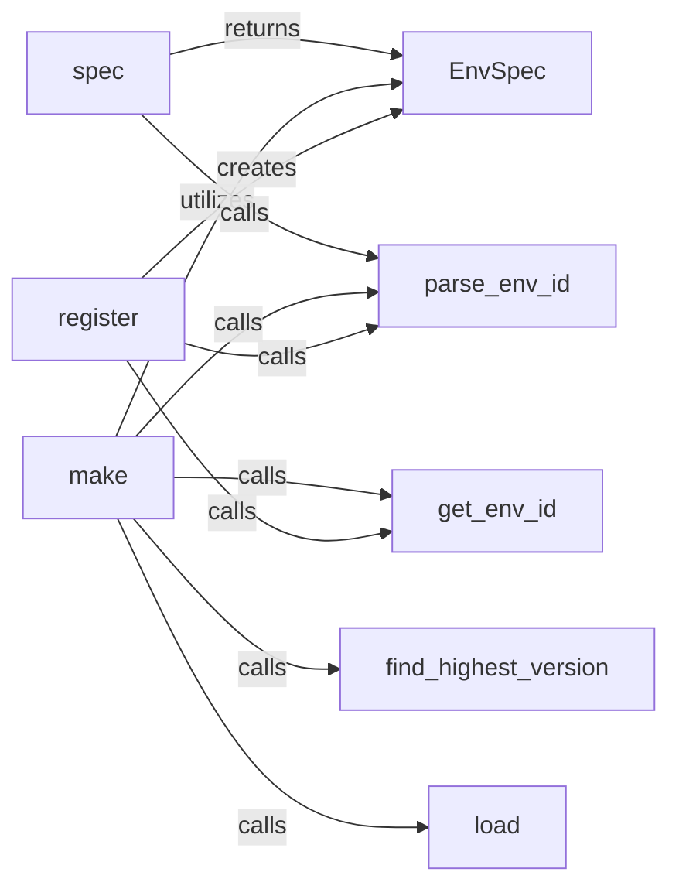

## Details

The Environment Registry subsystem in Gym is responsible for managing the lifecycle of environment definitions, from registration to instantiation. It acts as a central catalog, ensuring environments are discoverable and correctly configured for use by agents.

### EnvSpec
Serves as the immutable blueprint for a registered Gym environment. It encapsulates all essential metadata required to define and instantiate an environment, including its ID, entry point, and configuration parameters. It is the foundational data model for environment registration.

**Related Classes/Methods**:

- <a href="https://github.com/openai/gym/blob/master/gym/envs/registration.py#L117-L160" target="_blank" rel="noopener noreferrer">`gym.envs.registration.EnvSpec`:117-160</a>

### register
The primary API for adding new environment definitions to the global registry. It validates the uniqueness and correctness of environment IDs, constructs an EnvSpec object, and stores it in the registry. This component ensures that environments are properly cataloged and ready for use.

**Related Classes/Methods**:

- <a href="https://github.com/openai/gym/blob/master/gym/envs/registration.py#L434-L499" target="_blank" rel="noopener noreferrer">`gym.envs.registration.register`:434-499</a>

### make
The main user-facing function for instantiating a Gym environment. It resolves the environment ID, retrieves its corresponding EnvSpec from the registry, dynamically loads the environment's entry point, and creates an executable instance of the environment.

**Related Classes/Methods**:

- <a href="https://github.com/openai/gym/blob/master/gym/envs/registration.py#L502-L691" target="_blank" rel="noopener noreferrer">`gym.envs.registration.make`:502-691</a>

### spec
Provides a mechanism for users to retrieve the EnvSpec object for a given environment ID without actually instantiating the environment. This is crucial for inspecting environment metadata and configuration details before creation.

**Related Classes/Methods**:

- <a href="https://github.com/openai/gym/blob/master/gym/envs/registration.py#L694-L703" target="_blank" rel="noopener noreferrer">`gym.envs.registration.spec`:694-703</a>

### load
Handles the dynamic importation of Python modules and retrieval of the callable (class or function) that serves as the entry point for a registered environment. This component is vital for the lazy loading and modularity of environments.

**Related Classes/Methods**:

- <a href="https://github.com/openai/gym/blob/master/gym/envs/registration.py#L51-L63" target="_blank" rel="noopener noreferrer">`gym.envs.registration.load`:51-63</a>

### parse_env_id
Responsible for parsing a raw environment ID string (e.g., "CartPole-v1") into its constituent parts: namespace, environment name, and version. This standardization is critical for consistent ID handling across the registry.

**Related Classes/Methods**:

- <a href="https://github.com/openai/gym/blob/master/gym/envs/registration.py#L66-L94" target="_blank" rel="noopener noreferrer">`gym.envs.registration.parse_env_id`:66-94</a>

### get_env_id
Constructs a standardized, fully qualified environment ID string from its component parts (namespace, name, version). This ensures consistency when generating or comparing environment identifiers.

**Related Classes/Methods**:

- <a href="https://github.com/openai/gym/blob/master/gym/envs/registration.py#L97-L114" target="_blank" rel="noopener noreferrer">`gym.envs.registration.get_env_id`:97-114</a>

### find_highest_version
Determines and returns the highest available version for an environment name when a specific version is not provided in the ID (e.g., "CartPole"). This allows users to always get the latest stable version of an environment.

**Related Classes/Methods**:

- <a href="https://github.com/openai/gym/blob/master/gym/envs/registration.py#L257-L263" target="_blank" rel="noopener noreferrer">`gym.envs.registration.find_highest_version`:257-263</a>

### [FAQ](https://github.com/CodeBoarding/GeneratedOnBoardings/tree/main?tab=readme-ov-file#faq)